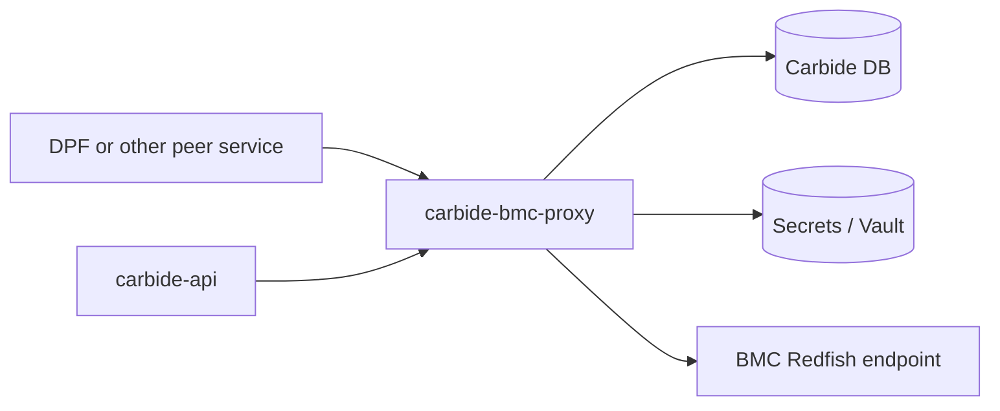
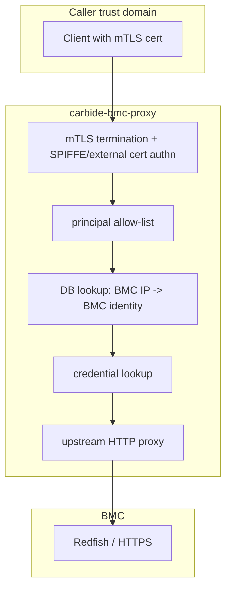
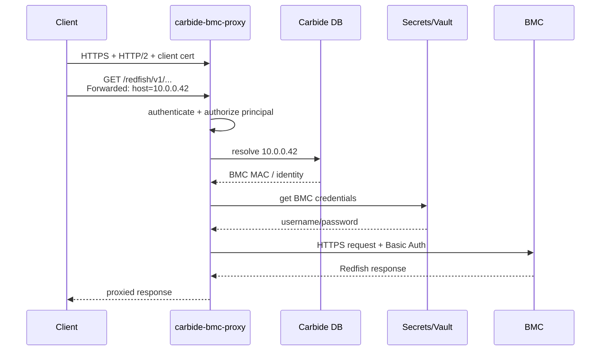

# carbide-bmc-proxy

A small authenticated HTTP/2 proxy for BMC access:

- authenticates callers with mTLS
- authorizes callers by service principal
- maps `Forwarded: host=<bmc_ip>` to a known BMC
- fetches the BMC's admin credentials from vault
- proxies the HTTP request to the target BMC

The point is to keep BMC authentication and credential handling in one place, while allowing multiple higher-level systems to coexist as peers.

## Configuration

The binary is started with:

```bash
cargo run -p carbide-bmc-proxy -- --config-path /path/to/bmc-proxy.toml
```

Important configuration fields:

- `listen`: proxy listen address, default `[::]:1079`
- `metrics_endpoint`: metrics listen address, default `[::]:1080`
- `database_url`: PostgreSQL connection string used to resolve BMC IPs
- `allowed_principals`: authorized caller principals, for example `spiffe-service-id/<name>`
- `tls.*`: server certificate, key, and trust roots for mTLS
- `auth.trust.*`: SPIFFE trust domain and allowed base paths
- `auth.cli_certs`: optional criteria for externally issued admin/client certs
- `bmc_proxy`: optional upstream override for dev/test chaining

Example shape:

```toml
listen = "[::]:1079"
metrics_endpoint = "[::]:1080"
database_url = "postgres://..."
allowed_principals = ["spiffe-service-id/dpf"]

[tls]
identity_pemfile_path = "/var/run/secrets/spiffe.io/tls.crt"
identity_keyfile_path = "/var/run/secrets/spiffe.io/tls.key"
root_cafile_path = "/var/run/secrets/spiffe.io/ca.crt"
admin_root_cafile_path = "/etc/forge/carbide-bmc-proxy/site/admin_root_cert_pem"

[auth.trust]
spiffe_trust_domain = "forge.local"
spiffe_service_base_paths = ["/forge-system/sa/", "/default/sa/"]
spiffe_machine_base_path = "/forge-system/machine/"
additional_issuer_cns = []
```

## Example Request

```bash
curl --http2 \
  --cert /path/to/tls.crt \
  --key /path/to/tls.key \
  -H 'Forwarded: host=192.168.192.8' \
  https://bmc-proxy.example/redfish/v1/Systems/Bluefield
```

The client chooses the BMC by IP. The proxy performs authentication, credential lookup, and backend authentication.


## Why?

We have at least two valid constraints at the same time:

1. Carbide cannot assume it will be the only system that ever talks to BMC's.
2. We don't want to distribute BMC credentials to every system that needs BMC access

So an authenticating proxy makes it so any system needing to talk to BMC's can do so without needing to spread credentials around.

An alternative approach is to have carbide-api be the only service that talks to BMC's, and have all operations on BMC's be implemented as high-level gRPC methods on carbide-api. But this isn't really a scalable approach: there is other management software (such as [NVIDIA Domain Power Service (DPS)][DPS]) that cannot take a dependency on carbide, and these systems need to coexist. So in order to support this without sharing BMC credentials, the idea is that each system should be configurable to use a general-purpose proxy for talking to BMC's, and carbide-bmc-proxy is merely an implementation of this.

## What's Using It?

Currently (as of 2026-04-10), nothing yet.

We soon expect that [DPS] will support configuration of an authenticating proxy like this one, to manage power configuration on BMC's. DPS is a standalone service that should not have a direct dependency on carbide-api. So carbide-bmc-proxy serves an implementation of such a proxy, although any proxy that implements similar functionality can work.

carbide-api itself is *not* using this, yet. But it does support configuring a bmc-proxy URL via the `bmc_proxy` config setting, which will work if pointed at a running instance of this crate.

Future work can implement a mode in carbide-api where it doesn't know about any BMC credentials, and would make all calls through carbide-bmc-proxy instead.

## Architecture

Today, the proxy reuses existing Carbide-adjacent building blocks:

- `carbide-authn`:  mTLS and SPIFFE principal extraction
- `carbide-secrets`: BMC credential lookup
- `carbide-api-db`: Access to the carbide database to resolve BMC IP's to MAC addresses (necessary for looking up credentials.)

### Dependency View



The important point in this picture is that both `carbide-api` and external peers can consume the same proxy. Neither needs direct access to BMC passwords.

### Trust Boundary View



The caller authenticates with a client certificate. If the caller is authorized, carbide-bmc-proxy looks up the target BMC, retrieves the corresponding credentials, and performs the backend request itself.

### Request Sequence



## Future Direction

This crate is meant to implement a clean architectural boundary, but the implementation still couples to carbide in slightly uncomfortable ways:

1. It's still a component of the ncx-infra-controller-core repo, so it's not fully independent
2. It expects a populated machine_interfaces table in the database in order to look up IP's to vault credential keys (which we rely on carbide-api to populate.)
3. It expects populated credentials in vault for every BMC (which we rely on carbide-api to populate.)

Point #1 doesn't really need to be solved, since there's no problem storing the crate in this repo and taking advantage of existing code. But future work can focus on making carbide-bmc-proxy:

- Keep its own persisted configuration state, so that it can "own" IP-to-credentials lookups, rather than relying on carbide-api's state
- Provide an admin/management API for setting/storing/rotating credentials (which carbide-api can call when configuring hosts.)

At which point we can strip all BMC credential storage code out of carbide-api and have it use this crate for BMC interaction.

[DPS]: https://docs.nvidia.com/datacenter/dps/versions/latest/
