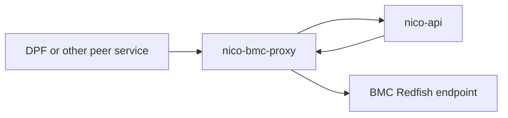
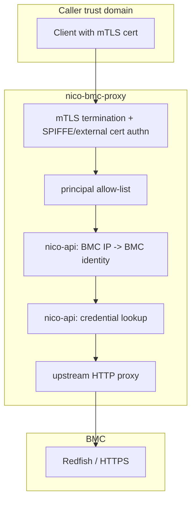
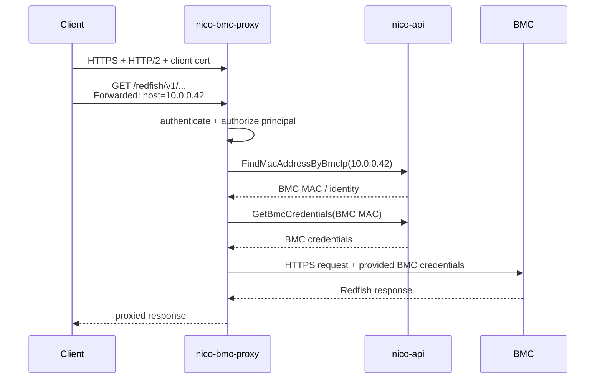

# nico-bmc-proxy

A small authenticated HTTP/2 proxy for BMC access:

- authenticates callers with mTLS
- authorizes callers by service principal
- maps `Forwarded: host=<bmc_ip>` to a known BMC through nico-api
- fetches the BMC's credentials from nico-api over gRPC
- proxies the HTTP request to the target BMC

The point is to keep BMC authentication and credential handling in one place, while allowing multiple higher-level systems to coexist as peers.

## Configuration

The binary is started with:

```bash
cargo run -p nico-bmc-proxy -- --config-path /path/to/bmc-proxy.toml
```

Important configuration fields:

- `listen`: proxy listen address, default `[::]:1079`
- `metrics_endpoint`: metrics listen address, default `[::]:1080`
- `allowed_principals`: authorized caller principals, for example `spiffe-service-id/<name>`
- `tls.*`: server certificate, key, and trust roots for mTLS
- `nico_api.*`: nico-api gRPC endpoint and mTLS material used for BMC IP resolution and `GetBmcCredentials`
- `auth.trust.*`: SPIFFE trust domain and allowed base paths
- `auth.acls`: per-principal ACL rules for HTTP method and path authorization
- `auth.cli_certs`: optional criteria for externally issued admin/client certs
- `bmc_proxy`: optional upstream override for dev/test chaining
- `class`: optional request classes, by method, path, and caller, that set
  how long the proxy waits on the BMC, and how many of their requests it sends
  to a BMC at a time; see [`class`](#class)
- `admission`: optional limit on the requests the proxy sends to each BMC; see
  [`admission`](#admission)
- `redirects.mode`: redirect policy, either `follow_same_origin` (default) or
  `return_to_client`

Example shape:

```toml
listen = "[::]:1079"
metrics_endpoint = "[::]:1080"
allowed_principals = ["spiffe-service-id/dpf"]

[redirects]
mode = "follow_same_origin"

[tls]
identity_pemfile_path = "/var/run/secrets/spiffe.io/tls.crt"
identity_keyfile_path = "/var/run/secrets/spiffe.io/tls.key"
root_cafile_path = "/var/run/secrets/spiffe.io/ca.crt"
admin_root_cafile_path = "/etc/nico/nico-bmc-proxy/site/admin_root_cert_pem"

[nico_api]
root_ca = "/var/run/secrets/spiffe.io/ca.crt"
client_cert = "/var/run/secrets/spiffe.io/tls.crt"
client_key = "/var/run/secrets/spiffe.io/tls.key"
api_url = "https://nico-api.nico-system.svc.cluster.local:1079"

[auth.trust]
spiffe_trust_domain = "nico.local"
spiffe_service_base_paths = ["/nico-system/sa/", "/default/sa/"]
spiffe_machine_base_path = "/nico-system/machine/"
additional_issuer_cns = []

[auth.acls]
"spiffe-service-id/dpf" = ["/redfish/v1/**"]
```

### Inbound TLS

The certificate, key and main client CA file must load successfully at startup.
An unreadable admin CA file (`admin_root_cafile_path`) is skipped; if readable,
PEM parse errors fail startup or reload. The configuration reloads on the first
connection after five minutes, using the same loading rules. A failed reload
retains the previous configuration and retries on the first connection at least
30 seconds later. Retention has no age limit: removed trust roots remain trusted
until a successful reload or restart. Failures increment
`carbide_bmc_proxy_tls_reload_failures_total`; connections served with the retained
configuration do not increment the connection-failure counter.
Retries reuse an unfinished reload task instead of starting another.

Accepted connections have 10 seconds to complete TLS, including any reload wait.
Timeouts close the connection and increment
`carbide_bmc_proxy_tls_connection_fail_total{reason="tls_connection_failure"}`.
Established HTTP connections have no fixed lifetime. Shutdown closes active
connections immediately and joins connection and reload tasks. A blocking TLS
file read that has already started cannot be cancelled; shutdown waits for it
to finish. TCP accept errors retry after one second; shutdown interrupts that
wait. These timers do not limit connection concurrency.

### `redirects.mode`

`follow_same_origin` follows up to five redirects within the original scheme, host, and effective
port. Redirects are returned instead when a `307` or `308` requires replaying a streamed request
body, or when chaining produces a redirect to the BMC's direct HTTPS address on port 443.

Automatically followed redirects do not re-run ACL authorization. Same-origin checks protect
credential scope; they do not establish that the redirected path is allowed for the principal.

For safe redirects returned to the client, the proxy removes the scheme and authority from
`Location`, preserving the path, query, and fragment. The client must send the same `Forwarded`
target on its follow-up request.

The proxy does not follow any other origin because the BMC credential includes the Redfish
`X-Auth-Token` header, which Reqwest does not strip automatically on a cross-origin redirect. Such
a redirect returns `502` without exposing its `Location`.

This is a deliberate security change from the earlier unrestricted five-hop policy: a
cross-origin redirect is rejected instead of being followed.

`return_to_client` disables automatic following and returns safe redirects using the same rewrite
so the caller can make a separately authorized request. This mode is experimental.

Both modes reject non-HTTP(S), malformed, ambiguous, credential-bearing, and other cross-origin
redirect targets. On a non-redirect response such as a Redfish session creation `201`, the proxy
rewrites a safe same-BMC `Location` and omits an unsafe one without changing the response status.

`NICO_BMC_PROXY__REDIRECTS__MODE` overrides the TOML value because environment providers are merged
after the configuration file. The Helm chart always sets that variable from
`bmcProxy.redirectMode`.

### `auth.acls`

`auth.acls` maps an authenticated principal to an ordered list of ACL entries:

```toml
[auth.acls]
"spiffe-service-id/nico-api" = ["/**"]
"spiffe-service-id/nv-dps" = [
  "GET /redfish/v1",
  "GET,POST /redfish/v1/Managers/BMC/NodeManager/Domains",
  "GET,PATCH,DELETE /redfish/v1/Managers/BMC/NodeManager/Domains/*",
]
```

Each ACL entry has the form:

```text
[!]VERB[,VERB...] /path/pattern
```

Rules:

- The leading `!` means deny. Without it, the entry allows.
- If the verb list is omitted, the entry matches any HTTP method.
- Entries are evaluated in order. The first matching entry wins.
- If no entry matches, the request is denied.
- ACLs are scoped per principal. A principal with no ACL list is denied.

Path matching syntax:

- Exact path components match literally.
- `*` matches exactly one path component.
- `prefix*` matches one path component with the given prefix.
- `*suffix` matches one path component with the given suffix.
- `**` matches zero or more path components.
- A single trailing slash does not create another path component. For example,
  `/redfish/v1/` matches `/redfish/v1`. Some clients include this slash when
  requesting the Redfish service root.
- A single `*` may appear by itself, at the beginning, or at the end of a path component.
  Valid: `/redfish/v1/Systems/*/SecureBoot/**`
  Valid: `/redfish/v1/Systems/system*/SecureBoot`
  Valid: `/redfish/v1/Systems/*Boot/SecureBoot`
  Invalid: `/redfish/v1/Systems/sys*tem/SecureBoot`
- At most one `**` is allowed in an ACL path.

Examples:

- `"/**"`
  Allow a principal to access any path with any method.
- `"GET /redfish/v1/**"`
  Allow only `GET` requests anywhere under `/redfish/v1`.
- `"!POST,PATCH /redfish/v1/Systems/*/SecureBoot/**"`
  Deny writes below any system's `SecureBoot` subtree.
- `"GET,POST /redfish/v1/Managers/BMC/NodeManager/Domains"`
  Allow both listing and creating node manager domains on the same path.

If you are translating endpoint docs into ACLs, replace templated path components such as
`{id}`, `{session_id}`, or `{policy_id}` with `*`.

### `class`

Each `[[class]]` table groups proxied requests that share an upstream budget
and admission settings:

```toml
[[class]]
name = "inventory"
match = ["GET /redfish/v1/UpdateService/FirmwareInventory/**"]
upstream_timeout = "3m"

[[class]]
name = "default"
upstream_timeout = "90s"
```

- `name`: the class's name on the request's trace span, as `bmc_proxy.class`,
  and its `class` label on the admission metrics.
  A lowercase letter followed by lowercase letters, digits, or `_`, at most
  32 characters in all, and unique across the tables.
- `match`: an array of the requests the class takes, each written like an ACL
  entry without a leading `!`: optional comma-separated methods (`GET`,
  `HEAD`, `POST`, `PUT`, `PATCH`, or `DELETE`, in any case), then a path in
  the syntax above. Required for every class but `default`.
- `principals`: an array of the callers whose requests the class takes, each
  a principal identifier as in `allowed_principals` and `auth.acls`, such as
  `spiffe-service-id/nv-dps`. A request belongs to the class only when its
  caller holds one of them and the request matches a pattern;
  `trusted-certificate` takes every caller that presented a trusted
  certificate. A class never lets a caller in: only requests the ACL allows
  are classified. Optional; a class without it takes every caller's requests.
  It may not be empty, list `anonymous`, which every caller holds, or list an
  empty or whitespace-padded identifier, and `default` may not set it.
- `upstream_timeout`: how long one exchange with the BMC may take, as a
  duration string such as `"500ms"`, `"45s"`, or `"5m"`, above zero and at
  most 30 minutes. A class that omits it gets 60 seconds, not the `default`
  class's budget.
- `priority`: from 0 to 255, higher first; orders the requests of different
  classes waiting for the same BMC under `max_in_flight_per_bmc`, and has no
  effect without it. Optional, 0 by default.
- `max_in_flight`: how many of the class's requests one proxy replica sends
  to one BMC at a time, at least 1. Optional; unlimited by default.
- `max_queued`: how many of the class's requests may wait for one BMC at a
  time, from 1 to 128; a request that stops waiting gives up its place, and
  one more than this is refused with `429` at once. Requests arriving
  together on their way to free slots do not count. Optional, 16 by default.
  Each BMC in use costs the proxy memory in proportion to the `max_queued` of
  every class that takes slots.
- `breaker`: a table of settings for the class's circuit breaker at each BMC,
  over those of `[admission.breaker]`; see
  [`admission.breaker`](#admissionbreaker). Optional.
- `slo`: the class's latency target at each BMC; see
  [`admission.slo`](#admissionslo). Optional.

The budget covers looking up the BMC's credentials in nico-api and any wait
for a slot at the BMC (see [`admission`](#admission)), then runs from
connecting to the BMC until the proxy has read the last byte of the BMC's
response body, redirects the proxy follows included. Most
bodies are passed on to the caller as they are read, so a slow caller spends
the budget too. When the budget runs out while the proxy looks up credentials
or waits for the BMC to answer, the caller gets `502`; while the request waits
for a slot, `429`; while the body is being passed on, the body is cut off. A
request the proxy replays with fresh credentials gets a budget of its own,
which covers looking up the fresh credentials. A streamed upload (a body over
8 MiB that declares its length) looks up credentials and waits for a slot
within its class's budget, then gets a budget of its own for the
transfer, scaled from its declared size: 60 seconds plus the transfer at
10 kB/s, at most four hours.

A request belongs to the first class, in file order, that takes its caller's
requests and has a matching pattern. A request no class takes belongs to
`default`, whose budget is 60 seconds; declare `default`, without `match` or
`principals`, only to change that or its admission settings. A budget longer
than the caller's own deadline does not help that caller. A `[[class]]` table
that breaks these rules, or has a key not listed here, stops the proxy from
starting.

### `admission`

The proxy can limit how many requests it sends to each BMC at a time, and
choose which waiting request goes next. Here, DPS's waiting requests go ahead
of other callers', but take at most two of a BMC's four slots, so DPS cannot
shut the others out; other callers send at most two metrics reads to a BMC at
a time:

```toml
[admission]
max_in_flight_per_bmc = 4

[[class]]
name = "dps"
principals = ["spiffe-service-id/nv-dps"]
match = ["/redfish/v1/**"]
priority = 1
max_in_flight = 2

[[class]]
name = "metrics"
match = ["GET /redfish/v1/**/EnvironmentMetrics"]
max_in_flight = 2
```

- `max_in_flight_per_bmc`: how many requests one proxy replica sends to one
  BMC at a time, across all classes, at least 1. Optional; unlimited by
  default. A class's own `max_in_flight` applies within it.
- `breaker`: the settings of every class's circuit breaker at each BMC; see
  [`admission.breaker`](#admissionbreaker). Optional; without it, only
  classes with a `breaker` table of their own have a breaker.
- `slo`: how the slots of classes without a latency target follow the
  classes with one; see [`admission.slo`](#admissionslo). Optional.

An `[admission]` table with a key not listed here stops the proxy from
starting.

A request takes a slot at its BMC before the proxy sends it when its class
sets `max_in_flight` or has a breaker, or `max_in_flight_per_bmc` is set;
otherwise it is sent at once. The proxy looks up the BMC's
credentials first, so a request for an address nico-api has no BMC
credentials for gets `502` without taking a slot or a place in a queue. A
request holds its slot until the proxy has passed the whole response on to
the caller, or the exchange has failed; a replay with fresh credentials keeps
the same slot. From the moment it gets the slot, it holds it no longer than
its exchange with the BMC can take, though: twice its class's budget, for a
first attempt and a replay, or its class's budget and its own for a streamed
upload. Past that, the slot goes to the next waiting request, so a caller
that stops reading cannot keep it, though the proxy keeps that response's
connection to the BMC open until the caller reads on or goes away.

A request that finds no free slot waits at the proxy in its class's queue for
that BMC. A freed slot goes to the highest-priority class that has a request
waiting and is under its own `max_in_flight`; classes of equal priority take
turns, and each class's requests go in the order they came. A class gets no
slot while a higher-priority class has a request waiting that its
`max_in_flight` and breaker let through, and its requests are refused when
their budget runs out. A request whose caller disconnects gives up its place,
except a streamed upload over HTTP/1, whose caller the proxy finds gone only
once it starts sending the upload.

Waiting spends the request's budget, and a request that waited has only the
rest of it for its first exchange with the BMC; a streamed upload keeps its
own. The proxy refuses a request with a plain-text body giving the reason:
with `429 Too Many Requests` when its class's queue at the BMC is full of
requests still waiting, or when no slot frees within its budget, and with `503
Service Unavailable` when the proxy already tracks 100,000 BMCs, when the
request's class's breaker at the BMC is open, or when it is shutting down. A
refused request never reached the BMC, so even a write can be sent again; the
refusal carries no `Retry-After`. It counts refusals in
`carbide_bmc_proxy_admission_refused_total`, by `class` and `reason`
(`queue_full`, `timeout`, `too_many_bmcs`, `breaker_open`, or
`shutting_down`), and records the waits of requests that got a slot in
`carbide_bmc_proxy_admission_wait_milliseconds`.

Limits are per proxy replica: with two replicas, a BMC can receive up to twice
a limit. A request the BMC is already handling cannot be overtaken, so keep
the classes whose requests are slow, and streamed uploads, which can hold a
slot for hours, at a `max_in_flight` below `max_in_flight_per_bmc`, leaving
slots for the others.

#### `admission.breaker`

With a breaker, the proxy stops sending a class's requests to a BMC that
keeps failing them, instead of letting each caller wait out its budget. Each
class has a breaker of its own at each BMC, so a BMC that fails one kind of
request keeps serving the others. Here, every class's breaker opens when the
BMC cannot be reached or does not answer, and DPS's also when the BMC answers
with a 5xx status:

```toml
[admission.breaker]
failure_threshold = 0.5
window = 32
min_samples = 5
cool_down = "10s"
trip_on = ["unreachable", "timeout"]

[[class]]
name = "dps"
principals = ["spiffe-service-id/nv-dps"]
match = ["/redfish/v1/**"]

[class.breaker]
trip_on = ["unreachable", "timeout", "5xx"]
```

`[admission.breaker]` gives every class a breaker, and a class's own `breaker`
table gives that class one, unless the `trip_on` the class ends up with is
empty. A class's breaker takes each setting from its own `breaker`, then from
`[admission.breaker]`, then the default:

- `failure_threshold`: the fraction of the class's recent exchanges with the
  BMC that must have failed to open the breaker, above 0 and at most 1. 0.5
  by default.
- `window`: how many of the class's most recent exchanges with the BMC count,
  from `min_samples` to 1024. 32 by default.
- `min_samples`: how many exchanges the class must have had with the BMC
  before the breaker can open, at least 1. 5 by default.
- `cool_down`: how long an open breaker stays open, as a duration string such
  as `"10s"`, above zero and at most 10 minutes. 10 seconds by default.
- `trip_on`: an array of the ways an exchange fails: `"unreachable"`, the
  proxy cannot connect to the BMC; `"timeout"`, the BMC does not answer in
  time; `"5xx"`, the BMC answers with any 5xx status; or a status from 400 to
  599, written as a string such as `"503"` or `"429"`, the BMC answers with
  it. `["unreachable", "timeout"]` by default. An empty array turns the
  class's breaker off. Most 4xx statuses, such as `400` or `404`, answer the
  caller's own mistakes: naming one lets one caller's bad requests open the
  breaker for every caller of the class.

A breaker table with a key or a `trip_on` value not listed here stops the
proxy from starting, as do settings out of bounds: in `[admission.breaker]`,
alone or with the defaults, or in a class, alone or with what it takes from
`[admission.breaker]`. Every request of a class with a breaker takes a slot.

A BMC that refuses the connection, or has not completed it and its TLS
handshake within 5 seconds, is `"unreachable"`. An attempt the BMC does not
answer within its budget is a `"timeout"`, including one whose budget, under 5
seconds, ran out while it was connecting, but only when it had at least half
its class's budget: a shorter attempt was cut short by its wait for a slot,
and a streamed upload that times out may have been slowed by its caller, so
neither counts. A status counts as the BMC's answer to the last attempt, after
any replay with fresh credentials. A connection the BMC closes without
answering, a body that stalls after the answer, and a failure of the proxy's
own, such as a credential lookup, never count. Every other freed slot counts
as a success, including one whose request stopped waiting, or got its slot too
late to use it: such requests dilute the failures, and one can be the request
that closes the breaker.

Once `min_samples` exchanges were recorded and `failure_threshold` of the last
`window` of them failed, the breaker opens, and its record starts over. For
`cool_down`, the proxy refuses the class's new requests to the BMC at once
with `503`, reason `breaker_open`; requests already waiting stay queued, and
other classes' requests go on. Then, once the class's earlier exchanges with
the BMC ended, the breaker lets one request through and refuses the others
until it ends: if it succeeds, the breaker closes, and if it fails, the
breaker opens for another `cool_down`. The proxy keeps an idle BMC's breakers
through their cool-down; after it, a BMC left idle for a minute or more drops
them, and its next request finds them closed. Each replica has breakers of its
own. The proxy counts each opening in
`carbide_bmc_proxy_breaker_opened_total`, by `class`, and logs it with the
BMC's address.

#### `admission.slo`

A class can set a latency target, so that the proxy holds back the other
classes at a BMC while that class's requests there are slow. Here, DPS's
power requests should see the BMC's answer within 2 seconds of reaching the
proxy, nine times in ten:

```toml
[admission]
max_in_flight_per_bmc = 4

[admission.slo]
window = 20
increase = 1
decrease = 0.5
min_in_flight = 1
reset_after = "1m"

[[class]]
name = "dps"
principals = ["spiffe-service-id/nv-dps"]
match = ["/redfish/v1/**"]
priority = 1

[class.slo]
latency = "2s"
percentile = 0.9
```

A class's `slo` table has:

- `latency`: how long the class's requests may take, from reaching the proxy
  to the BMC's response headers, as a duration string above zero and at most
  the class's `upstream_timeout`. Required.
- `percentile`: the fraction of the class's requests that must meet `latency`,
  above 0 and at most 1. Optional, 0.9 by default.

`[admission.slo]` tunes how the proxy follows the targets, and has:

- `window`: how many of a class's requests to a BMC the proxy weighs at once,
  from 1 to 1024. Optional, 20 by default.
- `increase`: how many slots a window that meets its target gives back, at
  least 1. Optional, 1 by default.
- `decrease`: the fraction of their slots the other classes keep after a
  window that misses its target, above 0 and below 1. Optional, 0.5 by
  default.
- `min_in_flight`: the fewest slots a cut leaves the other classes, from 1 to
  `max_in_flight_per_bmc`. Optional, 1 by default.
- `reset_after`: how long a BMC's classes with a target may go without a
  request counted, and none waiting on the BMC, before the other classes get
  its whole limit back, as a duration string above zero and at most an hour.
  Optional, 1 minute by default.

A class with a target needs `max_in_flight_per_bmc`, the limit the targets
share out; without it, or with a key not listed here or a value out of bounds,
the proxy does not start.

At each BMC, the classes without a target share one pool of slots, which
starts as all of `max_in_flight_per_bmc`. Each time a class with a target has
had `window` requests end there, the proxy compares their `percentile`
latency, by nearest rank, with `latency`: a miss cuts the pool to `decrease`
of what it was, rounded down, but no smaller than `min_in_flight`, and a
target met grows it by `increase`, up to the whole limit. A cut takes no slot
from a request already holding one, and the queues of the classes without a
target hold `max_queued` beyond the slots still free in the pool, refusing the
next request at once. Once no class with a target has had a request counted at
the BMC for `reset_after`, and none is waiting on the BMC, the pool is whole
again and partly filled windows start over. The classes with a target are
never held back, so give them a `priority` above the others for their requests
to go first as slots free.

A request's latency runs from its arrival at the proxy: it includes finding
the BMC's address, reading the caller's request body, looking up the BMC's
credentials, and waiting for a slot. It ends at the BMC's response headers,
after any replay with fresh credentials, or, for a request that gets none,
when it ends: one that timed out at the BMC, waited out its budget for a slot,
or whose caller went away counts as taking that long. A request the proxy
refuses without queueing it, one that could not reach the BMC, and one the
proxy fails on its own do not count.

Each BMC follows its own targets, in each replica. A BMC left without requests
for a minute or more starts over with the whole pool, whatever `reset_after`
is. `[admission.slo]` without a class target changes nothing, though its
settings must still be in bounds. The proxy counts each miss in
`carbide_bmc_proxy_slo_missed_total`, by `class`.

## Example Request

```bash
curl --http2 \
  --cert /path/to/tls.crt \
  --key /path/to/tls.key \
  -H 'Forwarded: host=192.168.192.8' \
  https://bmc-proxy.example/redfish/v1/Systems/Bluefield
```

Supply one BMC target in `Forwarded`: `host=<ip>`, `mac=<mac>`, or
`serial=<serial>`. MAC/serial resolve through nico-api; names are case-insensitive.
The first recognized target in header order is used; later targets are ignored,
with no fallback after errors.

Values may be unquoted or double-quoted (e.g. `serial="FOO,BAR-123"`).
Outer whitespace is ignored; quoted contents, including whitespace, commas and
semicolons, are preserved. Backslashes inside quotes escape the next character.
Unquoted commas/semicolons separate elements/parameters
([RFC 7239](https://www.rfc-editor.org/rfc/rfc7239.html#section-4)); quoted values follow
[HTTP quoted-string syntax](https://www.rfc-editor.org/rfc/rfc7230.html#section-3.2.6).

MACs accept 12 hex digits or six byte pairs separated by colons or hyphens
(mixed separators and either case allowed); dotted notation is unsupported.
Serials pass unchanged after quote decoding and match discovered product,
board or chassis serials exactly.

Missing, malformed or unmatched targets return `400`; nico-api lookup failures
return `502`. Malformed quoting reports `malformed quoted value in forwarded header`.
Non-text header values are skipped.

The proxy performs authentication, credential lookup, and backend authentication.

## Why?

We have at least two valid constraints at the same time:

1. NICo cannot assume it will be the only system that ever talks to BMC's.
2. We don't want to distribute BMC credentials to every system that needs BMC access

So an authenticating proxy makes it so any system needing to talk to BMC's can do so without needing to spread credentials around.

An alternative approach is to have nico-api be the only service that talks to BMC's, and have all operations on BMC's be implemented as high-level gRPC methods on nico-api. But this isn't really a scalable approach: there is other management software (such as [NVIDIA Domain Power Service (DPS)][DPS]) that cannot take a dependency on nico, and these systems need to coexist. So in order to support this without sharing BMC credentials, the idea is that each system should be configurable to use a general-purpose proxy for talking to BMC's, and nico-bmc-proxy is merely an implementation of this.

## What's Using It?

nico-api routes its own eligible BMC Redfish traffic through nico-bmc-proxy when its static `[bmc_proxy]` configuration section is enabled: machine-lifecycle traffic and the credentialed exploration of endpoints whose stored root credential is established. Credential-subject operations (credential setup, BMC session minting, password rotation, UEFI password management) and the other documented exceptions stay direct, so nico-api still holds BMC credentials. The routing contract, including every direct-path exception, is in [`crates/api-core/src/cfg/README.md`](../api-core/src/cfg/README.md#bmcproxyconfig--bmc_proxy).

We soon expect that [DPS] will support configuration of an authenticating proxy like this one, to manage power configuration on BMC's. DPS is a standalone service that should not have a direct dependency on nico-api. So nico-bmc-proxy serves an implementation of such a proxy, although any proxy that implements similar functionality can work.

Future work can move the remaining direct paths behind the proxy so that nico-api no longer holds BMC credentials at all.

## Architecture

Today, the proxy reuses existing NICo-adjacent building blocks:

- `nico-authn`: mTLS and SPIFFE principal extraction
- `nico-rpc`: nico-api gRPC client used for BMC IP resolution and credential lookup

### Dependency View


```mermaid
flowchart LR
    DPF[DPF or other peer service]
    NICo[nico-api]
    Proxy[nico-bmc-proxy]
    BMC[BMC Redfish endpoint]

    DPF --> Proxy
    NICo --> Proxy
    Proxy --> NICo
    Proxy --> BMC
```

The important point in this picture is that both `nico-api` and external peers consume the same proxy. External peers never need BMC passwords. nico-api still holds them: it is the proxy's credential source, and its credential-subject operations dial BMCs directly.

### Trust Boundary View


```mermaid
flowchart TB
    subgraph Caller["Caller trust domain"]
        Client[Client with mTLS cert]
    end

    subgraph ProxyBoundary["nico-bmc-proxy"]
        MTLS[mTLS termination + SPIFFE/external cert authn]
        ALLOW[principal allow-list]
        LOOKUP[nico-api: BMC IP -> BMC identity]
        CREDS[nico-api: credential lookup]
        FORWARD[upstream HTTP proxy]
    end

    subgraph BMCBoundary["BMC"]
        Redfish[Redfish / HTTPS]
    end

    Client --> MTLS --> ALLOW --> LOOKUP --> CREDS --> FORWARD --> Redfish
```

The caller authenticates with a client certificate. If the caller is authorized, nico-bmc-proxy looks up the target BMC, retrieves the corresponding credentials, and performs the backend request itself.

### Request Sequence


```mermaid
sequenceDiagram
    participant Client
    participant Proxy as nico-bmc-proxy
    participant API as nico-api
    participant BMC

    Client->>Proxy: HTTPS + HTTP/2 + client cert
    Client->>Proxy: GET /redfish/v1/...<br/>Forwarded: host=10.0.0.42
    Proxy->>Proxy: authenticate + authorize principal
    Proxy->>API: FindMacAddressByBmcIp(10.0.0.42)
    API-->>Proxy: BMC MAC / identity
    Proxy->>API: GetBmcCredentials(BMC MAC)
    API-->>Proxy: BMC credentials
    Proxy->>BMC: HTTPS request + provided BMC credentials
    BMC-->>Proxy: Redfish response
    Proxy-->>Client: proxied response
```

## Future Direction

This crate is meant to implement a clean architectural boundary, but the implementation still couples to nico in slightly uncomfortable ways:

1. It's still a component of the infra-controller repo, so it's not fully independent
2. It expects nico-api to resolve proxied BMC IPs through `FindMacAddressByBmcIp`.
3. It expects nico-api to return credentials from `GetBmcCredentials` for every proxied BMC.

Point #1 doesn't really need to be solved, since there's no problem storing the crate in this repo and taking advantage of existing code. But future work can focus on making nico-bmc-proxy:

- Keep its own persisted configuration state, so that it can "own" IP-to-credentials lookups, rather than relying on nico-api's state
- Provide an admin/management API for setting/storing/rotating credentials (which nico-api can call when configuring hosts.)

At which point we can strip all BMC credential storage code out of nico-api and have it use this crate for BMC interaction.

[DPS]: https://docs.nvidia.com/datacenter/dps/versions/latest/
