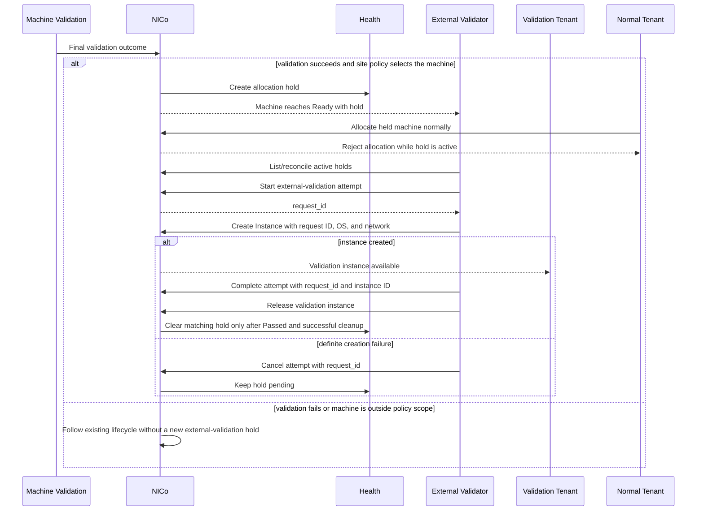
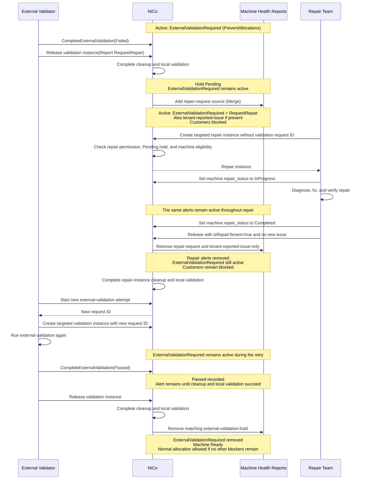

# External Validation Allocation Hold

## Software Design Document

## Revision History

| Version | Date | Modified By | Description |
| :---: | :---: | :---- | :---- |
| 0.1 | 2026-09-18 | Sunil Kumar | Initial draft |
| 0.2 | 2026-09-27 | Sunil Kumar | Add explicit-state alternative reference |
| 0.3 | 2026-09-28 | Sunil Kumar | Define phased delivery, ownership, security, idempotency, and durable recovery |
| 0.4 | 2026-09-29 | Sunil Kumar | Bind validation allocation to the request and define recovery |
| 0.5 | 2026-10-01 | Sunil Kumar | Require successful Machine Validation, reuse Create Instance and tenant authorization, and remove workflow-specific timeouts |
| 0.6 | 2026-10-07 | Sunil Kumar | Clarify shared targeted allocation and repair coexistence with an external-validation hold |

## Table of Contents

- [1. Introduction](#1-introduction)
- [2. Current State](#2-current-state)
- [3. Design](#3-design)
  - [3.1 Site Policy](#31-site-policy)
  - [3.2 Allocation Hold](#32-allocation-hold)
  - [3.3 External Validation Flow](#33-external-validation-flow)
    - [Phase 1 API Contract](#331-phase-1-api-contract)
    - [Instance Release and Recovery Detection](#instance-release-and-recovery-detection)
  - [3.4 Machine Validation Success Gate](#34-machine-validation-success-gate)
  - [3.5 Validation Cycle and Retry](#35-validation-cycle-and-retry)
  - [3.6 Relationship to Breakfix and Repair](#36-relationship-to-breakfix-and-repair)
  - [3.7 Phased Delivery](#37-phased-delivery)
- [4. Security and Compatibility](#4-security-and-compatibility)
- [5. Design Reference: Explicit ExternalValidation State](#5-design-reference-explicit-externalvalidation-state)

# **1. Introduction**

Machine Validation runs local checks through Scout, including site-provided
plugins. Passing those checks establishes local machine health, but some sites
need additional validation before handing the machine to a customer. These
checks may require a custom operating system and drivers, a separate validation
network, coordinated multi-machine tests, or a workflow that runs for days.
They need a tenant instance and an external service to manage the work rather
than only a test running in Scout's environment.

After Machine Validation succeeds, the machine can become `Ready` and a normal
tenant can claim it. The external service has no guaranteed opportunity to
allocate that machine first. NICo therefore needs an allocation gate that
reserves eligible machines for external validation without treating successful
Machine Validation as a failure.

This design lets NICo make a machine `Ready` while keeping it unavailable for
normal allocation until an authorized external validation workflow finishes.
External validation is not a NICo-managed machine state: NICo manages the
allocation hold, normal lifecycle, and audit trail, while the authorized
external-validation tenant claims the `Ready` machine and performs its own
detailed validation or repair work.

## **1.1 Purpose**

The purpose of this document is to define a simple, generic way for a site to
run external validation before a machine is released for normal tenant use.

The requirement is to connect successful local validation with the external
team's instance-based workflow safely. NICo must block normal allocation while
that work is pending, allow the authorized validation service or the existing
repair workflow to claim the machine, and release the gate only after a passing
result and successful cleanup. The gate must survive service restarts and
retries; a missing result must never make the machine available to customers.

The required behavior is:

1. A site can require external validation for eligible machines after Machine
   Validation succeeds.
2. Normal tenants cannot claim a machine while external validation is pending.
3. An authorized validation service can claim the held machine for its own
   validation instance.
4. Only a successful result followed by normal instance cleanup releases the
   machine for normal allocation.

## **1.2 Scope**

This SDD covers:

1. The site policy that selects when a machine needs external validation.
2. The health-based allocation hold created and owned by NICo.
3. The targeted validation-instance workflow for the external service.
4. Completion, retry, and recovery behavior.
5. Integration with successful Machine Validation, normal instance cleanup, and
   the existing breakfix workflow.

This SDD does not cover:

1. The test logic, image, network, or workflow of an external validator.
2. Replacing the existing repair workflow.
3. Allowing ordinary tenants to bypass health or allocation checks.
4. Changing the Machine Validation plugin input/output contract.
5. Escalating failed Machine Validation tests to external validation.

## **1.3 Assumption: External Tenant Allocation**

NICo reuses the existing targeted-allocation internals to allocate a held
machine into the external-validation team's site-controlled tenant. NICo keeps
the machine in `Ready` so this allocation can use the current
workflow; the team then performs its external validation or repair work inside
that tenant's instance. The service uses the existing Create Instance API with
`allowUnhealthyMachine: true` and the proposed `externalValidationRequestId`
field. NICo verifies the request binding before allowing allocation because the
`PreventAllocations` hold remains active until the workflow completes.

# **2. Current State**

NICo already has the building blocks needed for this workflow:

| Capability | Current behavior | Use in this design |
| :--- | :--- | :--- |
| Health `Merge` override | Independent sources can add health alerts. | NICo creates one workflow-owned hold. |
| `PreventAllocations` | Blocks normal instance allocation. | Keeps the machine out of normal tenant allocation. |
| Targeted instance creation | A provider-authorized tenant can request one machine, but the machine must be in the controller's `Ready` state. | Lets the validation service claim the held machine without introducing a new lifecycle state. |
| `allowUnhealthyMachine` | A targeted request can proceed despite health allocation alerts when the machine is otherwise provisionable; it does not allow allocation from another managed state. | Allows the validation service to claim its held machine while the health hold remains in place. |
| Instance release and cleanup | Releasing an instance returns the machine through normal cleanup and validation. | Ensures the validation instance is gone before normal allocation resumes. |
| Machine Validation | Scout runs built-in tests and site-provided plugins. | Local validation must succeed before external validation can begin. |

Today there is no workflow-specific state connecting these capabilities. An
external service can race with normal tenant allocation, and a passing external
result has no fenced, auditable way to release that allocation gate.

In particular, `allowUnhealthyMachine` relaxes health eligibility only. It does
not relax the managed-state requirement: targeted instance creation still starts
from `Ready`, not from `Failed`, `Validation`, or a proposed
`ExternalValidation` state. Keeping the machine `Ready` is intentional: it lets
the authorized external-validation tenant claim the machine through the existing
targeted-instance flow and then perform its detailed validation or repair work.
The `PreventAllocations` health hold blocks normal tenants during that work.

# **3. Design**

Each item below is marked **New** or **Changed**.

| Component | Change |
| :--- | :--- |
| Site policy | **New** — selects the machines that need external validation after Machine Validation succeeds. |
| NICo hold state | **New** — records the allocation hold, validation-cycle state, and active attempt. |
| Health | **Changed** — NICo writes a dedicated `Merge` health override with `PreventAllocations`. |
| External validation API | **New** — lets the configured service list, start, complete, and recover validation attempts. |
| Create Instance API | **Changed** — accepts an optional `externalValidationRequestId` to bind targeted allocation to an active validation attempt. Existing OS and network inputs are reused. |
| Machine Validation | **Changed** — successful validation creates a hold for eligible machines before they become normally allocatable. Test selection and failure behavior are unchanged. |

## **3.1 Site Policy**

The policy is site-scoped. It selects eligible machines using the site's normal
Machine Validation context or machine-group selection. It also defines the
validation tenant, audit destination, and the dedicated health source
and alert ID.

For machines selected by the policy, NICo creates a hold only after Machine
Validation succeeds. Failed tests, framework errors, and timeouts follow the
existing failure path; they do not start external validation. No trigger option
or plugin-specific opt-in is needed.

The following is an illustrative site configuration for every eligible machine:

```toml
[machine_validation_config.external_validation_hold]
enabled = true
contexts = ["Discovery"]
validation_tenant_id = "f97df110-f4de-492e-8849-4a6af68026b0"
health_report_source = "external-validation-hold"
alert_id = "ExternalValidationRequired"
```

The final configuration API must make the selected scope explicit; it must not
enable the policy for every machine by default.
Configuration validation rejects a health source shared with repair,
monitoring, or another workflow; `external-validation-hold` must remain a
separate NICo-owned source.

Only one external-validation policy may match a machine for one validation
cycle. NICo rejects ambiguous configuration at validation time rather than
creating competing holds. `validation_tenant_id` identifies the tenant permitted
to run this workflow. The tenant must not be used for ordinary customer workloads.

`validation_tenant_id` is the REST Tenant UUID used on instances and VPCs, not
an organization name or a newly created tenant for each attempt. A site may
reuse an existing validation tenant. The team retrieves its tenant through
`GET /v2/org/{org}/nico/tenant/current` and uses the returned ID. Site access
and targeted-instance-creation capability must already be enabled through the
normal tenant onboarding workflow. The REST layer resolves that UUID to the
Core tenant organization; Core validates the corresponding organization, not
the REST UUID against a Core organization ID.

There is no separate service-identity setting or alias registration. NICo uses
its existing authentication and tenant-management authorization. Any caller
with the required management permission for the configured tenant and access
to the site may manage its validation attempts; tenant membership alone is not
sufficient. Create Instance retains its existing allocation permissions and
resource checks. A request ID identifies an attempt, not an authorization token.
NICo records the authenticated actor for every mutation in the audit trail.

`contexts` uses Machine Validation's `Discovery`, `Cleanup`, and `OnDemand`
values. It selects where a successful local run can require external
validation; it is not the validation-cycle identifier. The example selects
new-capacity discovery only. A reprovision starts a new cycle, regardless of
which context its local validation uses.

## **3.2 Allocation Hold**

After Machine Validation succeeds for an eligible machine, NICo creates a
workflow-owned health override.
Its logical form is:

```json
{
  "source": "external-validation-hold",
  "mode": "Merge",
  "alerts": [
    {
      "id": "ExternalValidationRequired",
      "classifications": ["PreventAllocations"]
    }
  ]
}
```

`PreventAllocations` makes normal tenant allocation reject the machine. The
machine can still be `Ready`: `Ready` means lifecycle-ready, while the health
alert controls normal allocation eligibility. The dedicated source ensures this
workflow does not replace alerts from monitoring, maintenance, repair, or other
external integrations.

NICo records durable state for every hold and its active attempt. The attempt's
opaque `request_id` fences completion, so an old result cannot release a later
retry.

### **3.2.1 Atomic Gate and Durable State**

Creating a hold is part of making a machine available for the external
workflow. NICo must persist the hold record and its `PreventAllocations` health
override before, or atomically with, the transition that makes the host
`Ready`. A transition must never commit a normally allocatable `Ready` host and
write the hold later. The same transaction also records the validation cycle
and policy that required external validation.

The durable model is conceptually:

```text
ExternalValidationHold
  hold_id
  site_id
  validation_tenant_id
  machine_id
  validation_cycle_id
  policy_id
  state                  // Pending, AttemptOpen, AwaitingCleanup, Satisfied, Recovery
  created_at
  active_attempt_id      // optional

ExternalValidationAttempt
  request_id
  hold_id
  started_by             // authenticated actor for audit, not an ownership restriction
  caller_idempotency_key
  state                  // Open, Passed, Failed, Cancelled
  opened_at
  allocation_state         // NotStarted, Creating, or Created
  allocation_fingerprint   // binds the first accepted Create Instance inputs
  allocation_started_at    // optional; set when allocation is accepted
  validation_instance_id // optional until allocation creates the instance
  result_details         // optional, bounded
```

There is at most one active hold for a machine and validation cycle, and at
most one open attempt for a hold. `hold_id` remains stable for the cycle;
`request_id` changes for every attempt. NICo stores this state independently
of the health override so it can reconcile a missing override and retain the
audit record after clearing it.

NICo enforces these invariants in the database: a partial unique constraint
permits only one `Open` attempt per `hold_id`, and the tuple
`(site_id, validation_tenant_id, caller_idempotency_key)` is unique. Attempt
creation locks the hold and inserts the attempt in the same transaction. These
constraints, rather than client timing, decide which concurrent `Start` call
wins.

There are no external-validation claim, attempt, or cleanup timers. A pending
hold stays pending until claimed or explicitly resolved. An open attempt stays
open until an authorized caller completes or cancels it; it does not expire
automatically. External validation may run for days, including waiting for
peer machines. The external service owns its execution deadline and must
report a result and release the instance.

If the service stops, another authorized caller can resume the same attempt
or cancel it before allocation starts. An accepted or ambiguous allocation
must first be reconciled; it cannot be cancelled to admit a second allocation.
A lost service or missing result leaves the gate active for explicit recovery,
not automatic success. Hold and attempt timestamps support age monitoring.
Existing allocation and instance-cleanup recovery still apply; this design
does not replace their operation timeouts or introduce a separate cleanup
deadline. Instance binding comes from Create Instance, not from guessing
which instance later appeared on the machine.

## **3.3 External Validation Flow**

The external-validation path starts only after Machine Validation succeeds
for a machine selected by the site policy:



The external service does not create or remove the health override. Its Phase 1
workflow is:

1. List and reconcile active external-validation holds. This is the
   authoritative discovery path, including after service restart or missed
   notifications.
2. Call `StartExternalValidation(machine_id, caller_idempotency_key)` for a
   pending hold. NICo opens one attempt and returns an opaque `request_id`; an
   already-open attempt is not opened again.
3. Call the existing Create Instance API with the held `machineId`, configured
   `tenantId`, validation OS and network inputs, `allowUnhealthyMachine: true`,
   and `externalValidationRequestId` set to the returned `request_id`.
4. If NICo definitively rejects allocation before it begins, call
   `CancelExternalValidation` with the `request_id`.
5. Run its own validation or repair work in that instance.
6. Call `CompleteExternalValidation` with the `request_id`, validation instance
   ID, and `Passed`, `Failed`, or `Cancelled` outcome.
7. Release the validation instance for every terminal outcome through the
   existing instance-delete API. NICo clears the matching hold only after
   `Passed` and successful normal cleanup return the machine to `Ready`.

NICo provides these workflow APIs:

| API | Purpose |
| :--- | :--- |
| `ListExternalValidationHolds()` | Returns all active holds and their current attempt status. This is the authoritative discovery and recovery API. |
| `StartExternalValidation(machine_id, caller_idempotency_key)` | Opens an attempt for a pending hold and returns an opaque `request_id`. It reports no active hold or an already-open attempt without creating another one. |
| `CancelExternalValidation(request_id, details)` | Closes an active attempt only before allocation starts. It is idempotent and leaves the hold in place. |
| `CompleteExternalValidation(request_id, outcome, details, validation_instance_id)` | Records a result only for the matching active attempt. An identical completion replay is idempotent; a stale request or conflicting completion is rejected. |
| `RemoveExternalValidationHold(machine_id, reason)` | Audited break-glass recovery; not the normal completion path. |

There is no separate validation-instance creation API. The existing Create
Instance API receives the additive request-binding field described below.

### **3.3.1 Phase 1 API Contract**

Callers of `ListExternalValidationHolds`, `StartExternalValidation`,
`CancelExternalValidation`, and `CompleteExternalValidation` must be authenticated
and authorized to manage validation for the configured tenant at that site.
Another authorized caller in the same tenant may resume an attempt; it is not
restricted to the actor that started it. These callers cannot create, modify,
or clear the NICo health override. `RemoveExternalValidationHold` requires
site-administrator break-glass authority, not ordinary tenant permissions.

All hold and attempt mutations are persisted and auditable. The API responses
below are the external service's durable contract; DSX Exchange events are not
required for Phase 1 correctness.

Phase 1 extends the existing Create Instance API and propagates the request
binding through the REST, workflow, site-agent, and Core allocation layers.
The binding must reach the allocation commit; storing it only in the REST
service after creation is insufficient. Requests without the new field retain
existing behavior for machines without an external-validation hold.

#### **ListExternalValidationHolds**

The service calls this on startup and periodically thereafter. It returns every
active hold in its authorized scope, with pagination for large sites. Each item
includes:

```text
machine_id
hold_id                     // stable for this external-validation cycle
hold_state                  // Pending, AttemptOpen, AwaitingCleanup, or Recovery
request_id                  // present when an attempt is open, awaiting cleanup, or in recovery
allocation_state             // NotStarted, Creating, or Created
validation_instance_id      // present when allocation creates the target instance
created_at
```

The allocation state and `validation_instance_id` are persisted by NICo as
part of the request-scoped allocation workflow. This lets the service recover
after a restart and retry the same request without creating another instance.
The service uses this response to decide whether to start a new attempt or
resume an existing one. It must not infer that every `Ready` machine requires
external validation.

#### **StartExternalValidation**

Request:

```text
machine_id
caller_idempotency_key    // caller-generated UUID, retained across retries
```

NICo verifies the caller's permission for the configured tenant and site, the
machine is in that site, and an active hold exists. Opening a new attempt also
requires the machine to be `Ready`, unassigned, and free of `RequestRepair` or
other blocking alerts apart from this workflow's hold. An ineligible hold
returns `NoActiveHold` without opening an attempt; it remains visible in the
hold list. Idempotent replay of an existing attempt does not require the
machine to still be `Ready`. NICo atomically opens one attempt, generates and
persists an opaque `request_id`, and returns:

```text
status: Opened
request_id
machine_id
hold_id
```

If the caller retries after a timeout or service restart and the attempt is
already open with the same `caller_idempotency_key`, NICo returns the originally
persisted `request_id`; it does not create a second attempt. A different key
while an attempt is open returns `status: AlreadyOpen` with that active request
and its status. If the hold has been cleared or is not eligible, NICo returns
`status: NoActiveHold`. Once a failed or cancelled attempt is
closed and the hold is `Pending`, a subsequent start with a new idempotency key
opens a new attempt with a new `request_id`. Holds in `AwaitingCleanup` or
`Recovery` reject a new start until the prior allocation is resolved.

`Opened`, `AlreadyOpen`, and `NoActiveHold` are API response statuses, not
stored attempt states. `AlreadyOpen` returns the existing attempt; `NoActiveHold`
creates no attempt. Reusing an idempotency key always refers to its original
attempt, including its terminal status; it never opens another attempt.
Reusing a key for a different machine or hold returns a conflict. Authorized
callers in the same site and tenant share this idempotency scope, allowing
recovery without binding attempts to one service credential.

The external service must persist the `caller_idempotency_key` before calling
`StartExternalValidation` and persist the returned `request_id` before creating
the targeted instance. If it crashes between either step, it calls `Start` again
with the same key or uses `ListExternalValidationHolds()` to recover the durable
active `request_id`. NICo never relies on an in-memory request ID.

#### **Existing Create Instance API**

The service uses `POST /v2/org/{org}/nico/instance` with normal instance
configuration and one proposed optional field, `externalValidationRequestId`
(the opaque UUID returned by `StartExternalValidation`). It is required when
allocating a held machine for external validation, together with the exact
`machineId` and configured `tenantId`; automatic machine selection is not
supported for that path. It is omitted for ordinary allocations and existing
targeted repair allocations. Section 3.6 defines when repair may claim a held
machine without this field. Targeted instance creation itself is an existing
capability; the new field only binds an allocation to a validation attempt.

Illustrative request for a subnet-backed validation VPC:

```json
{
  "name": "external-validation-node-01",
  "tenantId": "f97df110-f4de-492e-8849-4a6af68026b0",
  "machineId": "<held-machine-id>",
  "operatingSystemId": "eaeb86ee-c435-444e-9e01-8346f67f194b",
  "vpcId": "34f5c98e-f430-457b-a812-92637d0c6fd0",
  "interfaces": [
    {"subnetId": "b4aa7daa-f66b-4db4-a71a-534a63e76112", "isPhysical": true}
  ],
  "labels": {"purpose": "external-validation"},
  "userData": "#cloud-config\nruncmd:\n  - /opt/validation/start\n",
  "allowUnhealthyMachine": true,
  "externalValidationRequestId": "<request_id-from-StartExternalValidation>"
}
```

The team registers its OS and creates its validation VPC and network through
the existing APIs first. Those resources must be accessible to its tenant at
the selected site. Existing rules apply: `name`, `tenantId`, and `vpcId` are
required; `operatingSystemId` is required unless an iPXE script is supplied;
at least one interface is required unless supported `autoNetwork` mode is used.
FNN networks use the existing VPC-backed interface fields instead of `subnetId`.
Labels and `userData` are optional. Cloud-init overrides require the OS's
`allowOverride` permission and retain the existing effective 32 KiB limit.
NICo does not choose the team's OS or validation network.

Before allocation, NICo validates the authenticated caller, site, tenant,
machine, current hold and cycle, and active `request_id`, alongside existing
resource permissions. The attempt must be `Open` and belong to the current
cycle. NICo rechecks repair and blocking health signals at allocation commit,
not just when the attempt starts. An active hold cannot be bypassed by an
ordinary targeted request, even with `allowUnhealthyMachine: true`; the
explicit repair exception is defined in Section 3.6.
The request authorizes bypass of this workflow's hold only; unrelated blocking
health alerts remain enforced for validation allocation.

NICo atomically records `Creating` and a fingerprint of the accepted instance
inputs before dispatching allocation. The same request ID is the allocation
idempotency key through every layer. Core enforces one allocation per key and
commits the request-to-instance binding with the instance before returning
success. A crash between the allocation commit and REST response cannot leave
an untracked allocation or cause a retry to create another instance.

An identical retry returns the original instance or an explicit in-progress
response while allocation is `Creating`. Reusing the ID with changed creation
inputs returns a conflict. NICo reconciles ambiguous allocation outcomes by
that key; the service must not start a fresh attempt. Only a confirmed
no-allocation outcome can return the attempt to `NotStarted` for cancellation
or a corrected create request. Closed or superseded requests must never create
another instance, even if their prior instance was deleted.

The hold-listing API exposes `allocation_state` and `validation_instance_id`
for recovery. The binding is protected instance metadata, persisted only when
request-bound creation is accepted. A label cannot establish or change it, and
ordinary instances are not automatically adopted into an attempt.

#### **Targeted Instance Caller and Ownership**

The caller of targeted instance creation is an authenticated service or
administrator authorized for the configured validation tenant and site. NICo
does not invoke the external team's validation API on its behalf. The service
calls the existing Create Instance API with `externalValidationRequestId` and
its OS and network inputs. NICo validates the binding to the held machine and
configured tenant before applying the health-hold bypass.
`StartExternalValidation` does not allocate
the machine and does not remove the hold. A definite pre-allocation rejection
can be cancelled immediately. An accepted or ambiguous allocation is recovered
through the same request ID rather than cancelled or replaced by another attempt.

The resulting instance belongs to `validation_tenant_id`; that tenant is the
execution environment for the external team's validation or repair work. The
external-validation service owns the operational lifecycle of that instance:
it waits for it to become usable, runs the work, reports the outcome through
`CompleteExternalValidation`, and releases the instance. NICo owns the host
lifecycle and hold only. On completion, NICo verifies that the supplied
instance is assigned to the held machine and belongs to the configured
validation tenant.

#### **CompleteExternalValidation**

Request:

```text
request_id
validation_instance_id
outcome                     // Passed, Failed, or Cancelled
details                     // bounded diagnostic text and/or result reference
```

NICo verifies that the caller has the required tenant and site permissions,
the request belongs to that scope and is active, has allocation state
`Created`, and that `validation_instance_id` is the targeted instance for the
held machine. A completion with an old request ID, a different tenant, or a
different machine is rejected. Replaying an identical completion is idempotent;
a conflicting second completion is rejected.

`Passed` records the result but does not immediately clear the hold. The
external service must release the validation instance, and NICo clears the hold
only after normal instance cleanup returns the machine to `Ready`. `Failed` or
`Cancelled` likewise requires the service to release any validation instance.
After that cleanup, the hold returns to `Pending` for operator action or a
later retry. If the instance disappears unexpectedly, or cleanup fails, NICo
keeps the hold and enters recovery rather than treating the attempt as success.

`Failed`, `Cancelled`, a missing result, or a failed cleanup leaves the hold in place.
NICo never treats a missing result or a deleted validation instance as success.

#### **Instance Release and Recovery Detection**

NICo owns recovery detection through its existing controller loop, not a
separate service. It checks saved attempts against allocation, instance, and
cleanup state, including after restart. Release and deletion also trigger
checks; missed notifications or an unavailable validator must not stop recovery.

- **Expected release:** After NICo records `Passed`, `Failed`, or `Cancelled`,
  the hold stays `AwaitingCleanup` through instance deletion. NICo retains the
  binding and result until it confirms the assignment is gone and cleanup and
  local validation succeeded. It then moves to `Satisfied` for `Passed`, or
  `Pending` otherwise, subject to Section 3.6. Deletion alone is not success.
- **Unexpected loss:** A confirmed release or deletion of the bound instance
  without a recorded result, an ownership mismatch, or failed cleanup or local
  validation moves the hold to `Recovery`. The hold and binding remain active.
- **Uncertain observation:** A lookup timeout, temporary service failure,
  stale inventory, or `Creating` allocation is not proof of loss. NICo retries
  using the saved allocation key and authoritative site state; another
  allocation remains blocked until the outcome is resolved.

An authorized operator must resolve the allocation and cleanup, then explicitly
close or fence the attempt before returning to `Pending`. Unconfirmed cleanup
keeps the hold in `Recovery`; it never expires into success. Hold removal uses
the administrator-only break-glass rules in Section 4.

#### **CancelExternalValidation**

Request:

```text
request_id
details                     // bounded reason for pre-allocation cancellation
```

This API represents a definite targeted-instance creation failure before a
`validation_instance_id` exists. NICo verifies that the request is active,
belongs to the configured tenant and site that the caller is authorized to
manage, and has allocation state `NotStarted`. It atomically records
`Cancelled`, closes the attempt, and keeps the hold in `Pending`. Replaying the
same cancellation is idempotent; an old request, an unauthorized caller, or an
attempt in `Creating` or `Created` is rejected.

The service must not use this API after an ambiguous create result. It retries
the existing Create Instance API with the same request ID and inputs, or reads
the hold's allocation state, so it cannot cancel an attempt that may already
own a machine.

## **3.4 Machine Validation Success Gate**

External validation is an additional check after successful Machine Validation,
not a replacement for failed local tests. Built-in tests and plugins retain
their existing selection, execution, and result handling. A failed test,
framework error, or timeout follows the normal Machine Validation failure path;
an external result cannot override it.

Releasing the validation instance still runs normal cleanup and Machine
Validation. NICo clears the hold only when the external result is `Passed` and
that lifecycle succeeds. A failed post-release Machine Validation run keeps
the hold in place for recovery. There are no plugin waivers or skipped tests.
An active repair request or another blocking health alert also prevents normal
allocation; a passing external result does not clear those independent sources.

## **3.5 Validation Cycle and Retry**

NICo ties the hold to the machine's pre-allocation validation cycle. A cycle
starts for a new discovery or reprovisioning lifecycle.

The Machine Validation run caused by releasing the validation instance reuses
the existing hold for that cycle; it does not create another one. After a
passing external result and successful validation-instance cleanup, NICo clears
the matching hold and marks the cycle satisfied. Later local validation in
that cycle does not require another external attempt. A new discovery or
reprovisioning cycle may require external validation again.

A pending hold is not silently replaced when a new discovery or reprovisioning
cycle starts. NICo fences the old attempt and keeps the gate active until any
old allocation and cleanup are resolved. It records the old cycle as
no longer eligible before evaluating the new cycle's successful Machine
Validation against the policy. If the machine is no longer in scope, only NICo can clear
the old gate after confirming no unresolved validation allocation remains.
Normal release of a validation instance stays within the original cycle; a
different `Cleanup` context alone does not start another cycle.

The hold and attempt lifecycle is:

```text
Pending
  → AttemptOpen
  → AwaitingCleanup
      → Satisfied    (Passed result and successful instance cleanup)
      → Pending      (Failed or Cancelled result and successful cleanup)

AttemptOpen → Pending       (Cancelled before validation-instance creation)
AttemptOpen → Recovery      (allocation outcome cannot be reconciled or instance is lost)
AwaitingCleanup → Recovery  (ownership mismatch, cleanup failure, or post-release MV failure)
```

Expected deletion after a recorded result stays in `AwaitingCleanup` until
NICo confirms the cleanup outcome, as defined in Section 3.3.1.
If repair was requested during that attempt, successful cleanup returns the
hold to `Pending` even after `Passed`; Section 3.6 requires validation after repair.

Only one validation instance can claim an active attempt. Completion is
idempotent for the same `request_id`, instance ID, and result. A retry starts a
new attempt with a new `request_id`, so older results cannot affect it. NICo
does not open a retry while the previous attempt is in `AwaitingCleanup` or
`Recovery`.

## **3.6 Relationship to Breakfix and Repair**

Breakfix and external validation share the existing targeted Create Instance
API. Both allocate an exact machine into a privileged tenant with that team's
OS and network: repair fixes a reported issue, while external validation checks
the machine before customer allocation.

| Detail | Existing breakfix / full repair | Proposed external validation |
| :--- | :--- | :--- |
| Allocation | Existing Create Instance with `machineId` and, when needed, `allowUnhealthyMachine: true`. | The same API, with an active `externalValidationRequestId`. |
| Completion | Set the machine's `repair_status`, then release with `isRepairTenant: true`. | Report `Passed`, `Failed`, or `Cancelled`, then release. |
| Health ownership | Repair handling changes repair sources only. | NICo clears the external hold only after `Passed`, successful cleanup, and local validation. |

The existing [Repair Tenant Workflow](../../docs/manuals/repair/repair_tenant_workflow.md)
and [Repair System Integration](../../docs/manuals/repair/repair_integration.md)
remain the repair contracts. Online repair is different: it keeps an existing
instance assigned and does not create another targeted instance.

### **Repair admission while a hold is active**

These checks are new only for held machines; targeted repair already exists.
NICo permits repair without `externalValidationRequestId` only when:

1. The caller has instance-creation permission for the tenant and site, and
   that tenant has effective targeted-instance-creation capability there.
2. The machine has an authorized `repair-request` override with `RequestRepair`;
   caller-supplied labels or descriptions are not proof.
3. The hold is `Pending`, with no open attempt or unresolved allocation or
   cleanup. Cancel pre-allocation attempts and resolve ambiguous outcomes first.
4. The machine is controller-`Ready`, unassigned, and provisionable. Existing
   ownership, maintenance, and controller checks still apply.

REST and Core serialize repair and validation admission against the same
machine and hold through allocation commit. An invalid request ID is rejected,
not treated as repair. Repair instances use the normal instance record and are
never adopted into validation attempts. The hold stays `Pending` and active
through repair assignment and cleanup.

This reuses the existing targeted capability, not a new repair-only role or
tenant setting. Grant it only to trusted operational tenants. `isRepairTenant`
is a release flag, not create-time authorization.

NICo blocks new validation attempts and allocation while `RequestRepair` is
active; client filtering is not enough. If repair is requested during an
attempt or its cleanup, NICo durably prevents that attempt from satisfying the
hold, even with `Passed`. Complete or cancel it and release any instance first;
successful cleanup returns the hold to `Pending` for repair and fresh validation.

**Successful repair does not remove `ExternalValidationRequired`.** Repair
release removes `repair-request` and, for `Completed` with no new issue,
`tenant-reported-issue`. Failed or incomplete repair also removes the repair
request, but retains or applies a blocking issue. These independent `Merge`
sources never remove the external hold. Retry validation only after repair
cleanup and local validation succeed
and other blocking alerts are cleared; removing `RequestRepair` alone is not
proof of success.

### **Example: validation fails, repair runs, then validation retries**

The diagram shows the successful repair-and-retry path. Every normal customer
allocation remains blocked until the final hold removal. These stages belong
to the same validation cycle; repair and retry do not create a new hold.
The notes name the active workflow alerts. Other health alerts may also exist
and are not removed by this workflow. `tenant-reported-issue` is present only
if an issue was reported; a `Failed` validation result does not add it or
`RequestRepair` automatically.



## **3.7 Phased Delivery**

| Phase | New implementation | Reused behavior | Outcome |
| :--- | :--- | :--- | :--- |
| Phase 1 | Site policy, durable hold and attempt records, external-validation APIs, request binding, and hold-aware repair admission. | Health override, existing OS/network inputs, targeted allocation, repair workflow, instance lifecycle, and Machine Validation. | Complete, recoverable external-validation workflow. |
| Phase 2 | External-validation hold metadata in DSX Exchange `Ready` events. | Phase 1 reconciliation API and state-change publishing. | Faster common path; correctness still comes from Phase 1 APIs. |

### **Phase 1: API-driven workflow**

Phase 1 delivers the complete, correct external-validation workflow without a
new DSX Exchange event contract. NICo creates and owns the
`PreventAllocations` hold after successful Machine Validation for an eligible
machine, before making it `Ready`. The site-controlled external-validation
service uses
`ListExternalValidationHolds()` to discover and reconcile pending work, then
uses `StartExternalValidation(machine_id, caller_idempotency_key)` to obtain a
`request_id`. It creates the validation instance through the existing Create
Instance API, supplying its OS and network inputs, `allowUnhealthyMachine: true`,
and `externalValidationRequestId`.

With the returned tenant instance, the service performs its validation or
repair work and calls `CompleteExternalValidation()` with the same `request_id`.
NICo retains the hold until a passing result and normal instance cleanup have
both completed. API-based discovery is mandatory in this phase: it lets the service
recover after restart and remains correct even if it has not observed a machine
state notification.

### **Phase 2: DSX Exchange event enrichment**

Phase 2 improves the common event-driven path but does not replace Phase 1
reconciliation. NICo already publishes managed-host state changes to the DSX
Exchange MQTT topic. The current payload contains the machine ID, timestamp,
and managed state only. This phase adds optional external-validation-hold
metadata to the `Ready` event, for example whether a hold is active and a
stable hold/cycle identifier.

The external-validation service can then ignore ordinary `Ready` events without
an API lookup and start work promptly when the event carries an active hold.
Implementing this phase requires an AsyncAPI contract update and matching NICo
state-change publisher and periodic-republisher changes. `ListExternalValidationHolds()`
remains the source of truth for service startup, missed events, and
out-of-order delivery.

Before external teams integrate, Phase 1 must publish the reviewed protobuf and
OpenAPI contracts for the workflow APIs and the additive Create Instance field.
Those contracts must specify pagination, authentication and tenant permissions,
response and error schemas, in-progress allocation responses, idempotent replay,
and conflict handling. The examples here are a proposed design, not an available
API specification or a delivery-date commitment.

# **4. Security and Compatibility**

- Only NICo creates, reconciles, and normally clears this hold.
- The validation service cannot remove a hold. Administrator-only break-glass
  removal requires a reason and audit record; any open attempt must be fenced
  and its instance release and cleanup resolved before normal allocation resumes.
- The site configures a validation tenant. Only authenticated callers with the
  required tenant and site permissions can allocate for or manage its validation
  attempts. Normal tenants cannot use this workflow.
- The initial design uses `allowUnhealthyMachine`. Because existing targeted
  allocation can bypass health allocation alerts broadly, validation uses a
  dedicated, site-controlled tenant and authorized callers, never a normal
  tenant. Trusted repair tenants retain their existing targeted capability.
  Create Instance verifies the active hold and request binding
  before permitting the validation allocation. A request without that binding
  can claim a held machine only through the authorized repair exception in
  Section 3.6; `allowUnhealthyMachine` alone is insufficient. Existing
  authentication, organization membership, role, and resource checks remain
  required.
- A completion request must match the active `request_id` and validation
  instance ID, and all creation, claim, completion, cancellation, retry, and recovery
  actions are auditable.
- Hold creation and the transition to a held `Ready` machine are atomic, so a
  normal tenant cannot allocate the machine in a gap before the health gate is
  present.
- Existing Machine Validation tests and the repair workflow keep their current
  behavior unless a site explicitly enables this policy. The design does not
  change the Machine Validation plugin contract or normal tenant allocation.

# **5. Design Reference: Explicit `ExternalValidation` State**

A dedicated `ExternalValidation` state was considered as an alternative to
returning a host to `Ready` with a `PreventAllocations` allocation hold. It is
a valid future lifecycle model:

```text
Validation / ExternalValidation / WaitingForClaim
  → Assigned / ExternalValidationInstanceRunning
  → Validation / ExternalValidation / AwaitingResult
  → Ready
```

This model has a clear ownership boundary: NICo keeps the host in validation
until the external workflow has completed, so normal tenant allocation is never
admitted merely because the host is lifecycle-ready.

It cannot, however, remain in `ExternalValidation` for the whole workflow. The
external validator runs through targeted instance creation using a
site-controlled tenant. That is still a normal NICo-managed instance
allocation; while that instance exists, the host must use the existing
`Assigned` lifecycle for network configuration, boot, instance cleanup, and
release.

Using this alternative would therefore require a separate, cross-cutting
allocation and lifecycle implementation:

1. **Allocation from validation.** Current targeted allocation, including
   `allowUnhealthyMachine`, admits a host only when its managed state is
   `Ready`. The alternative needs a narrowly authorized allocation route from
   `Validation / ExternalValidation / WaitingForClaim`; ordinary tenants must
   remain rejected.

2. **Atomic claim and assignment.** That route must atomically verify the
   validation tenant, site, machine, and active external-validation request,
   create exactly one instance, record its claim, and move the host into
   `Assigned / ExternalValidationInstanceRunning`.

3. **Context across `Assigned`.** The request identity and external-validation
   context must survive the existing `Assigned` lifecycle so that instance
   deletion can resume the correct validation operation.

4. **Non-standard release.** Normal instance release converges toward
   `Ready`. The alternative must instead return the host to
   `Validation / ExternalValidation / AwaitingResult`, where NICo accepts a
   matching result and chooses `Ready`, retry, or `Failed`.

5. **Recovery and policy changes.** Controller restart recovery,
   instance-delete recovery, timeouts, RBAC, audit, and observability must all
   understand this validation-to-assignment path.

The explicit-state model is therefore architecturally sound, but it is broader
than required for the initial use case. The selected allocation-hold design
reuses the existing targeted-instance and `Assigned` lifecycle. NICo creates
the hold before normal allocation can proceed, keeps ordinary tenants blocked,
and permits the configured validation tenant to claim it with the request-bound
Create Instance API, or an authorized repair allocation under Section 3.6.
Neither path removes the hold merely by allocating the machine. A future
implementation can adopt the explicit-state model if external validation
becomes a first-class lifecycle capability.
