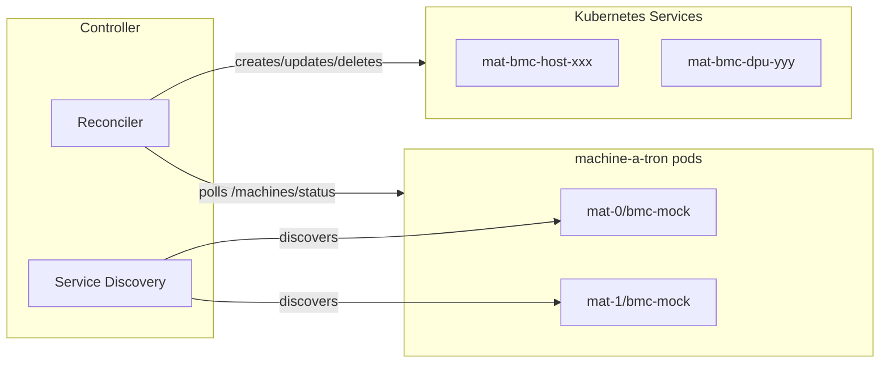

# Machine-a-tron Kubernetes Controller

Kubernetes controller that auto-discovers machine-a-tron pods and creates
Services for mock BMC endpoints.

## Features

- Auto-discovers machine-a-tron pods via `nvidia-infra-controller/mat-service=true`
  label
- Creates ClusterIP Services with BMC IP for each mock BMC
- Supports Redfish (TCP 443) and IPMI (UDP 623) ports
- IPMI ports are dynamically added when machine-a-tron reports `bmc.ipmi` in status
- Multi-pod deployments with pod-specific routing
- Automatic cleanup of stale Services

## Build

```bash
docker build -t mat-k8s-controller:latest .
kind load docker-image mat-k8s-controller:latest --name <cluster>
```

## Configuration

| Flag | Env Var | Default | Description |
|------|---------|---------|-------------|
| `--namespace` | `NAMESPACE` | `nico-system` | Kubernetes namespace |
| `--discovery-selector` | `DISCOVERY_SELECTOR` | `nvidia-infra-controller/mat-service=true` | Label selector for discovery |
| `--sync-interval` | `SYNC_INTERVAL` | `30s` | Reconciliation interval |
| `--target-selector` | `TARGET_SELECTOR` | `app.kubernetes.io/name=nico-machine-a-tron` | Pod selector for Services |
| `--insecure-skip-verify` | `INSECURE_SKIP_VERIFY` | `false` | Skip TLS verification (dev only) |
| `--log-level` | `LOG_LEVEL` | `info` | Log level |
| `--kubeconfig` | `KUBECONFIG` | (empty) | Path to kubeconfig (dev only, uses in-cluster config if empty) |

### Owner References

The controller automatically sets an ownerReference on each created Service,
pointing to the machine-a-tron Deployment that the Service routes traffic to.
This enables Kubernetes garbage collection - when a machine-a-tron Deployment
is deleted (e.g., when a pod is removed from Helm values or the release is
uninstalled), the Services routing to it are automatically cleaned up.

The owner Deployment is derived from the discovered Service name by stripping
the `-bmc-mock` suffix (e.g., `nico-machine-a-tron-mat-0-bmc-mock` →
`nico-machine-a-tron-mat-0`).

### Port Discovery

The controller automatically derives the bmc-mock API port from the discovered
Kubernetes Service. It looks for a port named `redfish` or `bmc-mock` in the
Service spec, falling back to the first available port. This eliminates the
need for manual port configuration and ensures the controller always uses the
correct port defined in the Service.

## Helm Deployment

Enable in parent chart:

```yaml
mat-k8s-controller:
  enabled: true
  image:
    pullPolicy: Never  # For local images
  config:
    insecureSkipVerify: true  # Only for dev with self-signed certs
```

## Service Structure

Created Services have:

**Labels:**

- `app.kubernetes.io/managed-by: mat-k8s-controller`
- `nvidia-infra-controller/mat-id: <uuid>`
- `nvidia-infra-controller/mat-machine-type: host|dpu`
- `nvidia-infra-controller/pod-name: <pod>` (multi-pod)

**Annotations:**

- `nvidia-infra-controller/mat-bmc-ip`
- `nvidia-infra-controller/mat-api-state`
- `nvidia-infra-controller/mat-power-state`
- `nvidia-infra-controller/mat-hardware-type`
- `nvidia-infra-controller/mat-ipmi-listen-port` (when `bmc.ipmi` reported in status)

**Ports:**

- `redfish` (TCP) - Always present for Redfish API access
- `ipmi` (UDP) - Present only when machine-a-tron reports `bmc.ipmi` in status

## Development

```bash
make build
make test
make run KUBECONFIG="$HOME/.kube/config"
```

## Troubleshooting

### ClusterIP already allocated

BMC IP is outside ServiceCIDR or already in use.

**Solutions:**

1. Reserve a ServiceCIDR for machine-a-tron (K8s 1.29+)
2. Use a CIDR within the cluster's ServiceCIDR
3. Delete conflicting Services

### ClusterIP change detected

BMC IP changed but ClusterIP is immutable. Controller will delete and recreate
the Service.

## Architecture


