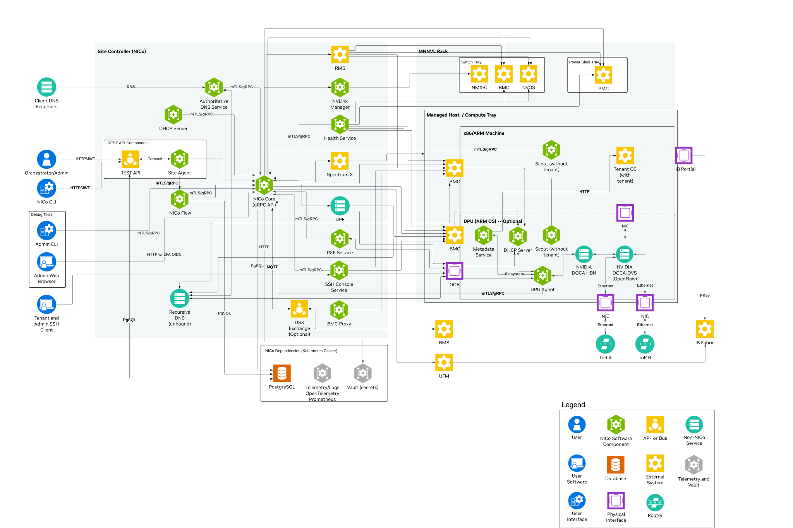
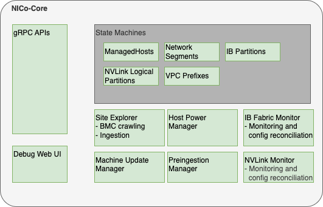

# Architecture

This page discusses the high-level architecture of a site running NVIDIA Infra Controller (NICo).

NICo orchestrates the lifecycle of ["Managed Hosts"](#managed-hosts) and other resources via a set of cooperating control plane services. These control plane services have to be deployed to a Kubernetes cluster with a size of at least 3 nodes (for high availability).

The Kubernetes cluster needs to have a variety of services deployed:

1. [The NICo control plane services](#nico-control-plane-services). These services are specific to NICo, and must be deployed together in order to allow NICo to manage the lifecycle of hosts.
1. [Dependency services](#dependency-services). NICo requires "off-the-shelf" dependencies like PostgreSQL, Vault and telemetry services deployed and accessible.
1. [Optional services](#optional-services). NICo Core components that can be disabled when their capabilities are not required.

The following chapters look at each of these in more detail.

## Managed Hosts

A "Managed Host" is a host whose lifecycle is managed by NICo.

The managed host consists of various internal components that are all part of the same chassis or tray:

- The actual x86 or ARM host, with an arbitrary amount of GPUs
- Zero or more DPUs (of type BlueField-2 or BlueField-3) plugged into the host
- The BMC that is used to manage the host
- The BMC that is used to manage the DPU (if present)

NICo deploys a set of binaries on these hosts during various points of their lifecycle, defined in the subsections that follow.

### Scout

[scout](https://github.com/NVIDIA/infra-controller/blob/main/crates/scout) is an agent that NICo runs on the host and DPU of managed hosts for a variety of tasks:

- "Inventory" collection: Scout collects and transmits hardware properties of the host to [NICo core](#nico-core) which can not be determined through out-of-band tooling.
- Execution of cleanup tasks whenever the bare-metal instance using the host is released by a user
- Execution of machine validation tests
- Periodic health checks

### DPU Agent

[dpu-agent](https://github.com/NVIDIA/infra-controller/blob/main/crates/agent) is an agent that NICo runs exclusively on DPUs managed by NICo as a daemon.

DPU agent performs the following tasks:

- Configuring the DPU as required at any state during the host’s lifecycle. This process is described more in depth in [DPU configuration](../dpu-management/dpu_configuration.md).
- Executing periodic health-checks on the DPU
- Running the NICo metadata service (FMDS), which provides the users on the bare-metal instance an HTTP-based API to retrieve information about their running instance. Users can, for example, use FMDS to determine their Machine ID or certain boot/OS information.
- Enabling auto-updates of the dpu-agent itself
- Deploying hotfixes for the DPU OS. These hotfixes reduce the need to perform a full DPU OS reinstallation, and thereby avoid bare-metal instances becoming unavailable for their users due to OS updates.

### DHCP Server

NICo runs a [custom DHCP server](https://github.com/NVIDIA/infra-controller/blob/main/crates/dhcp-server) on the DPU, which handles all DHCP requests of the actual host. This means DHCP requests on the host's primary networking interfaces will never leave the DPU and show up on the underlay network, which provides enhanced security and reliability. The DHCP server is configured by dpu-agent.

## NICo Control plane services

The NICo control plane consists of a number of services which work together to orchestrate the lifecycle of a managed host:

- [nico-core](https://github.com/NVIDIA/infra-controller/blob/main/crates/api): The NICo core service is the entrypoint into the control plane. It provides a [gRPC](https://grpc.io) API that all other components as well as users (site providers/tenants/site administrators) interact with, as well as implements the lifecycle management of all NICo-managed resources (VPCs, prefixes, InfiniBand and NVLink partitions and bare-metal instances). The [NICo Core](#nico-core) section describes it further in detail.
- [nico-dhcp (DHCP)](https://github.com/NVIDIA/infra-controller/blob/main/crates/dhcp): The DHCP server responds to DHCP requests for all devices on underlay networks. This includes Host BMCs, DPU BMCs and DPU OOB addresses. nico-dhcp can be thought of as a stateless proxy: It does not actually perform any IP address management - it just converts DHCP requests into gRPC format and forwards the gRPC-based DHCP requests to nico core.
- [nico-pxe (iPXE)](https://github.com/NVIDIA/infra-controller/blob/main/crates/pxe): The PXE server provides boot artifacts like iPXE scripts, iPXE user-data and OS images to managed hosts at boot time over HTTP. It determines which OS data to provide for a specific host by requesting the respective data from nico core - therefore the PXE server is also stateless.

  Managed hosts are configured to always boot from PXE. If a local bootable device is found, the host will boot it. Hosts can also be configured to always boot from a particular image for stateless configurations.

- [nico-hw-health (Hardware health)](https://github.com/NVIDIA/infra-controller/blob/main/crates/health): This service scrapes all host and DPU BMCs known by NICo for system health information. It extracts measurements like fan speeds, temperatures and leak indicators. These measurements are emitted as Prometheus metrics on a `/metrics` endpoint on port 9009. In addition to that, the service calls the nico-core API `RecordHardwareHealthReport` to set health alerts based on issues identified within the metrics. These alerts are merged within nico-core into the aggregated-host-health - which is emitted in overall health metrics and used to decide whether hosts are usable as bare-metal instances for tenants.
- [ssh-console](https://github.com/NVIDIA/infra-controller/blob/main/crates/ssh-console): The SSH console provides bare-metal tenants and site administrators virtual serial console access to hosts managed by NICo. The ssh-console service also sends the output of each host's serial console to the logging system (Loki), from where it can be queried using Grafana and logcli. In order to provide this functionality, the ssh-console service *continuously* connects to all host BMCs. The ssh-console service only forwards logs to users ("bare-metal tenants") if they connect to the service and get authenticated.
- [nico-dns (DNS)](https://github.com/NVIDIA/infra-controller/blob/main/crates/dns): Domain name service (DNS) functionality is handled by two services. The `nico-dns` service is authoritative for delegated zones. The Unbound recursive resolver handles all DNS queries from managed machines, forwarding requests for NICo-managed zones to `nico-dns` and resolving other names recursively.

## NICo Core

NICo core is the binary which provides the most essential services within the NICo control plane. It provides a [gRPC](https://grpc.io) API that all other components as well as users (site providers/tenants/site administrators) interact with, as well as implements the lifecycle management of all NICo-managed resources (VPCs, prefixes, InfiniBand and NVLink partitions and bare-metal instances).

NICo core can be considered as a "collection of independent components that are deployed within the same binary". These components are shown in the following diagram, and are described further below.

NICo core is the only component within NICo which interacts with the PostgreSQL database. This simplifies the rollout of database migrations throughout the product lifecycle.

{/* Source drawio file at ../static/nico-core.drawio */}

## NICo Core Components

### [gRPC](https://grpc.io) API handlers

The API handlers accept gRPC requests from NICo users and internal system components. They provide users the ability to inspect the current state of the system, and modify the desired state of various components (such as creating or reconfiguring bare-metal instances).

API handlers are all implemented within the trait/interface `rpc::nico::nico_server::NICo`. Various implementations delegate to the `handlers` subdirectory. For resources managed by NICo, API handlers do not directly change the actual state of the resources (such as the provisioning state of a host). Instead, they only change the required state (for example, "provisioning required" or "termination required"). The state changes will be performed by state machines (details below). The nico-core gRPC API supports [gRPC reflection](https://github.com/grpc/grpc/blob/master/doc/server-reflection.md) to provide a machine-readable API description so clients can auto-generate code and RPC functions in the client.

### Debug Web UI

NICo core provides a debug UI under the `/admin` endpoint. The debug UI allows you to inspect the state of all resources managed by NICo via a variety of HTML pages. For example, you can list details about all managed hosts and DPUs, or about the internal state of other components that are described in [NICo Core](#nico-core).

The Debug UI also provides access to various admin-level tools. For example, the Debug UI allows you to:

- Change the power state of hosts, reset the BMC, and change boot orders
- Inspect the Redfish tree of any BMC managed by NICo
- Perform changes to a BMC (via HTTP POST) in a peer-reviewed and auditable manner
- Inspect UFM responses

### State Machines

NICo implements State Machines for all resources managed by NICo. The state machines are implemented as idempotent state-handling function calls, which are scheduled by the system. State handling for various resource types is implemented independently. For example, the lifecycle of hosts is managed by different tasks and different code than the lifecycle of InfiniBand partitions.

NICo implements state machines for:

- Managed hosts (hosts + DPUs)
- Network segments
- InfiniBand partitions
- NVLink logical partitions

Read more about the NICo [state handling implementation](state_handling.md).

### Site Explorer

Site Explorer is a background module within the `nico-api` binary that continuously monitors the state of all BMCs detected on the underlay network. Its implementation lives in the separate `crates/site-explorer` crate to keep the `crates/api` crate smaller, but it is still started and run as part of NICo Core.

The process acts as a "crawler". It continuously tries to perform Redfish requests against all IPs on the underlay network that were provided by NICo Core and records information that NICo needs to manage hosts later. The information collected by NICo includes:

- Serial numbers
- Certain inventory data, such as the amount, type and serial numbers of DPUs
- Power state
- Configuration data, such as boot order and lockdown mode
- Firmware versions

NICo users can inspect the data that Site Explorer discovers using the `FindExploredEndpoints` APIs as well as using the NICo Debug Web UI.

Site Explorer requires an "Expected Machines" manifest to be deployed. Expected Machines describes the set of Machines that is expected to be managed by the NICo instance - it encodes BMC MAC addresses, hardware default passwords and other details of these Machines. The manifest can be updated using a set of APIs, e.g. `ReplaceAllExpectedMachines`.

Beyond the basic BMC data collection, Site Explorer also performs the following tasks:

1. It matches hosts with associated DPUs based on the Redfish reports of both components - e.g. both the host and DPU need to reference the same DPU serial number.
1. It kickstarts the ingestion process of the host once the host is in an "ingestable" state (all components are found and have up-to-date firmware versions).

Site Explorer emits metrics with the prefix `nico_endpoint_exploration_` and `nico_site_explorer_`.

### Preingestion Manager

Preingestion Manager is a background module within the `nico-api` binary. Its implementation lives in the separate `crates/preingestion-manager` crate to keep the `crates/api` crate smaller, but it is still started and run as part of NICo Core.

Preingestion Manager updates hosts that are below the minimum firmware version required for ingestion. Usually firmware updates to hosts are deployed within the main machine lifecycle, as managed by the ManagedHost state machine.

In some rare cases - e.g. with very old host or DPU BMCs - the host ingestion process can't be started yet because the BMC does not provide the necessary information to map the host to DPUs. In this case the firmware needs to be updated before ingestion, and Preingestion Manager performs this task. It also drives pre-ingestion reset flows and DPU BFB recovery/copy flows that must complete before normal ingestion can proceed.

### Machine Update Manager

Machine Update Manager is a scheduler for Host and DPU firmware updates. It selects Machines with outdated software versions for automated updates.

Machine Update Manager looks at various criteria to determine whether a Machine should get updated:

- The current Machine state: for example, whether it is occupied by a tenant. Only Machines in the `Ready` state are selected for automated software updates.
- Whether the Machine is healthy: no health alerts recorded on the Machine.
- How many Machines are already updating, and the overall amount of healthy hosts in the Machine. Machine Update Manager never updates all Machines at once, and will not schedule additional updates in case the temporary loss of Machines would move the site under the Machine health SLA.

Machine Update Manager does not perform the actual updates - it only performs scheduling/selection. The updates are instead applied within the ManagedHost state machine. This approach is chosen in order to assure that only a single component (managedhost state machine) is managing a host’s lifecycle at any point in time.

Machine Update Manager is an optional component and can be disabled.

### Host Power Manager

Host Power Manager is a component which orchestrates power actions against BMCs.

### IB (InfiniBand) Fabric Monitor

InfiniBand fabric monitor is a periodic process within NICo that performs all interactions with the InfiniBand fabric using UFM APIs.

In each run, IBFabricMonitor performs the following tasks:

- Checks the health of the fabric manager (UFM) by performing API calls
- Checks whether all security configurations for multitenancy are applied on UFM and emits alerts in case of inappropriate settings
- Fetches the actually applied InfiniBand partitioning information for each InfiniBand port on each host managed by NICo and stores it in NICo. The data can be inspected in the `Machine::ib_status` field in the gRPC API.
- Calls UFM APIs to bind ports (guids) to partitions (pkeys) according to the configuration of each host. This happens continuously based on comparing the expected InfiniBand configuration of a host (whether it is used by a tenant or not, and how the tenant configured the InfiniBand interfaces) with the actually applied configuration (determined in the last step).

InfiniBand Fabric Monitor is an optional component. It only needs to be enabled in the case NICo-managed InfiniBand is required.

IB Fabric Monitor emits metrics with prefix `nico_ib_monitor_`.

### NVLink Manager

NVLink Manager is a background module within the `nico-api` binary. Its implementation lives in the separate `crates/nvlink-manager` crate to keep the `crates/api` crate smaller, but it is still started and run as part of NICo Core.

Its `NvlPartitionMonitor` reconciles NVLink logical partition desired state with the state reported by NMX-C. In each run, it groups MNNVL-capable machines by chassis, resolves the corresponding NMX-C endpoint, queries GPU, compute-node, and partition state, records `MachineNvLinkStatusObservation` data, and creates, updates, or removes NMX-C partitions as needed.

## Dependency services

In addition to the NICo API server components, several other supporting services run within the K8s site controller nodes.

### K8s Persistent Storage Objects

Some site controller node services require persistent, durable storage to maintain state for their attendant pods. There are three different K8s StatefulSets that run on the controller nodes:

- [Loki](https://grafana.com/oss/loki/) - The loki/loki-0 pod instantiates a single 50GB persistent volume and is used to store logs for the site controller components.
- [Hashicorp Vault](https://www.vaultproject.io/) - Used by Kubernetes for certificate signing requests (CSRs). Vault uses three each (one per K8s control node) of the `data-vault` and `audit-vault` 10GB PVs to protect and distribute the data in the absence of a shared storage solution.
- [PostgreSQL](https://www.postgresql.org/) - Used to store state for any NICo or site controller components that require it including the main "nicodb". There are three 10GB `pgdata` PVs deployed to protect and distribute the data in the absence of a shared storage solution. The `nicodb` database is stored here.

## Optional services

The following NICo Core components can be disabled when their capabilities are not required:

- [Machine Update Manager](#machine-update-manager), which schedules automated Host and DPU firmware updates
- [IB Fabric Monitor](#ib-infiniband-fabric-monitor), which manages InfiniBand fabrics through UFM
