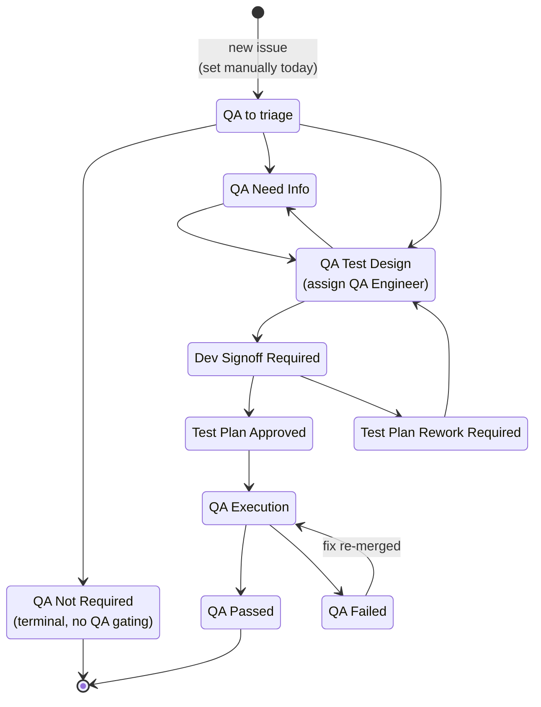

# Release and QA Process

This page describes how the NVIDIA Infra Controller (NICo) project is branched,
versioned, tested, and released. It is intended for both contributors and
operators who want to understand which version of NICo they should be running.

## TL;DR

- Use the latest final `vX.Y.Z` tag for production-style deployments.
- `main`, `-pr`, and `-rc` builds are for prerelease testing.
- Every month, `main` branches to `releases/vX.Y`; after one month of QA,
  that branch becomes the final `vX.Y.0` release.
- Patch releases stay on the same `releases/vX.Y` branch and ship only when
  fixes warrant them.
- NICo keeps three minor releases visible: Current, Maintenance, and EOL.
  Upgrades are supported from EOL to Maintenance or Current, from Maintenance
  to Current, and to newer patches in the same minor. Anything older than EOL
  has no supported upgrade path.
- Guaranteed public APIs stay backward-compatible within a major version.
  Breaking removals require a future major release and at least one full
  three-month roadmap window of notice.

## Where Releases Live

- **GitHub releases:** [https://github.com/NVIDIA/infra-controller/releases](https://github.com/NVIDIA/infra-controller/releases)
- **Issue tracker:** [https://github.com/NVIDIA/infra-controller/issues](https://github.com/NVIDIA/infra-controller/issues)
- **Source:** [https://github.com/NVIDIA/infra-controller](https://github.com/NVIDIA/infra-controller)

Every published minor and patch release is available on the GitHub releases page
above, tagged with its semver version (see [Tag Naming](#tag-naming) below).

## Branches

NICo uses just two long-lived branch types — `main` and per-minor-version
release branches — together with semver tags that distinguish prereleases,
release candidates, and final releases. The `-rc` and `-pr` suffixes are
**tag** suffixes, not branch suffixes.

| Branch              | Purpose                                  | Stability                |
|---------------------|------------------------------------------|--------------------------|
| `main`              | Ongoing development                      | No stability guarantee   |
| `releases/vX.Y`     | Stabilization and release of `vX.Y.*`    | Improves over QA window, becomes stable once a non-`-rc` tag is cut |

### `main` — Ongoing Development

All changes land on `main` first. There is **no expectation of stability** on
`main`; it is not QA tested. The only tests that gate changes to `main` are the
automated tests that run in CI. Features may be incomplete and bugs may be
present at any commit.

Use `main` if you want early access to in-progress features and you accept that
things will sometimes be broken.

### `releases/vX.Y` — Release Branches

When development for a minor version is feature-complete, a new long-lived
release branch (for example, `releases/v2.1`) is cut from `main`. This single
branch holds the entire life of that minor version:

- **During the one-month QA window**, the branch carries `vX.Y.Z-rcN` tags
  as fixes land — these are *release candidates*, not final releases.
- **Once QA signs off**, a final `vX.Y.0` tag is cut on the same branch.
- **After GA**, the branch continues to host patch releases (`vX.Y.1`,
  `vX.Y.2`, …) as they are tagged.

The branch itself never carries an `-rc` suffix — only the tags on it do.
The latest non-`-rc` tag on this branch is what most users should deploy.
See [Tag Naming](#tag-naming) below.

### Tag Naming

NICo uses [semantic versioning](https://semver.org/) of the form `vX.Y.Z`:

- `X` — major version
- `Y` — minor version
- `Z` — patch version

The following tag forms appear in the repository:

- **`vX.Y.0`** — A minor release. Published as a GitHub release from
  `releases/vX.Y`.
- **`vX.Y.Z`** (where `Z > 0`) — A patch release on top of `vX.Y.0`. Also
  published as a GitHub release from `releases/vX.Y`.
- **`vX.Y.Z-rcN`** (e.g. `v2.1.0-rc1`, `v2.1.0-rc2`, `v2.1.5-rc1`) — A
  release candidate. Applied to commits on `releases/vX.Y` during the QA
  window for whichever release is being prepared (initial `.0` or a later
  patch). All four elements — major, minor, patch, and RC number — are
  always present. Patch releases do not get their own branch — they live
  on the same `releases/vX.Y` branch and are distinguished only by the
  tag. So the first release candidate for `v2.1.5` is tagged `v2.1.5-rc1`
  on `releases/v2.1`, and the final tag (once QA signs off) is `v2.1.5`.
- **`vX.Y.Z-pr`** (always with `Z = 0`, e.g. `v2.2.0-pr`) — Applied to
  `main` immediately after a release branch is cut, to indicate that `main`
  is now the **prerelease** for the next minor version. All three numeric
  elements are present for consistency with `-rcN` tags. For example, the
  day `releases/v2.1` is cut, `main` is tagged `v2.2.0-pr`, signaling that
  `main` is now pre-v2.2.0.

## Release Cadence

NICo follows a fixed monthly cadence with a one-month QA window.

We also aim to **avoid releases during major US and international holiday
periods** — including, but not limited to, the late-December/early-January
end-of-year break, US Thanksgiving week, Lunar New Year, and Diwali — out of
respect for the work/life balance of contributors and operators who observe
them. When the published schedule would otherwise land a release inside one
of these windows, the release is rescheduled to the next practical date.

### Three-Month Rolling Roadmap

NICo maintains a three-month rolling roadmap alongside the monthly release
cadence. The roadmap gives contributors, QA, and operators a current view of
the next three planned minor-release cycles, including:

- planned feature themes or notable work targeted for each minor release;
- expected code-complete dates, QA windows, and final release targets;
- known schedule risks, dependency risks, or holiday-window adjustments; and
- items that have moved into or out of a cycle since the previous update.

The roadmap is refreshed at least once per month, typically after the monthly
branch cut and prerelease tag, so it always rolls forward to keep three months
visible. It is planning guidance rather than a release guarantee: features may
move between cycles as priorities change, QA findings emerge, or release dates
are adjusted.

### Minor Releases (`X.Y.0`)

Every month:

1. **Code complete** (last day of each month): a new release branch (e.g.
   `releases/v2.1`) is cut from `main`.
2. Immediately after the cut, `main` is tagged with `vX.(Y+1).0-pr` to mark
   the start of the next prerelease cycle on `main`.
3. The release branch is **stabilized and QA tested for one month**. During
   this window, release-candidate tags (e.g. `v2.1.0-rc1`, `v2.1.0-rc2`, …)
   are applied to commits on the branch as QA cycles through them.
4. **Final minor release** (last day of the following month): when QA signs
   off, a `vX.Y.0` tag is cut on the same `releases/vX.Y` branch and
   published as a GitHub release.

In short: minor releases ship one month after code complete.

### Patch Releases (`X.Y.Z`)

Patch releases happen on the `releases/vX.Y` branch after the corresponding
`vX.Y.0` has shipped. They are cut **as needed** — primarily for critical bug
fixes (data loss, security, production-blocking regressions) or significant
issues that cannot wait for the next minor release. There is no fixed patch
cadence; patches ship when the fixes warrant them.

Patch releases go through their own QA window, scoped to the changes being
shipped. The mechanics are the same as for a minor release but use a
patch-versioned RC tag:

1. Candidate commits are tagged on `releases/vX.Y` as `vX.Y.Z-rcN` (e.g.
   `v2.1.5-rc1`, `v2.1.5-rc2`).
2. QA executes the relevant test plans against the RC tag.
3. Once QA signs off, the final `vX.Y.Z` tag is cut on the same branch.

Note that **patch releases do not get their own branch.** All `v2.1.*` work
lives on `releases/v2.1`; only the tags distinguish a patch RC from the
final patch release. Each final patch release is published on GitHub with
a `vX.Y.Z` tag.

## Which Version Should I Use?

| Goal                                                    | What to run                                                |
|---------------------------------------------------------|------------------------------------------------------------|
| Early access to in-progress features                    | Latest `main`                                              |
| Slightly more stable, willing to help shake out bugs    | Latest `vX.Y.Z-rcN` tag on `releases/vX.Y`                 |
| Most stable, production-style use                       | Latest non-`-rc`, non-`-pr` tag on `releases/vX.Y`         |

Bugs found on a tagged release (`vX.Y.Z` with no `-rc` or `-pr` suffix) are
treated with the highest priority and are tracked as **QA test escapes** —
defects that slipped past the QA window and require a follow-up fix, typically
in the next patch release.

## Support Policy

At any point in time, exactly three minor releases are visible to users, each
in a different support tier. The tiers shift forward by one slot each time a
new minor release passes QA.

| Tier            | Which release      | Bug fixes?                       | Notes                                  |
|-----------------|--------------------|----------------------------------|----------------------------------------|
| **Current**     | The newest GA minor (e.g. `v2.2`) | Yes — normal bar         | Recommended for production deployments. **No new feature work lands here** — new features land in `main` and ship in the next minor release. Small, low-risk improvements may occasionally be backported alongside bug fixes. |
| **Maintenance** | One minor back (`v2.1`)           | Yes, but at a higher bar | Critical fixes and regressions only — not a destination for new feature work |
| **End-of-Life (EOL)** | Two minors back (`v2.0`)    | No                       | Unsupported. No further releases will be cut on this branch |

> **A note on terminology.** The middle tier is called **Maintenance** in this
> document. The user-supplied draft of this policy used the word *deprecated*;
> we use *Maintenance* instead because it's the more standardized industry
> term for "still supported, but on a higher bar for changes" (e.g. Kubernetes
> and PostgreSQL community releases). *Deprecated* in most ecosystems implies
> "scheduled for removal," which is closer to what we mean by **EOL**.

### Tier Transitions

When release `vX.Y` passes QA and becomes Current:

1. The release that was Current (`vX.(Y-1)`) moves to **Maintenance**.
2. The release that was Maintenance (`vX.(Y-2)`) moves to **EOL** and stops
   receiving fixes.
3. The newly Current release (`vX.Y`) begins accepting patch releases under
   the normal bar.

Because the monthly cadence is fixed, each minor release spends roughly
one month as Current, one month as Maintenance, and is then EOL.

### Fix Backporting

NICo uses a four-level severity scheme aligned with common industry practice
(see, for example, the
[Kubernetes patch-release criteria](https://kubernetes.io/releases/patch-releases/#cherry-pick-criteria)
and the [CVSS v3.1 severity ratings](https://nvd.nist.gov/vuln-metrics/cvss)
for security issues):

| Severity     | Definition                                                                                                                                            |
|--------------|-------------------------------------------------------------------------------------------------------------------------------------------------------|
| **Critical** | Data loss or corruption; security vulnerability rated CVSS ≥ 9.0; complete outage of a production system; no workaround available.                    |
| **High**     | Regression from the previous minor release; security vulnerability rated CVSS 7.0–8.9; major feature unusable for a typical user; workaround exists but is impractical. |
| **Medium**   | Functional bug affecting a non-critical workflow; security vulnerability rated CVSS 4.0–6.9; reasonable workaround exists.                            |
| **Low**      | Cosmetic, documentation, log-spam, minor UX, or quality-of-life issues; CVSS < 4.0.                                                                   |

A **change** is anything that is not just a bug fix: new APIs, new fields,
new flags, new dependencies, version bumps of major dependencies, refactors,
performance improvements that are not fixing a regression, etc.

The bars below apply on top of these definitions:

- **Current — "normal bar."** Accepts Critical, High, and Medium bug fixes,
  shipped via patch releases (`vX.Y.Z`). Low-severity fixes are accepted when
  they are low-risk; they may also be deferred to the next minor release.
  **New feature work does not land on Current** — features land in `main`
  and ship in the next minor release. Small, low-risk *changes* (for
  example, a one-line configuration option or a clearer error message) may
  occasionally land alongside fixes when their value clearly outweighs the
  risk of destabilizing a supported release; this is the exception, not the
  rule.
- **Maintenance — "higher bar."** Accepts **Critical and High only**.
  Medium- and Low-severity bug fixes are *not* backported, and no changes
  (in the sense above) are accepted. The intent is to keep Maintenance
  releases as stable and predictable as possible: only fixes that would
  otherwise compel a user to upgrade are backported.
- **EOL** receives no fixes regardless of severity. Users on EOL releases
  should plan an upgrade.

When in doubt about whether a fix clears the Maintenance bar, default to
"no" and link the original fix PR in a comment so the decision is auditable.

### Upgrade and Downgrade Support

| From → To                                  | Supported? |
|--------------------------------------------|------------|
| EOL → Maintenance                          | Yes        |
| EOL → Current                              | Yes        |
| Maintenance → Current                      | Yes        |
| Any → same minor, newer patch              | Yes        |
| Any backward direction (downgrade)         | **No**     |

In other words, you may skip the Maintenance tier when upgrading from EOL
straight to Current, but you may not move backward to an older minor (or to
an older patch within the same minor). If a Current release introduces a
problem that blocks you, the supported recovery is a forward-fix in the next
patch release, not a downgrade.

Downgrade support is being tracked as a potential future capability in
[issue #2019 — *feat: Need to be able to downgrade NICo versions*](https://github.com/NVIDIA/infra-controller/issues/2019);
follow that issue for the latest state.

## QA Workflow

NICo's QA process is tracked entirely in GitHub Issues, using the
[NVIDIA Infra Controller GitHub Project](https://github.com/orgs/NVIDIA/projects/142).
Every issue carries two relevant fields:

- **`Status`** — the overall lifecycle of the issue (dev side).
- **`QA Test Status`** — the QA-side lifecycle.

### Ground Rules

- **Every issue is expected to have a `QA Test Status`.** Even issues that turn
  out to need no testing must be marked `QA Not Required` — there is no
  "unset" outcome. Today this field is set manually; there is no automation
  that initializes it on issue creation.
- **Every PR is expected to have at least one linked issue.** Use GitHub's
  `Fixes #N` / `Closes #N` / `Resolves #N` keywords, or attach the PR to the
  issue from the issue's sidebar. Code changes without a linked issue should
  not merge.
- **QA decides what testing is needed, not engineering.** Engineers should not
  pre-set `QA Not Required` or otherwise short-circuit the QA triage process.
  The QA team owns triage and scoping; engineering owns the fix and the
  test-plan dev signoff.
- **Merging a PR does not close its linked issue(s).** When a PR merges, the
  linked issue should move to `Status: Verify` with `Disposition: Item Completed`
  — meaning the code is complete and the issue is now ready for QA to test.
  Closure happens only after QA passes. This is being automated via
  [PR #2584 — *ci: complete linked issues on merged PRs*](https://github.com/NVIDIA/infra-controller/pull/2584);
  the rest of this document assumes that automation is in place.

### `QA Test Status` Values and Transitions

The `QA Test Status` field walks roughly like this:

1. **`QA to triage`** — Default starting state. QA reviews the issue and
   decides what (if any) testing is required.
2. **`QA Need Info`** — QA needs clarification from the reporter or the
   engineer before they can scope the work. Returns to triage or test design
   once answered.
3. **`QA Not Required`** — Terminal QA state. The issue still proceeds through
   the normal dev workflow (`In Progress` → `Verify | Item Completed` →
   `Closed`); QA simply does not gate it. Used for internal refactors,
   dev-only tooling, doc-only changes, etc.
4. **`QA Test Design`** — QA owns the issue and is writing the test plan. The
   `QA Engineer` field is assigned at this point.
5. **`Dev Signoff Required`** — QA has drafted a test plan and is asking the
   responsible engineer to confirm that it correctly covers the change.
6. **`Test Plan Rework Required`** — Dev pushed back on the test plan. Returns
   to `QA Test Design` for revision.
7. **`Test Plan Approved`** — Dev has signed off. The plan is ready to be
   executed once the fix lands.
8. **`QA Execution`** — QA is actively running the approved test plan,
   typically after the linked PR(s) have merged and the issue has moved to
   `Status: Verify | Item Completed`.
9. **`QA Passed`** — All tests passed. The issue can move to `Status: Closed`.
10. **`QA Failed`** — Tests failed. The issue goes back to engineering for a
    fix; after the fix is merged it returns directly to `QA Execution` (the
    test plan itself does not need to be re-designed unless the failure
    reveals a gap in the plan).

### How `QA Test Status` Relates to Issue `Status`

The two fields move semi-independently:

- While dev is still working, `Status` is `In Progress` and `QA Test Status` is
  typically somewhere in the triage/test-design/signoff portion of its track.
- When the PR merges, the linked issue's `Status` flips to
  `Verify | Item Completed` (via the automation in
  [PR #2584](https://github.com/NVIDIA/infra-controller/pull/2584)), signaling
  to QA that the fix is code-complete and ready to be exercised. `QA Test
  Status` is expected to be `Test Plan Approved` (or already in `QA Execution`)
  by this point.
- Once `QA Test Status` becomes `QA Passed`, the issue's `Status` is moved to
  `Closed` with `Disposition: Item Completed`.
- If `QA Test Status` becomes `QA Failed`, the issue typically moves back to
  `Status: In Progress` so engineering can address the failure.

### Roles

- **Engineer** — writes the fix, links the PR to the issue, reviews the QA
  test plan when asked (`Dev Signoff Required`), and addresses any
  `QA Failed` outcomes.
- **QA Engineer** (set via the `QA Engineer` field, assigned at
  `QA Test Design`) — owns triage, test plan authoring, execution, and the
  final pass/fail call.

## Backward Compatibility

Breaking changes are **not allowed** anywhere in the codebase for anything that
falls under our API guarantees.

### Deprecation and Breaking-Change Notice

Guaranteed public APIs may be deprecated before a future breaking change, but
deprecation is a warning, not removal. A deprecated guaranteed API must remain
functional for the rest of the current major version.

Removal of, or an incompatible behavior change to, a guaranteed public API is
allowed only in a future major release. Any such change must be announced in the
release notes and the three-month rolling roadmap, and should include a
replacement or migration path when one exists.

When practical, deprecated public APIs should also produce an operator-visible
warning, such as an API warning, CLI warning, log message, or release-note
callout.

The minimum notice period for a breaking change to a guaranteed public API is
one full three-month rolling-roadmap window before the first release that removes
or changes it incompatibly. Emergency exceptions for security, data corruption,
or similarly severe issues must be called out explicitly in the release notes.

This notice policy applies only to the guaranteed surfaces below. Internal APIs
and storage formats listed under
[What Is Explicitly *Not* Guaranteed](#what-is-explicitly-not-guaranteed) may
change between releases.

### What Is Guaranteed to Remain Backward Compatible

- The **NICo REST API**.
- The **NICo CLI** (`nicocli`) — command names, arguments, flags, values, and
  exit codes.
- **Configuration file structures** — keys, values, filenames, and locations.
- **Environment variable names and values** consumed by NICo components.

If you depend on any of the above, you can rely on them not changing
incompatibly within and across releases.

### What Is Explicitly *Not* Guaranteed

The following are considered internal and may change without notice between
releases:

- The **gRPC API** and protobuf message contents.
- The **admin CLI** (also referred to as the *debug CLI*) — a lower-level tool
  intended for operators and developers, not end users.
- The **admin UI** (also referred to as the *debug UI*) — same audience as the
  admin CLI.
- The **Vault data model** — how secrets are laid out inside HashiCorp Vault.
- The **PostgreSQL database schema** used by NICo services. See
  [issue #2019](https://github.com/NVIDIA/infra-controller/issues/2019) for
  the current state of this guarantee (tracked alongside downgrade support,
  which depends on it).
- Any other internal API contract between NICo services, or persistent data
  formats used only by NICo itself.

If you build automation that depends on any of the unguaranteed items above,
expect to update it across NICo releases.

## Glossary

A few terms used on this page that may not be obvious:

- **Code complete** — the point in the cycle at which feature work for a minor
  version stops and stabilization begins. On this date, the release branch is
  cut from `main`.
- **Release candidate (rc)** — a tagged build on a `releases/vX.Y` branch
  that is a candidate for release, pending QA sign-off. Identified by the
  `-rcN` suffix on the tag (e.g. `v2.1.0-rc1`, `v2.1.5-rc2`). Note: `-rc`
  is a tag suffix only; there is no `releases/...-rc` branch.
- **Prerelease (pr)** — a build of `main` that is on its way to becoming the
  next minor release. Identified by the `-pr` suffix on a tag (e.g.
  `v2.2.0-pr`).
- **QA sign-off** — the formal acknowledgment from QA that a release candidate
  has passed its test plan and may be promoted to a final release.
- **QA test escape** — a defect discovered in a tagged, signed-off release that
  was not caught during the QA window. These are treated as high-priority and
  typically fixed in a subsequent patch release.
- **Semver** — [semantic versioning](https://semver.org/), the `vX.Y.Z` scheme
  used by NICo where `X` is major, `Y` is minor, and `Z` is patch.
- **Test plan** — the set of test cases QA writes for a given issue during
  `QA Test Design`. The plan is what gets dev-signed-off and then executed in
  `QA Execution`.
- **Disposition** — the GitHub project field that records *why* an issue was
  closed (e.g. `Item Completed`, `Cannot reproduce`, `Will not fix`,
  `Behaves Correctly`, `Not a bug`). Independent of `QA Test Status`.
- **Current** — the most recent GA minor release. Receives bug fixes under
  the normal bar via patch releases.
- **Maintenance** — the minor release one version behind Current. Still
  supported, but only for fixes meeting a higher bar (regressions, security
  fixes, critical blockers).
- **End-of-Life (EOL)** — the minor release two versions behind Current. No
  longer receives fixes. Users should upgrade to Maintenance or Current.
- **Three-month rolling roadmap** — a planning view of the next three planned
  minor-release cycles. It is refreshed monthly and used for coordination,
  not as a release guarantee.
