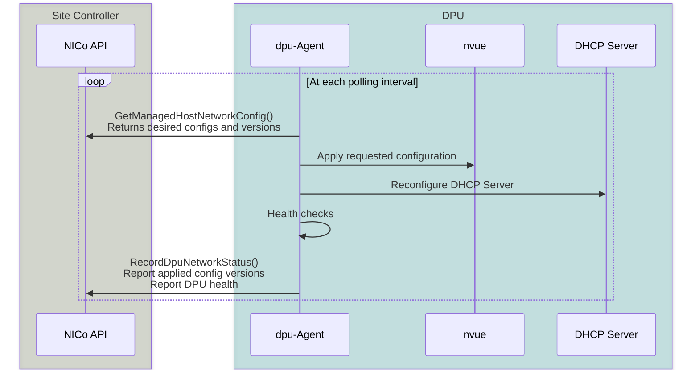
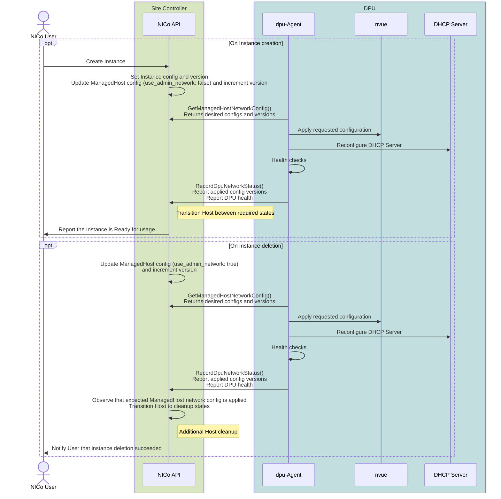

# DPU Configuration

NVIDIA Infra Controller (NICo) is a Bare-Metal-As-A-Service (BMaaS) solution. It manages the lifecycle of hosts, including user OS installation, host cleanup, validation tests, and automated software updates. It also provides host monitoring and virtualized private networking capabilities on ethernet and InfiniBand.

In order to enable virtual private networks (overlay networks), NICo utilizes DPUs as primary ethernet interfaces of hosts.

This document describes how NICo controls DPUs in order to achieve this behavior.

## Guiding Principles

The following guiding principles are for DPU configuration:

- Allow reconfiguration of DPU from any configuration into any other configuration with minimal complexity.
- Provide precise feedback on whether DPUs are configured as required, or whether stale configurations are present on the DPU.
- DPUs configurations can be reconstructed at any point in time (for example, if a firmware update and new operating system are installed on the DPU).

## Core Configuration Flow

The NICo site controller configures DPUs using a **declarative** and
**stateless** mechanism:

- The agent running on DPUs (`dpu-agent`) requests the current desired configuration using the `GetManagedHostNetworkConfig` gRPC API call. Example response data is provided in the [Appendix](#dpu-configuration-example).
- The agent converts each configuration from the site controller into an [NVUE](https://docs.nvidia.com/networking-ethernet-software/cumulus-linux/System-Configuration/NVIDIA-User-Experience-NVUE/) configuration file. It then reconfigures HBN with the NVUE CLI tool (`nv config apply`).
- The `dpu-agent` also reconfigures a DHCP server running on the DPU, which responds to DHCP requests from the attached host.
- After HBN and the DHCP server are reconfigured, `dpu-agent` checks whether the desired configuration is in place and the DPU is healthy. The checks include BGP peering with top-of-rack (ToR) switches and route servers.
- The `dpu-agent` uses the `RecordDpuNetworkStatus` gRPC API call to report back to the site control plane whether the desired configurations are applied, and whether all health checks are succeeding.
- After an agent iteration changes HBN or reloads local DHCP in ContainerExec mode, the agent adds a `PostConfigCheckWait` alert to one health report. The controller waits for a fresh health sample before it advances the host lifecycle.



## DPU LLDP Collection

NICo uses LLDP-MED data from each DPU to associate its physical uplinks with
top-of-rack switch ports. The collection path depends on how `dpu-agent` is
deployed:

**A systemd-managed agent invokes `lldpcli` directly.** Provisioning renames   `/etc/lldpd.d/lldp-interfaces.conf` to `/etc/lldpd.d/lldp-interfaces.conf.disabled`, configures `DAEMON_ARGS="-M 1"`, and restarts `lldpd` so LLDP-MED inventory is available on all interfaces.

**A DPF deployment runs `nico-lldp-sidecar`** from the same image as `dpu-agent`. The sidecar invokes the host's `lldpcli`, writes an atomic snapshot to the shared `/data/lldp` path, and the containerized agent reads that snapshot.

The DPF sidecar refreshes a successful snapshot every 120 seconds and retries a
failed collection after 30 seconds. It retains snapshots for ten minutes and
keeps the last successful snapshot when a later collection fails, but
`dpu-agent` rejects snapshots older than five minutes. This allows short
collection failures without reporting stale topology indefinitely.

The sidecar mounts the host `/run`, `/usr/sbin`, and `/lib` paths read-only and
mounts the host `/sys` at `/host-sys`, also read-only. It is granted only
`DAC_OVERRIDE`; all other Linux capabilities are dropped. Its default resource
requests are 10 millicores and 64 MiB, with limits of 250 millicores and 128
MiB. Keep the sidecar and agent image versions aligned because the shared
snapshot format is an internal contract.

For deployment settings and log collection, refer to
[DPF Setup for NICo Integration](../manuals/dpf.md#dpu-lldp-sidecar). For
operational checks, refer to [DPU Health Checks](../operations/monitoring-health.md#dpu-health-checks).

## DPU ToR Uplink Health

The DPU agent expects two ordered HBN uplinks. The first uplink is the primary
p0 interface, and the second is the redundant p1 interface. Health alert
targets use the configured HBN interface names. Normal PXE boot depends on p0.

Agents deployed with DOCA Platform Framework (DPF) query NVUE. Agents without
DPF query FRR. Both paths apply the same policy to BGP transport sessions. The
optional `min_dpu_functioning_links` field sets the minimum number of
established transport sessions. Add it as a top-level key in the `nico-api`
site configuration.

`nico-api` reads this field when the process starts. Restart the `nico-api`
Deployment after you change its site configuration ConfigMap. The chart adds a
ConfigMap reloader annotation by default, so installations with that reloader
restart the Deployment automatically.

The field accepts an unsigned 32-bit integer. The following table describes
each supported setting and the invalid configuration range:

| Value | ToR Uplink Behavior |
|---|---|
| Unset | Uses the default value of `2`. |
| `0` | Disables the p0 and p1 transport checks and their FRR IPv6 unicast negotiation checks. NVUE does not request BGP neighbor data. The agent emits no p0 PXE readiness signal. Other BGP and DPU health checks continue. |
| `1` | Either established transport session satisfies the minimum. A p0 failure remains visible because PXE requires p0. A p1 transport failure is suppressed when p0 is established. |
| `2` | Requires both sessions for a clean report. A lone p1 failure remains visible but does not block lifecycle progress. This value is the default. |
| Greater than `2` | Produces a critical configuration health alert because the agent expects exactly two uplinks. The NVUE path uses `BgpPeeringTor`; the FRR path uses `BgpStats`. |

No configuration change is required for this policy. A site using `1` can keep
it to suppress a lone p1 transport alert. Remove the setting to restore the
default p1 visibility. A lone p1 failure does not prevent allocation or block
host state transitions with either setting.

### Transport Session Policy

Both paths treat a missing neighbor or a state other than `Established` as an
unavailable uplink. NVUE also treats a missing state as an uplink finding. The
FRR summary requires a state string, so missing or malformed summary data
produces a critical `BgpStats` alert instead. The following table shows the
resulting `BgpPeeringTor` alerts for valid transport data:

| p0 Transport | p1 Transport | Minimum `1` | Minimum `2` |
|---|---|---|---|
| Established | Established | No alert | No alert |
| Unavailable | Established | p0 alert with `PreventAllocations` | p0 alert with `PreventAllocations` |
| Established | Unavailable | No alert | Unclassified p1 alert |
| Unavailable | Unavailable | Both alerts with `PreventAllocations` and `PreventHostStateChanges` | Both alerts with `PreventAllocations` and `PreventHostStateChanges` |

`PreventAllocations` keeps the host out of the allocation pool. On a p0
transport alert, it also supplies the PXE readiness signal used during normal
instance provisioning. The controller checks this signal before it leaves
`WaitingForNetworkConfig` and immediately before the normal PXE restart in
`WaitingForRebootToReady`.

The final restart check also evaluates general
`PreventHostStateChanges` alerts. Hosts without managed DPUs receive this
general check but have no p0 check. Instance deletion and custom iPXE reboot
paths bypass the final readiness check.

The p0 check applies to the initial normal PXE flow. Live network updates do not
use this PXE readiness gate.

### FRR IPv6 Unicast Warnings

For an FNN configuration with an IPv6 loopback, the non-DPF FRR path also checks
whether required uplinks negotiated the IPv6 unicast address family. Other FRR
configurations do not run this address family check. The DPF NVUE path checks
transport state only.

FRR reports an address family failure as a `BgpPeeringTor` alert whose message
states that the session did not negotiate IPv6 unicast. This warning does not
mean that the BGP transport session is unavailable. One address family warning
is unclassified and does not supply the p0 PXE readiness signal.

With a minimum of `1`, only p0 must negotiate IPv6 unicast. With a minimum of
`2`, both uplinks must negotiate it. At `2`, if both uplinks have findings,
including a mix of a transport failure and an address family warning, both
alerts include `PreventAllocations` and `PreventHostStateChanges`.

### Health Sampling After Configuration Changes

When an agent iteration applies an actual HBN configuration change, it adds a
critical `PostConfigCheckWait` alert to that iteration's health report. The
alert includes `PreventAllocations` and `PreventHostStateChanges`. The
controller therefore cannot accept the newly acknowledged network version from
that same report. It waits for a later health report.

This behavior is a report boundary, not a fixed timer. If the next iteration
does not apply another configuration change, the agent removes the alert. When
the uplink check is enabled and completes, the later report contains its current
BGP result. With default agent settings, the active polling interval is 10
seconds.

On the NVUE path, only an actual HBN update triggers this alert. An accepted
DHCP gRPC request does not trigger it by itself. On the ContainerExec path, an
actual local HBN update or DHCP reload triggers the alert.

## Bootstrap CA Trust

Before a DPU agent can use the configuration APIs, it needs a certificate
authority (CA) bundle to authenticate the NICo API. Configure the bundle source
for non-DPF provisioning in the site configuration:

```toml
[dpu_config]
bootstrap_ca_source = "legacy_download" # legacy_download | embedded | mounted
```

If this field is omitted, NICo preserves the historical behavior: the booting
DPU downloads `/api/v0/tls/root_ca` from `nico-pxe`. This supports rolling
upgrades, but the download remains dependent on unauthenticated DHCP, DNS, and
HTTP. `embedded` uses a site-specific bundle staged into the DPU BFB only when
its build is given an explicit `BOOTSTRAP_CA_PATH`. There is no repository or
default fallback for the dedicated embedded payload. Existing legacy artifact
inputs remain unchanged. `mounted` instead expects the provisioning environment
to place an operator-managed bundle at `/opt/forge/forge_root.pem`. NICo does
not create that mount. The embedded
source at `/opt/forge/embedded_forge_root.pem` and mounted final path are
distinct. Both non-network modes fail closed when their own bundle is missing
or invalid and never fall back to the download.

NICo includes this setting only in DPU provisioning instructions. It does not
change host Scout boot behavior.

Upgrade NICo and publish compatible boot artifacts before you change the
setting. To switch an installed non-DPF DPU, reprovision it or use another
trusted mechanism to install the bundle. Changing site configuration alone
does not rewrite its filesystem. For root rotation, build or mount an overlap
bundle containing the old and new roots. Reprovision or refresh every DPU, then
verify that each one installed the overlap bundle at
`/opt/forge/forge_root.pem` and can authenticate the NICo API. Rotate the API
server chain to the new root and verify authentication again. Only then deploy
a bundle without the old root, verify every DPU again, and retire the old root.

Containerized DPF agents use the separate
`[dpf.dpu_agent_bootstrap_ca]` policy and apply it when their init container
starts. Refer to
[DPU Agent Bootstrap CA](../manuals/dpf.md#dpu-agent-bootstrap-ca) for the
legacy-download and mounted-object forms. The shared published DPF
dpu-agent image does not embed a site trust anchor.

When pinning a root, verify that the NICo API sends the issuing intermediate
certificate with its leaf certificate. Selecting a stable root establishes the
intended trust anchor. If each replacement intermediate chains to the pinned
root and the server presents the complete chain, clients can validate leaf
certificates across those rotations without replacing the bundle. If an
intermediate chains to a different root, stage and verify an updated bundle
before rotating the server chain. This is server certificate validation and
remains required whether client-certificate authentication is enabled. It does
not authenticate the earlier DHCP, DNS, iPXE, and user-data boot chain. Embedded
mode also depends on an authenticated artifact and boot chain, such as verified
image signatures plus Secure Boot. Otherwise, an attacker can replace both the
artifact and its CA.

## Configuration Versioning

NICo uses versioned immutable configuration data in order to detect whether any intended changes have not yet been deployed:

- Every time a configuration for the DPU changes, an associated version number is increased.
- The version number is sent back from the DPU to the site controller as part of the `RecordDpuNetworkStatus` call.
- If the reported version number of the DPU does match the last desired version number and if the DPU reports itself as healthy/operational, the control plane knows that the configuration was deployed and can report that fact to tenants. If the version number does not match the desired version number, or if the DPU is not yet healthy, the instance will appear as `Provisioning`/`Configuring`/`Terminating` to the administrator.
- NICo will never show a configuration as applied without feedback from the DPU. Doing so would cause reliability issues (e.g. double-assignment of IPs), as well as raise security concerns.

The DPU configuration that is applied can be understood as coming from two different sources:

- **Tenant configurations**: While a tenant controls the host, the tenant can
  change the desired overlay network configuration. For example, the tenant can
  select the VPC prefix and configure the virtual function (VF) interfaces.
- **Site controller and host lifecycle**: The site controller updates parts of
  the network configuration during the host lifecycle. Provisioning moves host
  networking from the admin overlay to the tenant overlay. Release moves it
  back to the admin overlay.

In order to separate these concerns, NICo internally uses two different configuration data structs and associated version numbers (`instance_network_config` versus `managedhost_network_config`). It can thereby distinguish whether a setting that is required by the tenant has not been applied, compared to whether a setting that is required by the control plane has not been applied.

Some example workflows that lead to updating configurations are shown in the following diagram:



## Host isolation

One important requirement for NICo is that Hosts/DPUs that are not confirmed to be part of the site are isolated from the remaining hosts on the site.

A DPU might get isolated from the cluster without the DPU software stack being erased (e.g. by site operators removing the knowledge of the DPU from the site database).

In order to satisfy the isolation requirements and to prevent unknown DPUs on the site from using resources (e.g. IPs on overlay networks), an additional mechanism is implemented: If the `GetManagedHostNetworkConfig` gRPC API call returns a `NotFound` error, the dpu-agent will configure the DPU/Host into an isolated mode.
The isolated configuration is only applied when the site controller is unaware of the DPU and its expected configuration. In case of any other errors (for example, intermittent communication issues), the DPU retains its last known configuration.

> **Note:** This is not the only mechanism that NICo utilizes to provide security on the networking layer. In addition to this, ACLs and routing table separation are used to implement secure virtual private networks (VPCs).

## Appendix

### DPU Configuration Example

```json
{
  "asn": 4294967000,
  "dhcp_servers": [
    "192.168.126.2"
  ],
  "vni_device": "vxlan48",
  "managed_host_config": {
    "loopback_ip": "192.168.96.36",
    "quarantine_state": null
  },
  "managed_host_config_version": "V3-T1733950583707475",
  "use_admin_network": false,
  "admin_interface": {
    "function_type": 0,
    "vlan_id": 14,
    "vni": 0,
    "gateway": "192.168.97.1/24",
    "ip": "192.168.97.49",
    "interface_prefix": "192.168.97.49/32",
    "virtual_function_id": null,
    "vpc_prefixes": [],
    "prefix": "192.168.97.0/24",
    "fqdn": "192.168-97-49.example.com",
    "booturl": null,
    "vpc_vni": 0,
    "svi_ip": null,
    "tenant_vrf_loopback_ip": null,
    "is_l2_segment": true,
    "vpc_peer_prefixes": [],
    "vpc_peer_vnis": [],
    "network_security_group": null
  },
  "tenant_interfaces": [
    {
      "function_type": 0,
      "vlan_id": 16,
      "vni": 1025032,
      "gateway": "192.168.98.1/26",
      "ip": "192.168.98.11",
      "interface_prefix": "192.168.98.11/32",
      "virtual_function_id": null,
      "vpc_prefixes": [
        "192.168.98.0/26"
      ],
      "prefix": "192.168.98.0/26",
      "fqdn": "192.168-98-11.unknowndomain",
      "booturl": null,
      "vpc_vni": 42,
      "svi_ip": null,
      "tenant_vrf_loopback_ip": null,
      "is_l2_segment": true,
      "vpc_peer_prefixes": [],
      "vpc_peer_vnis": [],
      "network_security_group": null
    }
  ],
  "instance_network_config_version": "V1-T1733950572461281",
  "instance_id": {
    "value": "b4c38910-9319-4bee-ac04-10cabb569a4c"
  },
  "network_virtualization_type": 2,
  "vpc_vni": 42,
  "route_servers": [
    "192.168.126.5",
    "192.168.126.11",
    "192.168.126.12"
  ],
  "remote_id": "c3046v74fnh6n4fs5kqvha0t76ub7ug7r9eh1dtilj0pe89eh99g",
  "deprecated_deny_prefixes": [
    "192.168.4.128/26",
    "192.168.98.0/24",
    "172.16.205.0/24"
  ],
  "dpu_network_pinger_type": "OobNetBind",
  "deny_prefixes": [],
  "site_fabric_prefixes": [
    "192.168.4.128/26",
    "192.168.98.0/24",
    "172.16.205.0/24"
  ],
  "vpc_isolation_behavior": 2,
  "stateful_acls_enabled": false,
  "enable_dhcp": true,
  "host_interface_id": "3912c59c-8fc0-400d-b05f-7bf62405018f",
  "min_dpu_functioning_links": null,
  "is_primary_dpu": true,
  "multidpu_enabled": false,
  "internet_l3_vni": null
}
```
