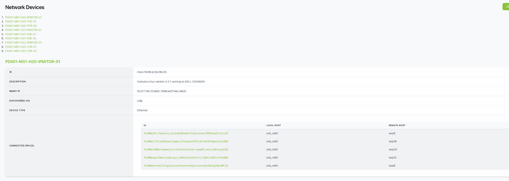

# FAQs

This document contains frequently asked questions about NVIDIA Infra Controller (NICo).

## Installation (Day 0)

**Where does NICo run? Is it a container/microservice, a single container, or a collection deployed via Helm?**

NICo commonly runs on a Kubernetes cluster (with 3 or 5 control plane nodes recommended), though there is no requirement to do so. NICo runs as a set of microservices for API, DNS, DHCP, Hardware Monitoring, BMC Console, Rack Management, etc.

NICo can be deployed with Helm charts (located in  the `/helm`) directory or with Kubernetes Kustomize manifests.

**Does NICo install Cumulus Linux onto Ethernet switches?**

No, NICo does not install Cumulus Linux onto Ethernet switches.

**Does NICo install the DPU operating system?**

Yes, NICo installs the DPU operating system, including all DPU firmware (BMC, NIC, UEFI). NICo also deploys HBN, a containerized service that packages the same core networking components (FRR, NVUE) that power Cumulus Linux.

**Does NICo install NVIDIA Unified Fabric Manager (UFM)?**

No, NICo does not install UFM; it is a dependency. NICo leverages existing UFM deployments for InfiniBand partition management via the UFM API using partition keys (P_Keys). 

**Does NICo manage InfiniBand switches in standalone mode?**

No, NICo does not manage InfiniBand switches in standalone mode. Instead, NVIDIA Unified Fabric Manager (UFM) is required for InfiniBand partitioning and fabric management. NICo calls UFM APIs to assign partition keys (P_Keys) for isolation.

## Configuration (Day 1)

**Can NICo be utilized for HGX platforms for host life cycle management?**

Yes, NICo supports DGX as well as OEM/ODM nodes that are CPU-only, for storage, etc.

**Does NICo support installing operating systems onto servers? What operating systems are supported for installation on NICo?**

Yes, NICo supports both PXE and image-based installation of operating systems onto servers. Any operating system supported by [iPXE](http://ipxe.org) can be installed. Operating system management (patching, configuration, image generation) is the user’s responsibility.

**Do I need to change the OOB management TOR to configure a separate VLAN for the NICo managed hosts and DPU (DPU OOB, Host OOB), with DHCP relay pointing to NICo DHCP?**

Yes, this is the most common way to configure NICo. Each VLAN (sometimes the whole switch is a VLAN) or SVI port needs to have its DHCP relay for the machines and DPUs you wish to manage, with NICo pointing to the DHCP server address you have set up.

**Do I need to change existing infrastructure if separate VLANs are used?**

No, there is no need to change existing infrastructure if separate VLANs are used.

**With only one RJ45 on BF3, the DPU in-band IP addresses allocation is part of DPU loopback allocated by NICo. Does it assume that the same management switch also supports DPU SSH access and that the DPU SSH IP is allocated by NICo and only accessible inside the data center?**

The IP addresses issued to the DPU RJ45 port are from the "network segments" (which is different than a DPU loopback)--the API in NICo is used to create a Network Segment of type underlay on whatever the underlying network configuration is. NICo issues two IPs to the RJ45: One IP is the DPU OOB used to SSH to the ARM OS and NICo management traffic; the other IP is for the DPU BMC, which is used for Redfish and DPU configuration.  

Also note that the host BMC needs to be on a VLAN that is forwarded to the NICo DHCP relay.

**The host overlay interfaces addresses on top of vxlan and DPU is allocated via NICo through the control NIC on NICo through overlay networking. Is DHCP relay configuration needed on any switches? Does this overlay need to be manually configured on the NICo control host NIC?**

The DHCP relay is required only on the switches connected to the DPU OOBs/BMCs and Host BMCs. The in-band ToRs only need to be configured for BGP Unnumbered as "routed port". The "overlay" networks that NICo will assign IPs to are defined as "network segments" with the "overlay" type, then the overlay network is referenced when creating an instance.

**Do I need to separate the NICo PXE to isolate the PXE installation process from site PXE server?**

There is a separate PXE server that NICo needs to serve its own images, which are shipped as part of the software (DPU software, iPXE, etc). But if the DHCP is configured correctly and there's connectivity from the Host to the NICo PXE service, then these applications can live side-by-side.

## Operations (Day 2)

**How do I communicate with NICo? Does it expose an API or shell interface?**

NICo exposes an REST API interface and authentication through JWT tokens or IdP integration (keycloak). There is also an admin-facing CLI and debugging/Engineering UI.

<Note>The REST API is the primary way to interact with NICo and should be used for all state-modifying operations (creating/modifying tenants, VPCs, instances, etc). The admin CLI is a convenience tool for administrative tasks and should not be relied upon for production workflows. </Note>

**Should I use NICo as an OS installation tool?**

NICo is more than an OS installation tool. It helps with OS provisioning, but it's not the main use case for NICo. Automated Baremetal lifecycle management, network isolation, and rack management are its key use cases. This includes hardware burn-in testing, hardware completeness validation, Measured Boot for firmware integrity, ongoing automated firmware updates, and out-of-band continuous hardware management.

**Does NICo communicate with NIVIDA NetQ to retrieve information about the network?**

No, NICo does not communicate with NetQ.

**Does NICo bring up NVLink?**

NICo supports NVLink bring-up through [Rack-Level Administration (RLA)](manuals/rack_level_admin.md) and manages NVLink partitions through NMX-C APIs.

**Does NICo support NVLink partitioning?**

Yes, NICo supports NVLink partitioning.

**How does NICo maintain tenancy enforcement between Ethernet (N/S), Infiniband (E/W), NVLink (GPU-to-GPU) networks?**

* **Ethernet**: VXLAN with EVPN for VPC creation on DPUs
* **E/W Ethernet (Spectrum-X)**: A CX-based firmware, named "DPA", which uses VXLAN on CX switches (as part of a future release)
* **Infiniband**: UFM-based partition key (P_Key) assignment
* **NVLink**: NMX-M-based partition management

DPUs enforce Ethernet isolation in hardware, UFM enforces InfiniBand isolation, and NMX-M enforces NVLink isolation--all coordinated by NICo.

**When NICo is used to maintain tenancy enforcement for Ethernet (N/S), does it require access to make changes to Spectrum (SN) switches running Cumulus, or are all changes limited to HBN (Host-Based Networking) on the DPU?**

Ethernet tenancy enforcement is limited to HBN on the DPU and does not require NICo to make changes to SN switches running Cumulus Linux. NICo expects the switch configuration to provide BGP speakers on the switches that speak IPv4 Unicast and L2/L3 EVPN address families, as well as "BGP Unnumbered" (RFC 5549).

**Does NICo maintain the database of the tenancy mappings of servers and ports?**

NICo stores the owner of each instance in the form of a `tenant_organization_id` that is passed during instance creation.

**When NICo is used to maintain tenancy enforcement for Ethernet and hosts are presented to customers as bare metal, is OOB isolation of GPU/CPU host BMC managed as well, or only the N/S overlay running on DPU?**

NICo configures the host BMC to disable connectivity from within the host to the BMC (e.g. Dell iDrac Lockdown, disabling KCS, etc), and also prevents access from the host (via network) to the BMC of the host. Effectively, the user cannot access the BMC of the bare metal hosts. The BMC console (serial console) is accessed by a user through a NICo service called "SSH Console", which performs authentication and authorization to ensure that the user accessing the console is the current owner of the machine.

**Can NICo be used to manage a portion of a cluster?**

NICo requires the N/S and OOB Ethernet DHCP relays pointed to the NICo DHCP service as well as access to UFM and NMX-M for E/W. Additionally, the EVPN topology must be visible to all nodes that are managed by the same cluster. If the DC operator wants to separate EVPN/DHCP into VLANs and VRFs, then you can arbitrarily assign nodes to NICo management or not. NMX-M and UFM are not multi–tenant aware, so there's a possibility of two things configuring NMX-M and UFM from interfering with each other.

**How does NICo select a bare metal host to satisfy the request for an instance? What selection criteria is supported?**

For the gRPC API, NICo doesn't automatically select a bare metal host; instead, you pick the machine when calling "AllocateInstance" gRPC. The REST API has a concept of resource allocations, so a tenant would get an allocation of some number of a type of machine, and when creating an instance against that instance type, a host will be randomly selected.

The NICo team is working to support bulk allocations, where all machines are allocated on the same NVLink domain. There is another effort to allocate using labels on the machine, so you can choose machines in the same rack, etc.

**How is NICo made aware of power management endpoints (BMC IP and credentials) for bare metal?**

When you provision a NICo "site", you tell it which BMC subnets are provisioned on the network fabric, and then those subnets perform DHCP relaying to the NICo DHCP service. When a BMC requests an IP, NICo allocates one and then looks at an "expected machine" table for the initial username and password for that BMC (using its MAC address, which NICo cross-references with the DHCP lease). You don't have to "pre-define" BMCs, but you do need to provide the initial MAC address, username, and password.

**Are there APIs to query and debug the DPU state?**

DPUs report health status (such as if HBN is configured correctly, if BGP peering is established, or if the HBN container is running), along with heartbeat information and the version of the configuration that has been applied. DPUs also perform health checks for BMC-side health from the DPU BMC, including thermals and other hardware sensors.

This information is also visible in the admin web UI. Furthermore, you can SSH to the DPU and poke around if the issue isn't obvious using these methods.
