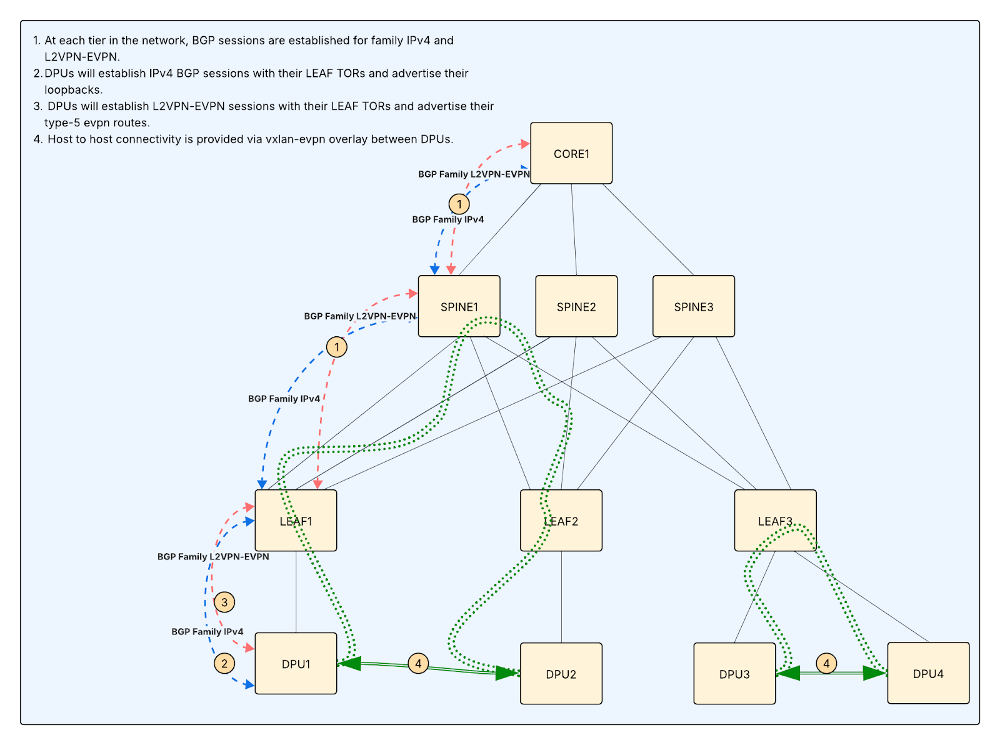

# Network Prerequisites

This page covers the networking infrastructure that must be in place before deploying NICo, including IP allocations, BGP configuration, EVPN overlay setup, and physical cabling.

At a high level, these are the networking requirements:

- **VNIs**: Datacenter-unique VNIs allocated based on the expected number of VPCs
- **ASNs**: Globally-unique 32-bit ASNs allocated based on the expected number of DPUs
- **IPv4 prefixes**: A single, globally-unique IPv4 prefix with a total IP allocation size based on the formula: `(expected number of servers + expected number of DPUs) * 2 + 2`. One or more additional, globally-unique IPv4 prefixes with a total IP allocation of: `expected number of DPUs * 2`. The minimum individual prefix size is `/31`.
- **Routing**: A mechanism for route-propagation and a default route for the tenant EVPN overlay network.

## IP Address Pools

NICo requires several IP address pools. The site owner supplies their own subnets and VLANs--do not use the default NICo subnets.

### Control Plane Management Network

| Item | Detail |
|---|---|
| IPs per node (with DPU) | 3 (host BMC + DPU ARM OS + DPU BMC) |
| IPs per node (without DPU) | 1 (host BMC) |
| Managed by | Parent datacenter via DHCP |

### Control-Plane Network

Each site controller node uses a `/31` point-to-point subnet between the host OS and the DPU PF representor (if DPUs are present). IPs are allocated statically at OS install time. If DPUs are not used, each node requires one IP.

### Control Plane Service IP Pool

Typically, a `/27` pool is used for services running on the control plane cluster.

### Management Network for Managed Hosts

| Item | Detail |
|---|---|
| IPs per host | 1 (host BMC) + 2 per DPU (DPU ARM OS + DPU BMC) |
| IPs for MNNVL racks | 3 per switch (BMC + 2 NVOS) + 1 per power shelf PMC |
| Managed by | NICo (can be split across multiple pools) |

<Warning>Out-of-band (OOB) switches must have a DHCP relay pointing to the NICo DHCP service (refer to the [BMC and Out-of-Band Setup](bmc-oob-setup.md) page for more details).</Warning>

### DPU Loopback Pool

One IP per DPU is used as the DPU loopback address during DPU networking.

### Admin Network

One IP per managed server is used the host IP when no tenant is assigned. The pool should be large enough for one usable IP per managed server, plus any required network and broadcast addresses for the subnet(s).

### Tenant Networks

When a managed host is allocated to a tenant, it joins a tenant network. There can be multiple tenant networks. IP allocations are managed by NICo.

Two host IPs per managed host per tenant network (PF + VF) are provisioned as one `/31` per interface. For example, a host with 1 DPU using the PF and one VF consumes two `/31` subnets per tenant network (one `/31` for each interface). For multiple tenant networks, provide separate pools, each sized for all servers.

## Autonomous System Numbers (ASNs)

- Every DPU is assigned a unique ASN from a pool given to NICo. In multi-DPU hosts, each DPU has its own ASN.
- 32-bit ASNs are required to ensure sufficient unique numbers.
- Follow [RFC 7938](https://datatracker.ietf.org/doc/html/rfc7938) guidelines for data center routing to prevent path hunting and loops.
- If using route-servers, a specific ASN is needed for the BGP route-server set (typically shared across the redundant route-server set).

## VNI Allocations

- **L3VNI**: Use one VNI per expected VPC in a site. Each VPC requires a unique L3VNI to identify its VRF.
- **L2VNI**: Use one unique L2VNI for the admin network in a site.

<Note>VNIs must be datacenter-unique.</Note>

## Underlay and BGP Configuration

- **Enable eBGP unnumbered**: Use on all leaf switches facing DPUs (RFC 5549).
- **Assign ASNs**: Allocate a pool of unique AS numbers based on the expected number of DPUs for the site.
- **Advertise loopbacks**: DPUs advertise `/32` loopbacks for VXLAN tunnel endpoints.
- **VTEP-to-VTEP connectivity**: DPUs must receive either all other DPU `/32` routes, an aggregate containing them, or a default route.
- **Route filtering**: Filter DPU announcements to loopbacks only; aggregate routes at the leaf/pod level; set max-prefix limits on leaf switch ports facing DPUs.

## Overlay and EVPN Configuration

These are the two options for EVPN overlay peering:

**Option 1: Dual-stacked IPv4/EVPN sessions with TOR**
- TORs accept EVPN sessions with DPUs in addition to existing IPv4 sessions.
- Spines (and ideally all tiers) are configured for EVPN sessions with TORs.

**Option 2: Route-servers**
- Deploy at least two redundant BGP route servers (e.g. on site controllers) for EVPN overlay peering.
- Establish multi-hop eBGP sessions (EVPN address family only) between DPUs and route servers.
- Disable IPv4 unicast on overlay sessions.

NICo does not deploy or manage the route servers--they are external infrastructure that you provision separately. When route servers are enabled in the siteConfig (`enable_route_servers = true`), the NICo DPU Agent configures FRR/NVUE on each DPU to peer with the route server IPs you provide (`route_servers = [...]`). The DPU creates a `routeserver` BGP peer-group with multi-hop TTL 255, external AS, and L2VPN-EVPN address family only.

### Default Route

A default route must be provided to the overlay. Options:
- Allow additional L2VPN-EVPN sessions with leaf TORs and configure the same sessions at each tier of the network.
- Configure dedicated tenant gateways with an isolated tenant VRF, peer them with core routers, and apply route-leaking to inject a default route into the tenant VRF

## Route-Targets

Standardized common route targets:

| Route-Target | Purpose |
|---|---|
| `:50100` | Control-Plane / Service VIPs — exported by site controller DPUs |
| `:50200` | Internal tenant routes |
| `:50300` | Maintenance network routes |
| `:50400` | Admin network routes |
| `:50500` | External tenant routes |

These are defaults and can be changed, as long as all components agree on the values. For example, if you choose an internal-common route target of 45001 instead of 50200, ensure both the NICo config and the network are updated.

**Import/export policies**:

- Tenant/admin networks (`:50200` through `:50500`) must import `:50100` to reach control-plane VIPs.
- Site controllers exporting `:50100` must import `:50200` through `:50500` to reach all managed endpoints.

<Note>While many deployments align the route target number with the VNI for administrative simplicity, the routing policy is strictly governed by the route target import/export configuration, not the VNI itself.</Note>

## Switch Configuration

These are the minimum switch configuration requirements:

- Configure TOR ports connecting to the site controller (or its DPU) for BGP unnumbered sessions.
- Enable LACP in sending and receiving mode.
- Configure BGP route maps to accept delegated routes.
- Enable the EVPN address family.
- Accept dual-stacked IPv4 + EVPN sessions from site controllers.
- Configure site controllers to export service VIPs with a dedicated EVPN route-target that all managed-host DPUs import.
- Configure site controllers to import EVPN route-targets for all internal tenant networks, external tenant networks, and any additional route-targets required for service connectivity.

## Site Controller Networking Topology

These are the two common options for connecting site controller nodes to the network fabric: single uplink and dual-homed uplink.

### Option 1: Single Uplink, Logical Separation

Use one physical NIC carrying the following:

- **Mgmt VLAN**: host/SSH/apt/pkg access
- **K8s node traffic**: API server, Kubelet
- **Pod/Service traffic**: Overlay or routed

### Option 2: Dual-homed Uplink (Reference Design)

This design requires the DPU to be in DPU mode on site controllers.

- The site controller typically uses a single DPU/NIC with two uplinks, each cabled to a different ToR switch participating in BGP unnumbered.
- Both links carry management and Kubernetes traffic; isolation is done via VLANs/VRFs and policy, not by dedicating one NIC to management and one to the data plane.

## Physical Cabling

- Connect DPUs to ToR/EoR switches (dual-homed recommended for redundancy).
- Ensure separate out-of-band management connectivity for DPU BMCs.

## General Guidance

| Setting | Recommendation |
|---|---|
| MTU | 1500 for overlays (VXLAN/Geneve); 9000 only if underlay supports it end-to-end |
| DNS | Enterprise resolvers; NodeLocal DNS cache optional |
| Gateway/routing | Static or routed (BGP) per site standards--no dependency on NICo routes |
| Bonding/LACP | Optional for NIC redundancy; otherwise simple active/standby |
| Firewalling | Allow K8s control-plane and node ports per chosen CNI, plus SSH from a secure management network. Block everything else by default. |
