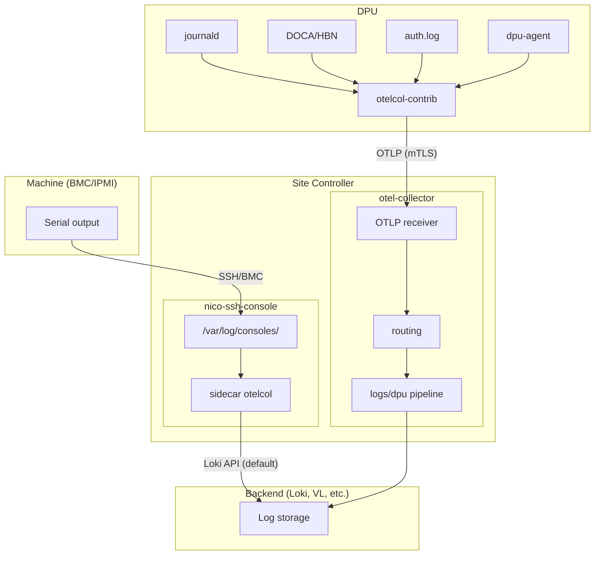

# Machine and DPU Logs

This document covers log collection from NICo-managed devices: machine/DPU serial console output
and DPU system/application logs. For NICo service logs (nico-api, nico-dns, etc), see
[logging.md](logging.md).

---

## 1. Overview

NICo manages two categories of device logs:

| Source | What it captures | Collection method |
|--------|------------------|-------------------|
| **Machine/DPU console logs** | BMC serial console output (boot messages, kernel output, crash dumps) | nico-ssh-console captures to files, sidecar ships to backend |
| **DPU logs** | System logs (journald), DOCA/HBN, nico-dpu-agent, auth logs | otelcol-contrib on DPU forwards via OTLP to site collector |



**Log flow:**
- **Console logs**: The default sidecar ships directly to Loki via Loki API. This can be
  reconfigured to export via OTLP to a site collector if needed.
- **DPU logs**: Always flow via OTLP over mTLS to the site otel-collector, which routes
  them through processing pipelines to the backend.

---

## 2. Machine console logs (nico-ssh-console)

### 2.1 How it works

When a user connects to a machine's BMC console through nico-ssh-console, the proxy:

1. Establishes an SSH session to the BMC
2. Captures all serial console output (stdout from the BMC session)
3. Strips ANSI escape sequences for cleaner logs
4. Writes timestamped output to a local file
5. Rotates files when they exceed the configured size

Console logging runs for the duration of each BMC session. When the session ends, the logger
writes a closing timestamp and flushes the file.

### 2.2 Log file location and naming

Console logs are written to:

```
/var/log/consoles/<machine-id>_<bmc-ip>.log
```

For example:
```
/var/log/consoles/fm100ds..0042_10.0.1.50.log
```

The filename encodes both the NICo machine ID and the BMC IP address, making it easy to
identify which machine produced the logs.

### 2.3 Log content

Console logs contain raw serial output with session markers:

```
--- ssh-console started at 2026-06-12T10:15:30+00:00 ---
[    0.000000] Linux version 5.15.0-generic ...
[    0.000000] Command line: BOOT_IMAGE=/vmlinuz-5.15.0
[    2.341892] pci 0000:00:1f.0: [8086:a0c8] type 00 class 0x060100
...
[   45.123456] systemd[1]: Reached target Multi-User System.
--- ssh-console shutting down at 2026-06-12T10:45:12+00:00 ---
```

These logs are useful for:
- Debugging boot failures
- Capturing kernel panics and oops messages
- Reviewing BIOS/UEFI output
- Diagnosing hardware initialization issues

### 2.4 Configuration

Console logging is controlled by nico-ssh-console configuration:

| Setting | Default | Description |
|---------|---------|-------------|
| `console_logs_path` | `/var/log/consoles` | Directory for console log files |
| `console_logging_enabled` | `true` | Enable/disable console capture |
| `log_rotate_max_size` | `10 MiB` | Rotate when file exceeds this size |
| `log_rotate_max_rotated_files` | `4` | Keep up to N rotated files (`.log.0` through `.log.3`) |

When rotation occurs, the current `.log` file becomes `.log.0`, previous `.log.0` becomes
`.log.1`, and so on. The oldest file beyond the limit is deleted.

### 2.5 Centralizing console logs

The nico-ssh-console Helm chart includes an optional OpenTelemetry Collector sidecar for
shipping console logs to a backend.

**Enable the sidecar:**

```yaml
# values.yaml for nico-ssh-console-rs
lokiLogCollector:
  enabled: true
  image:
    repository: otel/opentelemetry-collector-contrib
    tag: "0.102.0"
```

**Default sidecar configuration:**

The sidecar reads from `/var/log/consoles/*.log` and extracts machine metadata from filenames:

```yaml
receivers:
  filelog:
    include:
      - /var/log/consoles/*.log
      - /var/log/consoles/*.log.*
    start_at: beginning
    storage: file_storage
    operators:
      - type: regex_parser
        regex: '^(?P<machineid>[a-z0-9]+)_(?P<bmc_ip>[^_]+).log$'
        parse_from: attributes["log.file.name"]

processors:
  attributes:
    actions:
      - key: exporter
        value: nico-ssh-console-rs
        action: upsert
      - key: loki.attribute.labels
        value: machineid,exporter
        action: insert
      - key: loki.format
        value: raw
        action: insert
  batch: {}
  memory_limiter:
    check_interval: 5s
    limit_mib: 4096
    spike_limit_mib: 1024

exporters:
  loki:
    endpoint: "http://loki.loki.svc.cluster.local:3100/loki/api/v1/push"
    headers:
      "X-Scope-OrgID": nico

service:
  extensions: [file_storage]
  pipelines:
    logs:
      receivers: [filelog]
      processors: [attributes, batch]
      exporters: [loki]
```

**Alternative: stdout to DaemonSet collector:**

To follow the standard Kubernetes pattern where the DaemonSet collector picks up all pod logs,
configure the sidecar to write to stdout instead of directly to a backend:

```yaml
configFiles:
  otelcolConfig: |
    extensions:
      file_storage:
        directory: /var/lib/otelcol/filelog-checkpoints
    receivers:
      filelog:
        include:
          - /var/log/consoles/*.log
          - /var/log/consoles/*.log.*
        start_at: beginning
        storage: file_storage
        operators:
          - type: regex_parser
            regex: '^(?P<machineid>[a-z0-9]+)_(?P<bmc_ip>[^_]+).log$'
            parse_from: attributes["log.file.name"]
    processors:
      attributes:
        actions:
          - key: component
            value: nico-ssh-console-rs
            action: upsert
      batch: {}
      memory_limiter:
        check_interval: 5s
        limit_mib: 4096
        spike_limit_mib: 1024
    exporters:
      debug:
        verbosity: basic    # Writes to stdout
    service:
      extensions: [file_storage]
      pipelines:
        logs:
          receivers: [filelog]
          processors: [memory_limiter, attributes, batch]
          exporters: [debug]
```

The DaemonSet collector on each node reads `/var/log/pods/` (including the sidecar's stdout)
and forwards all logs to your backend. This keeps the architecture simple - console logs flow
through the same pipeline as all other pod logs.

### 2.6 Querying console logs

Once centralized, query console logs by machine ID:

**Loki (LogQL):**
```logql
{machineid="fm100ds..0042"}
```

**VictoriaLogs (LogsQL):**
```
machineid:fm100ds..0042
```

To find boot failures or kernel panics:
```logql
{machineid="fm100ds..0042"} |~ "panic|oops|failed|error"
```

---

## 3. DPU logs

DPUs run an OpenTelemetry Collector (`otelcol-contrib`) deployed via the `nico-otelcol` Helm
chart (`bluefield/charts/nico-otelcol/`). The chart deploys a DaemonSet that runs on DPU nodes
managed by DPF (DOCA Platform Framework). For non-Kubernetes DPU deployments, a systemd service
(`otelcol-contrib.service`) provides the same functionality.

The collector gathers logs from multiple sources and forwards them to the site controller over mTLS.

### 3.1 Log sources on the DPU

The following logs are collected from the **DPU Arm OS**. All log files are physically located on
the DPU's local filesystem.

| Source | Receiver | Component label | Description |
|--------|----------|-----------------|-------------|
| Kernel/dmesg | `journald/kernel` | `journald` | Kernel messages, hardware events |
| DOCA/HBN | `filelog/doca` | `hbn` | FRR, nl2docad, nvued, supervisord, syslog |
| nico-dpu-agent | `filelog/nico-dpu-agent` | `journald` | NICo agent logs (logfmt format) |
| Auth logs | `filelog/auth` | `dpu-auth-filelog` | `/var/log/auth.log` for security auditing |

**DOCA/HBN log paths:**

These paths are on the DPU Arm OS filesystem. The HBN container writes logs to host-mounted
volumes, making them accessible to the otelcol-contrib collector running on the host.

```
/var/log/doca/hbn/frr/frr.log
/var/log/doca/hbn/nl2docad.log
/var/log/doca/hbn/nvued.log
/var/log/doca/hbn/supervisor/supervisord.log
/var/log/doca/hbn/syslog
```

**nico-dpu-agent logs:**

The agent can run in two modes depending on the deployment:

- **Systemd service** (`forge-dpu-agent.service`): Logs go to journald. Query with
  `journalctl -u forge-dpu-agent.service`.
- **Containerized DaemonSet** (via DPF): Logs go to stdout, captured at
  `/var/log/pods/*/nico-dpu-agent/*.log`. The collector parses the CRI log format.

In both cases, the agent emits logfmt output. The otelcol-contrib collector extracts log levels
from the logfmt `level=` field.

### 3.2 DPU collector configuration

The DPU runs `otelcol-contrib` with configuration from `/etc/otelcol-contrib/config.yaml`.
Key aspects:

**Resource attributes added to all logs:**
- `host.name` — DPU hostname (from `resourcedetection` processor)
- `machine.id` — NICo machine ID (from file at `/run/otelcol-contrib/machine-id`)
- `host.machine.id` — Host machine ID (from `/run/otelcol-contrib/host-machine-id`)
- `component` — Log source identifier (`journald`, `hbn`, `dpu-auth-filelog`)

**Export to site controller:**

```yaml
exporters:
  otlp/site:
    endpoint: site-otel-receiver.nico:443
    tls:
      ca_file: /opt/forge/forge_root.pem
      cert_file: /opt/forge/machine_cert.pem
      key_file: /opt/forge/machine_cert.key
      reload_interval: 1h
    retry_on_failure:
      enabled: true
      initial_interval: 5s
      max_interval: 30s
      max_elapsed_time: 1h
```

DPU logs are sent over mTLS using machine certificates provisioned by NICo.

<Note title="DPU services">
Two separate services handle telemetry on the DPU:
- **`otelcol-contrib`** — The OpenTelemetry Collector that collects and exports logs/metrics
- **`forge-dpu-otel-agent`** — A Rust helper service that periodically renews the mTLS certificates used by otelcol-contrib to authenticate with the site controller

The cert renewal agent is *not* a custom OTel build — it's a sidecar that manages certificate lifecycle so otelcol-contrib can maintain secure connections.
</Note>

### 3.3 Site collector receiver

The site otel-collector receives DPU logs via OTLP and routes them to the backend. Example
configuration (adapt to your deployment):

```yaml
receivers:
  otlp:
    protocols:
      grpc:
        endpoint: ${env:MY_POD_IP}:4317

service:
  pipelines:
    logs/dpu:
      receivers: [otlp]
      processors:
        - memory_limiter
        - resource/dpu-logs-loki
        - batch
      exporters: [loki]  # or otlphttp for VictoriaLogs
```

**Resource labels for Loki indexing:**

```yaml
processors:
  resource/dpu-logs-loki:
    attributes:
      - action: insert
        key: loki.resource.labels
        value: exporter, machine.id, host.machine.id, host.name, component, site
      - action: insert
        key: loki.format
        value: raw
```

<Note>
The routing/pipeline configuration depends on your deployment. It may require customization for your environment.
</Note>

### 3.4 Querying DPU logs

**By DPU hostname:**
```logql
{host_name="dpu-node-01"}
```

**By machine ID:**
```logql
{machine_id="fm100ds..0042"}
```

**By component:**
```logql
{component="journald"} |~ "kernel"
{component="hbn"} |~ "frr|bgp"
{component="dpu-auth-filelog"}
```

**Kernel errors on a specific DPU:**
```logql
{host_name="dpu-node-01", component="journald"} | json | PRIORITY <= 3
```

---

## 4. Troubleshooting

### Console logs not appearing

| Symptom | Cause | Fix |
|---------|-------|-----|
| No files in `/var/log/consoles/` | `console_logging_enabled: false` | Enable in config |
| Files exist but empty | No active BMC sessions | Connect to a machine console |
| Sidecar not shipping | `lokiLogCollector.enabled: false` | Enable sidecar in Helm values |
| Sidecar shipping but no data in backend | Wrong exporter endpoint | Check sidecar config and backend connectivity |

**Verify console logging is working:**
```bash
# Check for console log files
kubectl exec -it deploy/nico-ssh-console-rs -- ls -la /var/log/consoles/

# Tail a console log
kubectl exec -it deploy/nico-ssh-console-rs -- tail -f /var/log/consoles/<machine-id>_<ip>.log
```

### DPU logs not appearing

| Symptom | Cause | Fix |
|---------|-------|-----|
| No logs from DPU | otelcol-contrib not running | Check `systemctl status otelcol-contrib` on DPU |
| Connection refused | Site collector not listening | Verify OTLP receiver is enabled |
| TLS errors | Certificate issues | Check cert paths and renewal (`forge-dpu-otel-agent`) |
| Logs arriving but missing labels | Processor misconfiguration | Check `resource/dpu-logs-loki` processor |

**Verify DPU collector is running:**
```bash
# SSH to DPU and check service
systemctl status otelcol-contrib

# Check collector logs
journalctl -u otelcol-contrib -f

# Verify certificate files exist
ls -la /opt/forge/machine_cert.pem /opt/forge/machine_cert.key
```

**Verify site collector is receiving:**
```bash
# Check site collector logs for incoming connections
kubectl logs -l app.kubernetes.io/name=opentelemetry-collector -f | grep -i "otlp\|dpu"
```

### Accessing DPU logs directly

When centralized logging isn't available or you need to debug on the DPU itself:

```bash
# SSH to DPU (if SSH works)
ssh <dpu-oob-ip>

# Check nico-dpu-agent logs
journalctl -u forge-dpu-agent.service -e --no-pager

# Check otelcol-contrib logs
journalctl -u otelcol-contrib -e --no-pager

# Check HBN/DOCA services
sudo crictl ps
sudo crictl logs <container-id>

# Check BGP status (inside DOCA HBN container)
sudo crictl exec -ti $(sudo crictl ps | grep doca-hbn | awk '{print $1}') \
  vtysh -c 'show bgp summary'
```

If SSH to the DPU fails, use **DPU BMC or rshim console** access to check whether the DPU OS
booted.

### Other useful log locations

| Location | Description |
|----------|-------------|
| `/var/log/nico/nico-scout.log` | Host discovery scout logs during machine ingestion |
| `journalctl -u nico-dpu-agent` | DPU agent: heartbeat, network config, BGP, HBN, service health |
| `/var/log/doca/hbn/*` | DOCA HBN component logs (FRR, nvued, nl2docad, etc.) |
| `/var/log/auth.log` | DPU authentication/security events |

---

## 5. References

- [logging.md](logging.md) — NICo service logging documentation
- [OpenTelemetry Collector filelog receiver](https://github.com/open-telemetry/opentelemetry-collector-contrib/tree/main/receiver/filelogreceiver)
- [OpenTelemetry Collector journald receiver](https://github.com/open-telemetry/opentelemetry-collector-contrib/tree/main/receiver/journaldreceiver)
- [Loki LogQL documentation](https://grafana.com/docs/loki/latest/query/)
