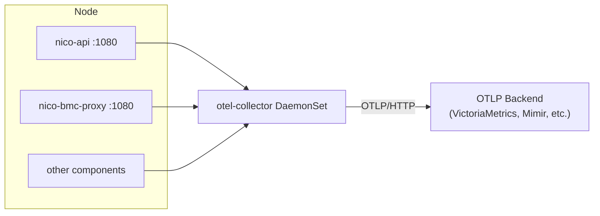

# NICo Metrics

NICo components expose metrics in Prometheus format. This document describes how metrics
are exposed, what they measure and how to collect them using an OpenTelemetry Collector
DaemonSet or Prometheus ServiceMonitors.

For alerting thresholds, KPIs and PrometheusRule examples, see [alerts.md](alerts.md).

## 1. How metrics are exposed

Each NICo component runs an HTTP server exposing a `/metrics` endpoint in Prometheus text
format. The OpenTelemetry SDK creates metrics using the Meter API, then the
`opentelemetry-prometheus` exporter bridges them to a Prometheus registry served over HTTP.

Components also expose `/health` (liveness) and `/ready` (readiness) endpoints on the same
metrics port for each component:

| Component | Port | Primary metrics |
|-----------|------|-----------------|
| nico-api | 1080 | State lifecycle, capacity, health, API performance |
| nico-api (per-object) | 9091 | Per-object state progress (disabled by default, high cardinality) |
| nico-hardware-health | 9009 | Hardware telemetry, sensor readings |
| nico-bmc-proxy | 1080 | BMC connection stats |
| nico-dhcp | 1089 | Lease counts, request handling |
| nico-dns | 8053 | Query rates, resolution latency |
| nico-pxe | 8080 | Boot request counts |
| nico-ssh-console-rs | 9009 | Console sessions, BMC connections |

All NICo metrics use the `carbide_` prefix. Metric types are indicated by the `# TYPE`
comment in Prometheus exposition format. Note that NICo uses `_count` as a suffix for
some gauges (e.g., `carbide_hosts_usable_count`, `carbide_dpus_healthy_count`) - check
the `# TYPE` metadata to determine the actual metric type.

## 2. What the metrics tell you

NICo metrics fall into several categories, each answering different operational questions.

### State lifecycle: "Are machines progressing normally?"

The state controller is the heart of NICo's lifecycle management. It tracks machines,
network segments, IB partitions and other objects through their lifecycle states. For
each object type, you get metrics showing current distribution across states, SLA
violations, time-in-state histograms and transition counts.

The most important metric pattern is `carbide_<object>_per_state_above_sla`. This counts
objects stuck longer than the configured threshold for that state. Any non-zero value
means something is blocking normal lifecycle progression and warrants investigation.
Common causes include BMC connectivity issues, PXE boot failures or external service
timeouts.

Related metrics include `carbide_<object>_per_state` (current count per state),
`carbide_<object>_state_time_in_state_seconds` (histogram of time spent) and
`carbide_<object>_state_handler_errors_total` (processing failures).

### Capacity: "How much headroom do we have?"

Capacity metrics answer whether you can accept new workloads. The machine controller
exposes `carbide_hosts_usable_count` and `carbide_gpus_usable_count` showing hosts and
GPUs available for allocation. The `carbide_available_ips_count` metric tracks IP
address pool exhaustion.

For multi-tenant deployments, `carbide_resource_pool_*` metrics break down capacity by
resource pool. Watch for pools approaching zero availability before tenants start seeing
allocation failures.

### Health: "What's broken right now?"

Health metrics reveal infrastructure problems. The machine controller exposes
`carbide_hosts_health_status_count` and `carbide_dpus_healthy_count` / `carbide_dpus_up_count`
showing aggregate health across the fleet.

For detailed breakdowns, `carbide_hosts_unhealthy_by_probe_id_count` and
`carbide_hosts_unhealthy_by_classification_count` label unhealthy hosts by probe type
and classification. This tells you not just how many hosts are unhealthy but why - sensor
warnings, agent connectivity failures, validation errors, etc.

DPU health is tracked separately with `carbide_dpus_*` metrics showing total, online and
healthy counts. A gap between online and healthy indicates DPUs that are reachable but
failing health checks.

### Discovery: "Is site explorer finding everything?"

Site explorer continuously discovers infrastructure. The `carbide_site_explorer_*` metrics
show discovery status, result counts and any mismatches between expected and actual
inventory. Rising error counts or stale discovery timestamps indicate connectivity issues
with BMCs or switches.

### Firmware management

Firmware update metrics track the upgrade queue and active operations.
`carbide_firmware_queue_length` shows pending updates while
`carbide_firmware_active_updates` shows concurrent operations. The pre-ingestion manager
metrics (`carbide_preingestion_*`) track firmware image preparation.

### API performance

The nico-api exposes detailed request metrics. `carbide_api_grpc_server_duration_milliseconds`
is a histogram of request latency by method. Watch p95 and p99 for SLO monitoring.

Database performance appears in `carbide_db_pool_*` metrics showing connection pool
utilization. Low idle connections or high wait times indicate database contention.

Vault metrics (`carbide_api_vault_requests_*`) track secret management operations. Failures
here cascade to certificate issuance and machine provisioning.

### Hardware health service

The nico-hardware-health component has two separate endpoints. The `/metrics` endpoint
exposes service-level metrics (probe success rates, scrape latency). The `/telemetry`
endpoint exposes raw sensor readings (temperatures, power, fan speeds) collected via
Redfish from BMCs.

<Tip>
The telemetry endpoint is high-cardinality due to per-sensor labels. Enable it only when
your metrics backend can handle the volume and you need sensor-level visibility.
</Tip>

### Network services

Supporting services expose their own metrics. nico-dhcp tracks lease operations and
request handling. nico-dns exposes query rates and resolution latency.

### Console services

nico-ssh-console-rs exposes `carbide_ssh_console_*` metrics for BMC connection counts,
session durations and error rates. This is useful for debugging console access issues.

## 3. Collection architecture



### ServiceMonitor configuration

NICo Helm charts include ServiceMonitor resources for Prometheus Operator environments.
This requires Prometheus Operator CRDs to be installed in the cluster. Enable ServiceMonitors
in Helm values:

```yaml
serviceMonitor:
  enabled: true
  interval: 30s
```

For nico-hardware-health, there are separate ServiceMonitors for service metrics and
hardware telemetry. Enable telemetry scraping only when storage allows:

```yaml
serviceMonitor:
  enabled: true        # /metrics endpoint
telemetryServiceMonitor:
  enabled: false       # /telemetry endpoint (high cardinality)
```

### OTel Collector configuration

Configure the prometheus receiver for Kubernetes service discovery. This example scrapes
only the `/metrics` endpoint. For nico-hardware-health `/telemetry` (high-cardinality
sensor data), add a separate scrape job targeting the `telemetry` port name.

<Note>
If running as a DaemonSet, each replica will independently discover and scrape
all targets, duplicating samples. For DaemonSet deployments, implement target
allocation/sharding via the [Target Allocator](https://opentelemetry.io/docs/kubernetes/operator/target-allocator/).
</Note>

```yaml
receivers:
  prometheus:
    config:
      scrape_configs:
        - job_name: 'nico'
          kubernetes_sd_configs:
            - role: endpoints
              namespaces:
                names: [nico-system]
          relabel_configs:
            - source_labels: [__meta_kubernetes_service_annotation_prometheus_io_scrape]
              action: keep
              regex: true
            - source_labels: [__meta_kubernetes_endpoint_port_name]
              action: keep
              regex: metrics

processors:
  batch: {}

exporters:
  # VictoriaMetrics single-node
  otlphttp:
    endpoint: http://victoriametrics:8428/opentelemetry/v1/metrics
  # VictoriaMetrics cluster: http://vminsert:8480/insert/0/opentelemetry/v1/metrics
  # Grafana Mimir: http://mimir:8080/otlp/v1/metrics

service:
  pipelines:
    metrics:
      receivers: [prometheus]
      processors: [batch]
      exporters: [otlphttp]
```

## 4. Per-object state metrics endpoint

The nico-api state controller can expose per-object state progress metrics from a
**dedicated listener** separate from the main `/metrics` endpoint. This feature is
disabled by default because it produces O(fleet) cardinality - one series per object
for each metric.

While aggregate metrics like `carbide_machines_per_state_above_sla` tell you *how many*
machines are stuck, per-object metrics tell you *which* - critical at 100k-machine scale
for identifying individual stuck objects.

### Metrics exposed

| Metric | Type | Purpose |
|--------|------|---------|
| `carbide_object_state_entered_timestamp_seconds` | gauge | Current state as join key + exact state age (`time() - value`). One series per live object. |
| `carbide_object_state_sla_seconds` | gauge | Resolved SLA for current state. Alerts never change when SLA policy does. |
| `carbide_object_manual_intervention_required` | gauge | Value 1 when operator action needed; `reason` is a bounded token. |
| `carbide_object_info` | gauge | Stable traits (rack, SKU, vendor, model) for joins, similar to `kube_node_info`. |
| `carbide_machine_dpu_info` | gauge | Host-to-DPU associations (one series per DPU). |
| `carbide_machine_instance_info` | gauge | Machine-to-instance and tenant associations. |

All metrics use labels `object_type` and `object_id`. State metrics add `state` and
`substate` labels. These series exist only while true: transitions replace entries,
deletions clear them immediately.

### Configuration

Enable via TOML configuration:

```toml
[observability.per_object_state_metrics]
enabled = true                    # default: false
listen_address = "[::]:9091"      # dual-stack default
# Defaults to all supported types; also valid: network_segment, vpc_prefix,
# spdm_attestation, ib_partition
object_types = ["machine", "switch", "power_shelf", "rack"]
```

The `object_types` field deserializes into an enum, so a mistyped token fails config
parsing instead of silently emitting nothing.

### Helm configuration

Enable via Helm values:

```yaml
service:
  perObjectStateMetrics:
    enabled: true
    port: 9091
    objectTypes:
      - machine
      - switch
      - power_shelf
      - rack
      - network_segment
      - vpc_prefix
      - spdm_attestation
      - ib_partition

perObjectStateMetricsServiceMonitor:
  enabled: true
  interval: 60s       # slow scrape is sufficient
  scrapeTimeout: 25s
```

This creates:

- The application listener and container port
- A dedicated Kubernetes Service (`nico-api-object-metrics`)
- An optional ServiceMonitor with a slower scrape interval

If using `configFiles.nicoApiConfig` to replace the chart's bundled configuration, that
custom TOML must include the `[observability.per_object_state_metrics]` section explicitly.

### Scrape guidance

- **Interval:** 60-120 seconds is sufficient. Series change only on state transitions.
- **Same Prometheus:** Both endpoints must be scraped into the same Prometheus instance
  for joins to work.
- **Multi-replica caveat:** With `replicas > 1`, aggregate away the scrape instance before
  joining:

  ```text
  max by (object_type, object_id, state, substate) (...)
  ```

### Example queries

**Objects stuck beyond their SLA:**

```text
max by (object_type, object_id, state, substate)
    (time() - carbide_object_state_entered_timestamp_seconds)
  > on(object_type, object_id, state, substate) group_left()
    max by (object_type, object_id, state, substate)
        (carbide_object_state_sla_seconds)
```

**Objects requiring manual intervention:**

```text
max by (object_type, object_id, reason)
    (carbide_object_manual_intervention_required == 1)
```

**Join stuck machines with rack info:**

```text
(
  max by (object_type, object_id, state, substate)
    (time() - carbide_object_state_entered_timestamp_seconds{object_type="machine"})
    > 3600
)
  * on(object_type, object_id) group_left(rack, sku)
    max by (object_type, object_id, rack, sku)
        (carbide_object_info)
```

For alerting rules using these metrics, see [alerts.md](alerts.md#5-per-object-alerting).

## 5. Dashboards

NICo ships three Grafana dashboards in the Helm chart at `helm/observability/dashboards/`.
Import these JSON files into your Grafana instance or enable the Helm chart's dashboard
provisioning.

### Site overview dashboard

The site overview (`nico-overview.json`) is the main operational dashboard showing fleet status at a glance:

**Service and site health** - API status indicator (READY/DOWN), running version with Git SHA,
unhealthy host count, DPU online and healthy counts. These stat panels give immediate
visibility into control plane and fleet health.

**Capacity** - Host and GPU availability gauges, resource pool utilization. Shows how much
headroom remains before new allocations fail.

**Tenancy and inventory** - Tenant allocation breakdown, managed entity counts. Useful for
capacity planning and understanding fleet composition.

**Host lifecycle states** - Current distribution of hosts across lifecycle states. Highlights
machines in transitional states that may need attention.

**Health alerts** - Unhealthy hosts broken down by probe type and classification. Shows
which health check is failing and what impact it has (PreventAllocations,
PreventHostStateChanges, etc.).

### Object lifecycle dashboard

The object lifecycle board (`nico-lifecycle.json`) provides a deep dive
into state machine behavior for any object type (machines, network segments,
IB partitions). Uses an `$object_type` variable to switch between types.

**Current state** - Object count, objects above SLA, current handling errors. The "above SLA"
panel is key - any non-zero value indicates stuck objects.

**Objects by state** - Stacked area chart showing distribution over time. Helps identify
patterns (e.g., provisioning backlog during business hours).

**Above SLA by state** - Which specific states have stuck objects. Narrows investigation to
the failing transition.

**State-handler errors** - Error counts from controllers processing state transitions.
Indicates bugs or external service failures.

**Transitions and latency** - State entry rate (throughput), handler latency p95, time in
state before transition p95. Shows whether the system is keeping up with demand.

**Controller work rate** - Iteration rate and latency for the state controller loop. High
latency here suggests database or processing bottlenecks.

### API performance dashboard

The API performance dashboard (`nico-api-performance.json`) tracks
control plane health and performance metrics:

**Request summary** - API status, request rate, p95 latency, gRPC error rate. Top-level
indicators for SLO monitoring.

**Requests by method and status** - Heatmap of request latency by gRPC method. Identifies
which endpoints are slow or failing.

**Database** - Queries per second, time per request, connection pool utilization. Database
contention is a common cause of API slowdowns.

**Vault and transport** - Vault request rates, token refresh timing, TLS connection counts.
Catches secret management issues before they cause auth failures.

### Deploying dashboards

**Option A: Helm provisioning (recommended)**

Enable dashboard provisioning in your Helm values. The chart creates a ConfigMap that
Grafana's sidecar picks up automatically:

```yaml
grafanaDashboards:
  enabled: true
  namespace: monitoring        # Where Grafana runs
  folder: NICo                 # Grafana folder name
  labels:
    grafana_dashboard: "1"     # Matches kube-prometheus-stack default
```

The target namespace must exist and the Grafana sidecar must watch it. For kube-prometheus-stack,
configure `grafana.sidecar.dashboards.searchNamespace` if Grafana is in a different namespace.

**Option B: Manual import**

Download the JSON files from `helm/observability/dashboards/` and import via Grafana UI
(Dashboards -> Import -> Upload JSON file). Set the Prometheus datasource when prompted.

Each dashboard provides variables for datasource selection and metric prefix customization.
The prefix defaults to `carbide_` (NICo's current emission prefix). If your site uses
`alt_metric_prefix`, update the dashboard variable accordingly.

## 6. Troubleshooting

### Missing metrics

If a component's metrics aren't appearing in your backend, first verify the endpoint works:

```bash
kubectl port-forward -n nico-system svc/nico-api-metrics 1080:1080
curl -s http://localhost:1080/metrics | head -20
```

If this fails, check pod status (`kubectl get pods -n nico-system`) and logs. If it succeeds,
the issue is in collection - check OTel Collector logs for scrape errors or export failures:

```bash
kubectl logs -n monitoring -l app.kubernetes.io/name=opentelemetry-collector | grep -i error
```

Common causes: ServiceMonitor labels don't match, scrape config namespace wrong, network
policy blocking scrape, exporter authentication failure.

### High cardinality

If your metrics backend is growing rapidly or queries are slow, you may have high-cardinality
metrics. Hardware telemetry (`/telemetry` endpoint) is the most common culprit due to
per-sensor labels.

Solutions:

- Disable telemetry scraping if not needed
- Add recording rules to aggregate before storage
- Filter high-cardinality labels in the collector

### Stale metrics

If metrics show old values, check that the scrape target is healthy and the endpoint isn't
hanging. Use `kubectl describe servicemonitor` to verify scrape configuration. If endpoints
are slow to respond, increase scrape timeout - but keep it at or below the scrape interval
(e.g., `scrape_interval: 30s` with `scrape_timeout: 25s`).

## 7. References

- [NICo Helm charts](https://github.com/NVIDIA/infra-controller/tree/main/helm/charts) - ServiceMonitor configs, metrics ports
- [NICo Grafana dashboards](https://github.com/NVIDIA/infra-controller/tree/main/helm/observability/dashboards) - JSON dashboard files
- [Full metrics reference](core_metrics.md) - Auto-generated list
- [OpenTelemetry Collector Helm chart](https://opentelemetry.io/docs/platforms/kubernetes/helm/collector/)
- [Prometheus receiver](https://github.com/open-telemetry/opentelemetry-collector-contrib/tree/main/receiver/prometheusreceiver)
