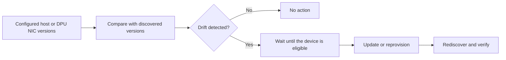
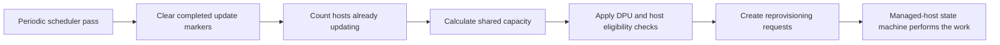

# Firmware Updates <Badge intent="launch" minimal>New</Badge>

This guide first gives a high-level view of firmware updates in NICo and helps
you choose the workflow that applies to your hardware. The linked workflow
pages then explain their configuration, prerequisites, execution, verification,
and recovery in detail.

## Overview

NICo uses a site-wide desired-state process for managed host firmware and DPU
NIC firmware. Operators configure the versions expected at the site. When
automatic updates are enabled, NICo compares those versions with the firmware
reported by managed hardware. Drift makes a device eligible for an update,
which NICo schedules automatically instead of requiring a one-off update
command.

The drift-driven workflow is:

Detecting drift does not mean the update starts immediately. NICo may wait for
the machine to enter an eligible state, an update window to open, or site-wide
concurrency limits to allow more work. The responsible controller then performs
the update or reprovisioning and verifies the result from newly discovered
hardware state.

[Pre-ingestion](firmware-updates/pre-ingestion.md) is a related but separate
path. When automatic updates are enabled, it can update new hardware whose
firmware is below a configured minimum before NICo ingests and manages it.
After ingestion, drift detection keeps the hardware aligned with the configured
baseline.

Not every firmware workflow begins with drift detection. Rack-scale compute
trays, NVSwitches, and power shelves can be updated through explicit API
requests. Some platforms require a vendor tool, a script, rack maintenance, or
a manually confirmed procedure. Refer to
[Choose the update path](#choose-the-update-path) for the path used by each
component.

## How automatic work is scheduled

Machine Update Manager schedules automatic firmware work for managed hosts and
DPUs. It does not install firmware itself; the managed-host state machine owns
the disruptive work and the return to service.

On each scheduler pass, NICo:

1. clears bookkeeping for updates that have completed;
1. counts the distinct hosts already in maintenance or an update workflow;
1. calculates the remaining capacity from the site-wide machine-update limit;
1. asks the enabled DPU and host firmware modules for eligible work; and
1. creates requests until the shared capacity is full.

Host and DPU work therefore compete for the same capacity, and a host with
several drifted DPUs counts once. Each module still applies its own state,
health, approval, and update-window checks before selecting a host. If the
calculated capacity is zero, drift remains pending and no automatic managed
machine update starts.

Pre-ingestion firmware is not scheduled by Machine Update Manager. It has a
separate polling interval and concurrency limit because the hardware has not
yet entered the managed-host lifecycle. Refer to the
[Machine Update Manager architecture](../architecture/overview.md#machine-update-manager)
for the broader ownership model.

## Set the expected versions

NICo does not discover the latest firmware version on its own. Before NICo can
detect drift, the site must define which firmware versions are expected.

For host firmware, NICo uses a catalog organized by BMC vendor, host model, and
component. A component can define both:

- `preingest_upgrade_when_below`: the threshold that triggers firmware work
  before ingestion.
- `default`: the desired version used to detect drift after ingestion.

For example, a host reporting BMC version `7.05.00.00` meets a configured
minimum of `7.00.00.00`, so ingestion can continue. If the default is
`7.10.30.00`, that host is still drifted after ingestion and becomes eligible
for the managed-host firmware workflow.

Host definitions can come from the
[Host Firmware Config API](api:PUT/v2/org/{org}/nico/firmware-config/host),
legacy `metadata.toml` files, or static `host_models` configuration. NICo merges
these sources into one effective catalog. The API is the current configuration
method; `metadata.toml` is retained for existing deployments.

DPU NIC firmware uses an accepted-version list in the site configuration
instead of the host catalog. Rack and component workflows receive their target
from an explicit request or their component backend.

Refer to [Configure Firmware Versions](firmware-updates/configuration.md) for the
configuration models, setting reference, examples, and source precedence.

## Choose the update path

Use the table below to find the path for the hardware and component you are
updating. For hosts, the path also depends on whether ingestion has completed.

| Your situation | Update path | How it begins |
|---|---|---|
| A host has not completed ingestion and a reported component version is below `preingest_upgrade_when_below`. | [Pre-ingestion](firmware-updates/pre-ingestion.md) | The pre-ingestion manager detects the condition. When global automatic updates are enabled, it selects the default or pre-ingestion-only firmware entry and starts the update. |
| Firmware on a managed host differs from the effective default in the merged firmware catalog. | [Host firmware](firmware-updates/host-firmware.md) | When host automatic updates are enabled, NICo detects the drift and schedules host reprovisioning. If `explicit_start_needed` is enabled, NICo first waits for the host's update window. |
| A managed DPU NIC reports a version outside `dpu_nic_firmware_update_versions`. | [DPU NIC firmware](firmware-updates/dpu-firmware.md#dpu-nic-firmware) | When DPU NIC updates are enabled, NICo detects the drift and schedules DPU reprovisioning. |
| A DPU component other than the NIC needs an update. | [DPU firmware components](firmware-updates/dpu-firmware.md#components-covered) | Request DPU reprovisioning explicitly. Applying the BFB updates the bundled firmware and verifies selected components; non-NIC drift is not an independent automatic trigger. |
| A rack, compute tray, NVSwitch, or power shelf needs an update. | [Rack and component firmware](firmware-updates/rack-component-firmware.md) | An operator requests the update through the appropriate API. NICo routes it to the controller or backend responsible for that component. |
