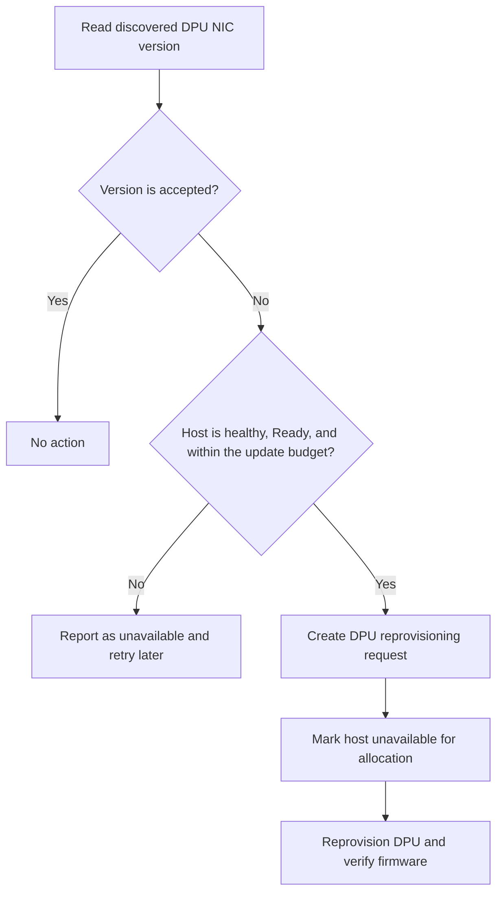
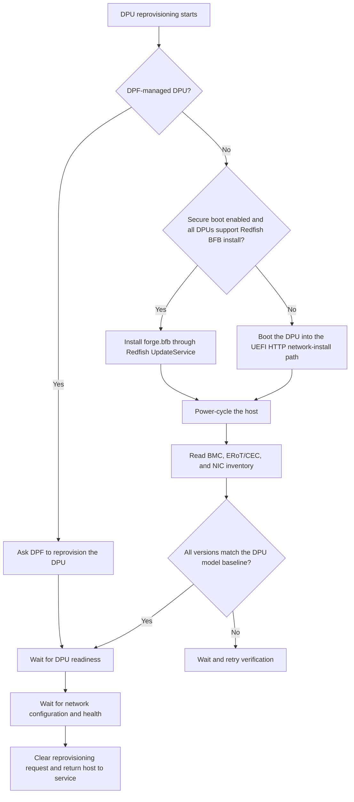

# DPU Firmware Updates

DPU firmware is updated as part of DPU reprovisioning. NICo does not upload a
separate package for each DPU component. Instead, it installs or boots the
site's BlueField Bundle (BFB), power-cycles the platform, and then checks the
firmware reported by the DPU BMC.

Keep two kinds of configuration separate:

- `dpu_nic_firmware_update_versions` determines whether DPU NIC drift should
  automatically start reprovisioning.
- `dpu_models` contains the BMC, ERoT/CEC, and NIC versions that NICo expects
  after the BFB has been applied.

These values and the BFB must describe the same release. Refer to
[DPU firmware](configuration.md#dpu-firmware) before enabling
automatic updates.

## Components covered

The classic, non-DPF reprovisioning path uses the following Redfish inventory:

| Component | Redfish inventory match | Role in the workflow |
|---|---|---|
| DPU OS and bundled firmware | `DPU_OS` / BFB | NICo installs `forge.bfb` through Redfish when supported, or boots the DPU into the network-install path. The BFB carries the DPU software and associated firmware payloads. |
| DPU NIC | `DPU_NIC` | Its reported version is the automatic drift trigger. NICo also verifies it after reprovisioning. |
| DPU BMC | An inventory ID containing `BMC_Firmware` | Verified after reprovisioning against the DPU model catalog. |
| ERoT/CEC | `Bluefield_FW_ERoT` | Verified after reprovisioning against the DPU model catalog. |
| DPU UEFI | `DPU_UEFI` | Read for inventory and topology data, but not compared in the current post-reprovision verification loop. |

The distinction matters: BMC or ERoT/CEC drift alone does not make Machine
Update Manager select a DPU. A NIC mismatch starts the workflow; applying the
BFB is expected to bring the other verified components to the corresponding
baseline.

## DPU NIC firmware

### Drift detection

Machine Update Manager periodically reads the DPU NIC version discovered for
each managed DPU. It trims surrounding whitespace and checks for an exact
match in `dpu_config.dpu_nic_firmware_update_versions`.

For example:

```toml
[dpu_config]
dpu_nic_firmware_reprovision_update_enabled = true
dpu_nic_firmware_update_versions = ["32.43.1014", "32.44.1030"]
```

A DPU reporting either listed version is compliant. A DPU reporting
`32.42.1000` is drifted. The list does not identify which version NICo will
install; the deployed BFB determines the resulting firmware versions.

Setting `dpu_nic_firmware_reprovision_update_enabled = false` removes the DPU
NIC module from Machine Update Manager. NICo then stops detecting and
scheduling classic DPU NIC drift automatically. It does not disable DPU
reprovisioning requested through the API.

### Eligibility and scheduling

Drift is evaluated per DPU, but scheduling and disruption are managed per
host. If several DPUs attached to one host are drifted, NICo groups them into
one host update and counts that host once against the shared machine-update
limit.

NICo automatically selects a host only when all of the following are true:

| Check | Requirement |
|---|---|
| Managed-host state | The host is in top-level `Ready`. An assigned host is not automatically selected. |
| Health | The aggregate host health report has no alerts. |
| Existing work | The host is not already in another machine-update workflow, and none of its DPUs already has a reprovisioning request. |
| Site capacity | The shared `machine_updater.max_concurrent_machine_updates_*` policy has room for another host. DPU and host firmware work use the same budget. |

When the host is eligible, Machine Update Manager creates a reprovisioning
request on each drifted DPU. The managed-host controller adds a
`HostUpdateInProgress` health alert with `PreventAllocations`, restarts the
selected DPUs, and enters DPU reprovisioning.



### Reprovisioning and verification

The installation mechanism depends on how the DPU is managed and on platform
capabilities:



`dpu_config.dpu_enable_secure_boot` controls the classic installation branch
and defaults to `false`:

- When it is `false`, NICo uses the UEFI HTTP network-install path.
- When it is `true`, NICo uses Redfish BFB installation only when every attached
  DPU reports BMC firmware `24.10` or newer. If one DPU does not meet that
  requirement or has no reported BMC version, NICo uses network installation.
- DPF-managed provisioning takes precedence and does not use this classic
  secure-boot decision.

This setting chooses how NICo applies the BFB. It does not enable automatic DPU
selection and does not choose the BFB or component target versions.

For the classic path, version verification uses exact string equality. NICo
checks BMC, ERoT/CEC, and NIC in that order. It waits when an inventory entry
is missing, has no version, or reports a different version. DPU UEFI is not in
this verification loop.

For DPF-managed DPUs, Machine Update Manager asks DPF for devices whose
installed BFB or DPU flavor differs from the active `DPUDeployment`. DPF drift
can therefore trigger the same host-level scheduling flow without consulting
the classic NIC accepted-version list. DPF owns reprovisioning, and NICo skips
the classic Redfish component comparison afterward.

## Assigned hosts and operator requests

An assigned host is not eligible for automatic DPU NIC selection. Its drift
contributes to the unavailable count until the host returns to top-level
`Ready`.

An operator can
[request DPU reprovisioning explicitly](api:PATCH/v2/org/:org/nico/machine/:machineId/dpu/reprovision).
The API requires a `HostUpdateInProgress` health alert with
`PreventAllocations`; the CLI's `--update-message` option creates that alert
before sending the request:

```bash
nico-admin-cli -a <core-api-url> dpu reprovision set \
  --id <host-or-dpu-machine-id> \
  --update-message "<ticket-or-maintenance-reference>"
```

Passing a host ID requests reprovisioning for all attached DPUs. Passing a DPU
ID requests it only for that DPU. On an unassigned `Ready` host, the controller
can start the request directly. On an assigned host, the request waits for
tenant reboot approval or the configured `instance_autoreboot_period`, as
described in
[Assigned hosts need reboot approval](host-firmware.md#assigned-hosts-need-reboot-approval).

The CLI still accepts `--update-firmware`, but the current DPU state machine
does not branch on that value. Every classic DPU reprovision follows the same
BFB installation or network-install path and firmware verification.

## Monitor an update

Show the versions reported for all DPUs:

```bash
nico-admin-cli -a <core-api-url> dpu versions
```

The output includes DPU NIC, BMC, BIOS/UEFI, HBN, and DPU agent versions. Do
not use `dpu versions --updates-only` as the authoritative drift list: the
current implementation reads an empty legacy expected-version map and can
return all DPUs instead of only drifted ones.

List pending and active DPU reprovisioning requests, then inspect the
managed-host substate for a particular host:

```bash
nico-admin-cli -a <core-api-url> dpu reprovision list
nico-admin-cli -a <core-api-url> managed-host show <host-machine-id>
```

The following metrics provide the site-wide view:

| Metric | Meaning |
|---|---|
| `carbide_pending_dpu_nic_firmware_update_count` | Drifted DPUs attached to hosts currently eligible for automatic selection. |
| `carbide_unavailable_dpu_nic_firmware_update_count` | Drifted classic DPUs whose host is not currently eligible. |
| `carbide_running_dpu_updates_count` | DPU reprovisioning requests marked as firmware updates that have started. |
| `carbide_dpu_firmware_version_count{firmware_version="..."}` | DPUs grouped by the firmware version reported in their DPU hardware information. |
| `carbide_firmware_updates_total{target="dpu_nic",phase="started"}` | Automatic DPU NIC update starts. This target does not emit a `completed` phase. |
| `carbide_firmware_update_failures_total{target="dpu_nic",cause="wrong_version_after_update"}` | Reprovisioning returned to `Ready`, but the reported NIC version is still outside the accepted list. |

## Recover a stalled update

Start with `dpu reprovision list` and `managed-host show`. The substate usually
separates an installation problem from a post-install health or configuration
problem.

| Symptom | Check |
|---|---|
| `InstallDpuOs/WaitForInstallComplete` does not advance | Inspect the Redfish task and `nico-api` logs. Verify that the DPU BMC can reach `carbide-pxe.forge` and that `forge.bfb` is available. |
| `WaitingForNetworkInstall` does not advance | Check the DPU's UEFI HTTP boot, PXE requests in `nico-pxe`, and whether the DPU agent starts from the installed image. |
| `VerifyFirmareVersions` keeps waiting | Compare BMC, ERoT/CEC, and NIC Redfish inventory with `dpu_models`. A mismatch usually means that the deployed BFB and configured baseline do not describe the same release. |
| `WaitingForNetworkConfig` does not advance | Check DPU agent health and whether the managed-host network configuration versions are synchronized. |
| The host returned to `Ready`, but the update marker remains | Check the NIC version against `dpu_nic_firmware_update_versions`. NICo deliberately retains the update health marker when the resulting NIC version is not accepted. |

Restart an active or failed reprovisioning flow for all requested DPUs on a
host:

```bash
nico-admin-cli -a <core-api-url> dpu reprovision restart \
  --id <host-machine-id>
```

Clear a request only when it has not started:

```bash
nico-admin-cli -a <core-api-url> dpu reprovision clear \
  --id <host-or-dpu-machine-id>
```

For DPU OS installation, networking, and health details beyond firmware, refer to
[DPU Lifecycle Management](../../dpu-management/dpu-lifecycle-management.md).

## Current limitations

- `dpu_nic_firmware_initial_update_enabled` does not currently suppress BFB
  installation or firmware verification during initial DPU setup; the machine
  controller only logs the value.
- The machine controller stores
  `dpu_nic_firmware_reprovision_update_enabled`, but does not consult that field
  while executing a reprovisioning request. The setting controls automatic
  selection through Machine Update Manager.
- The `update_firmware` value stored on a DPU reprovisioning request is used by
  status and metrics, but does not select a different execution path.
- Automatic completion emits no `carbide_firmware_updates_total` event with
  `phase="completed"` for the `dpu_nic` target. Use reprovisioning state, the
  running gauge, and resulting inventory for completion monitoring.
- Classic post-reprovision verification does not compare `DPU_UEFI`, even
  though the DPU model catalog contains a UEFI entry.
