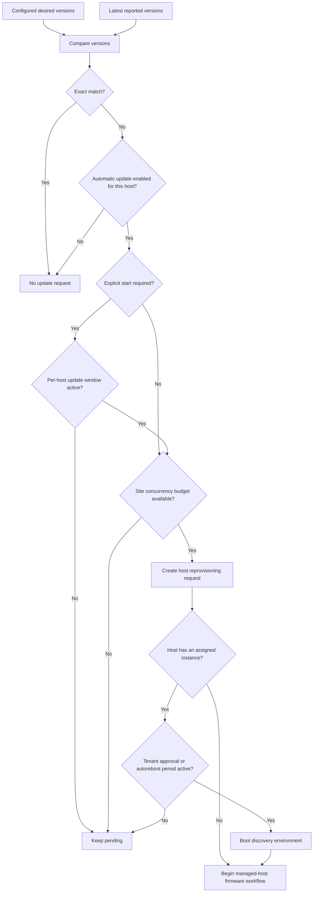
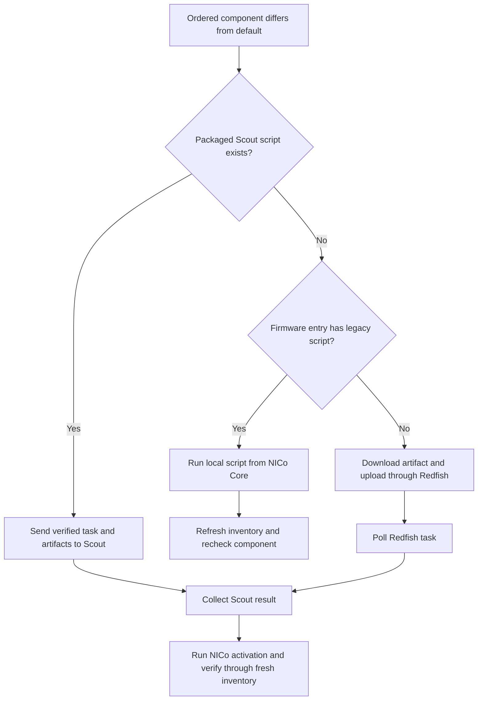

# Managed Host Firmware Updates

Managed host firmware updates keep an ingested host aligned with the default
versions in the
[effective host firmware catalog](configuration.md#host-firmware-catalog).
They are normally triggered by drift, scheduled by Machine Update Manager, and
executed by the managed-host state machine.

This is different from [pre-ingestion](pre-ingestion.md). Pre-ingestion uses a
minimum-version threshold before the host is managed. The managed-host path
compares a managed host with its steady-state defaults and performs the work as
host reprovisioning.

Three parts of NICo cooperate in this workflow:

| Responsibility | NICo component |
|---|---|
| Determine whether reported firmware differs from the defaults. | Site Explorer and the host firmware catalog. |
| Decide whether another host may start an update. | Machine Update Manager. |
| Install, activate, and verify each component. | Managed-host state machine, with Redfish, Scout, or a local script. |

## How an automatic update starts



### Drift detection

Machine Update Manager snapshots the default version of each configured
component by vendor and model. Site Explorer independently stores the versions
reported by the host's matching Redfish inventory entries. A host is drifted
when these two normalized `Versions` maps are not exactly equal.

This comparison is equality-based, not an ordering comparison. A version is
drifted whether it is older, newer, or formatted differently from the
configured default. `preingest_upgrade_when_below` is not used after ingestion.

The catalog can change through the
[Host Firmware Config API](api:PUT/v2/org/{org}/nico/firmware-config/host)
or legacy/static configuration. Machine Update Manager refreshes its
desired-version snapshot when the runtime configuration changes or the legacy
firmware directory is modified.

### Scheduling gates

A drifted host becomes eligible only after the relevant gates pass:

| Gate | Behavior |
|---|---|
| Automatic update policy | `firmware_global.autoupdate` supplies the site default. A per-machine override can enable or disable one host independently. |
| Host state | With `firmware_global.instance_updates_manual_tagging = true`, automatic selection is limited to unassigned hosts in `Ready`. When false, assigned hosts can also be selected. Unassigned hosts are considered first. |
| Existing work | A host with an existing reprovisioning request is not selected again. Machines already in maintenance or another update workflow count against the shared budget. |
| Explicit start | When the model has `explicit_start_needed = true`, the current time must be inside that machine's firmware update window. |
| Site capacity | `machine_updater.max_concurrent_machine_updates_absolute` defines the usable site-wide update ceiling. Machines already in maintenance consume this budget. |

Automatic machine updates do not start when both concurrency limits are
unset, because the resulting update ceiling is zero. Machine Update Manager
runs every `machine_update_run_interval` seconds; the default is 300 seconds.

> **Current limitation:**
> `machine_updater.max_concurrent_machine_updates_percent` is intended to set a
> percentage-based ceiling and account for unhealthy hosts. The current
> implementation passes the total and unhealthy host counts to that calculation
> in reverse, so setting the percentage option reduces the calculated ceiling
> to zero. Until that is corrected, configure
> `machine_updater.max_concurrent_machine_updates_absolute` and leave the
> percentage option unset.

When a host is selected, NICo creates a host reprovisioning request. The
managed-host state machine then adds the `host-fw-update` health report. This
report prevents a currently unassigned host from being allocated and suppresses
external health alerting caused by expected update operations.

### Enable or disable one host

The per-machine policy overrides the global setting:

```bash
nico-admin-cli -a <core-api-url> machine auto-update \
  --machine <machine-id> --enable

nico-admin-cli -a <core-api-url> machine auto-update \
  --machine <machine-id> --disable

nico-admin-cli -a <core-api-url> machine auto-update \
  --machine <machine-id> --clear
```

`--clear` returns the host to the `firmware_global.autoupdate` policy.

The static `firmware_global.host_enable_autoupdate` and
`firmware_global.host_disable_autoupdate` fields are legacy controls. The
current scheduler does not read `host_enable_autoupdate`, and it compares
`host_disable_autoupdate` entries only with machine IDs. A matching disabled
entry also ends host selection for that scheduler pass. Use the per-machine
command for new operational workflows.

### Open an explicit-start window

For a model with `explicit_start_needed = true`, set a window on the affected
machines:

```bash
nico-admin-cli -a <core-api-url> managed-host start-updates \
  --machines <machine-id-1> <machine-id-2> \
  --start <start-time> \
  --end <end-time>
```

Use `YYYY-MM-DDTHH:MM:SS+0000` for an explicit UTC offset, or
`YYYY-MM-DDTHH:MM:SS` for local time.
Omitting `--start` starts the window now. Omitting `--end` makes it last 24
hours. Cancel a pending window with:

```bash
nico-admin-cli -a <core-api-url> managed-host start-updates \
  --machines <machine-id> --cancel
```

This command opens a scheduler gate; it does not create an update request by
itself. Models without `explicit_start_needed` do not require this window.

### Assigned hosts need reboot approval

An assigned host can have a pending reprovisioning request without immediately
interrupting its instance. The request starts when either:

- the tenant approves updates while rebooting the instance; or
- the current time is inside the site-level
  `machine_updater.instance_autoreboot_period`.

Tenant approval is expressed as:

```bash
nico-admin-cli -a <core-api-url> instance reboot \
  --instance <instance-id> --apply-updates-on-reboot
```

The autoreboot period is separate from the per-machine firmware window. The
firmware window lets Machine Update Manager create the request for a model that
requires explicit start. The autoreboot period lets an assigned host consume an
existing request without waiting for tenant approval.

After approval, NICo moves the assigned host through its platform configuration
and discovery-boot states before entering the same component-update loop used
for an unassigned host. `HostReprovision` is the internal state name; this is
not a return to pre-ingestion.

### Request host reprovisioning directly

An operator can bypass automatic drift selection and scheduling by creating a
host reprovisioning request:

```bash
nico-admin-cli -a <core-api-url> host reprovision set \
  --id <machine-id> \
  --update-message "<ticket-or-maintenance-reference>"
```

The state machine still compares inventory with the catalog and returns the
host to its prior steady state if nothing needs an update. A direct request is
not constrained by Machine Update Manager's concurrency calculation, although
an assigned host still needs reboot approval. Use it only as part of an
operator-controlled maintenance procedure.

The host reprovisioning command always enters firmware checking; its legacy
`--update-firmware` flag is not needed. A request that has not started can be
removed with `host reprovision clear --id <machine-id>`.

## Update workflow

After the request can proceed, the managed-host state machine performs the
following sequence:

1. **Protect the host.** NICo records the update health report and, where
   needed, moves an assigned host into its discovery environment and disables
   platform lockdown.
1. **Refresh inventory.** Site Explorer revisits the BMC. The state machine
   selects the effective catalog definition by BMC vendor and host model.
1. **Select a component.** NICo walks `ordering` and finds the first component
   for which any matching inventory entry differs from the default version.
   Pre-ingestion-only firmware entries are excluded.
1. **Install it.** NICo chooses the installation route described below.
   Multi-artifact entries are applied in sequence.
1. **Activate and verify.** For Scout and Redfish updates, NICo performs
   component-specific resets, reboots, or configured power drains. A legacy
   local script owns its own activation procedure. NICo then requests fresh
   inventory and checks the reported versions.
1. **Repeat.** NICo returns to the beginning of `ordering` and selects the next
   mismatched component.
1. **Restore service.** When no mismatch remains, NICo restores lockdown when
   required, returns the host to `Ready` or its assigned-instance state, clears
   the reprovisioning request, and removes the update health report.

### Installation route

The installation mechanism is selected per vendor, model, and component. It is
not a separate top-level workflow.



The route precedence is:

1. **Scout script.** NICo first looks for a packaged
   `/opt/carbide/scout-firmware-scripts/<vendor>/<model>/<component>/upgrade.sh`
   and its `metadata.toml`. If present, NICo sends Scout the verified script,
   artifact URLs and digests, and execution timeouts. Scout downloads and
   verifies the files, runs the script on the host, and reports the result.
1. **Core-local script.** If no Scout script exists and the firmware entry has
   `script`, NICo runs that legacy script on the Core service with the BMC
   address and credentials in its environment. The script is responsible for
   installation and activation; after it succeeds, NICo returns to inventory
   checking.
1. **Redfish.** Otherwise NICo resolves the configured artifact, waits for a
   shared `firmware_global.max_uploads` slot, uploads asynchronously, and polls
   the returned Redfish task.

All successful routes eventually return to component selection. Scout and
Redfish updates first pass through NICo's activation and inventory-verification
states; the legacy script path returns directly to inventory checking.

### Platform and OEM procedures

NICo selects the configured component, starts the integrated installation
route, and verifies the resulting inventory. The approved platform or OEM
procedure remains authoritative for package selection, prerequisites,
preservation settings, activation requirements, and recovery.

Before adding an artifact or script to the catalog, verify that it implements
the procedure for the exact platform and release. A successful Redfish task or
script exit only shows that the installation mechanism completed; NICo still
needs fresh inventory to confirm the configured version. Refer to the
[Redfish workflow](../../architecture/redfish_workflow.md) for the request and
task ownership boundaries.

### Manual platform gate

When `firmware_global.requires_manual_upgrade` is enabled for an MNNVL-capable
host, NICo pauses in `WaitingForManualUpgrade` before selecting components.
GB200 is the common example. Complete the approved platform procedure, then
confirm it with:

```bash
nico-admin-cli -a <core-api-url> host reprovision \
  mark-manual-upgrade-complete --id <machine-id>
```

NICo then refreshes inventory and runs the normal component loop for anything
that still differs from the catalog. Marking the manual work complete does not
assert that every component is compliant; verification still comes from
discovered inventory.

## Monitor and verify

List pending or active host reprovisioning requests:

```bash
nico-admin-cli -a <core-api-url> host reprovision list
```

Inspect the current state and recent state history:

```bash
nico-admin-cli -a <core-api-url> managed-host show <machine-id>
nico-admin-cli -a <core-api-url> machine show <machine-id> --history-count 10
```

Use the host BMC address to inspect the firmware inventory last stored by Site
Explorer:

```bash
nico-admin-cli -a <core-api-url> site-explorer get-report \
  managed-host <bmc-ip>
```

The principal host firmware substates are:

| State | Meaning |
|---|---|
| `CheckingFirmwareV2`, `CheckingFirmwareRepeatV2` | Refresh inventory and select the next mismatched component. |
| `WaitingForManualUpgrade` | Wait for completion of the approved platform procedure. |
| `WaitingForScoutUpgrade` | Wait for Scout to execute the packaged upgrade task and report its result. |
| `WaitingForScript` | Wait for the legacy Core-local script. |
| `WaitingForUpload` | A Redfish upload is running asynchronously. |
| `WaitingForFirmwareUpgrade` | The upload completed and NICo is polling the Redfish task. |
| `ResetForNewFirmware` | NICo is performing activation resets, reboots, or power drains. |
| `NewFirmwareReportedWait` | NICo is refreshing inventory until all matching entries report the target. |
| `FailedFirmwareUpgrade` | The attempt failed; NICo is waiting to retry or has exhausted its retry budget. |

Refer to [Managed Host State Diagrams](../../architecture/state_machines/managedhost.md)
for these firmware substates in the complete host lifecycle.

Completion requires more than leaving an installation state. Verify that the
host returned to `Ready` or `Assigned/Ready`, the reprovisioning request is no
longer listed, and Site Explorer reports the configured default versions.

Useful metrics are:

| Metric | What it shows |
|---|---|
| `carbide_pending_host_firmware_update_count` | Hosts currently selected by the drift query as needing firmware work. |
| `carbide_active_host_firmware_update_count` | Hosts whose top-level state is `HostReprovision`. Assigned-host firmware substates are not included by this query. |
| `carbide_exhausted_reprovision_retry_count` | Unassigned hosts whose top-level firmware retry budget is exhausted. Assigned-host update substates are not included. |
| `carbide_firmware_updates_total{target="host"}` | Host updates started and completed, separated by the `phase` label. |
| `carbide_host_reprovision_retries_total` | Automatic retries of failed host firmware reprovisioning. |
| `carbide_machines_in_maintenance_count` | Machines consuming the shared maintenance budget. |
| `carbide_concurrent_machine_updates_available` | The calculated site-wide concurrency ceiling for machine updates. |

Refer to [Core Metrics](../../observability/core_metrics.md) for the common metric
labels and collection endpoint.

## Failures and recovery

Transient upload failures and interrupted asynchronous uploads return to
firmware checking and are attempted again. A failed Scout result, failed local
script, terminal Redfish task, or firmware that exhausts its activation-reset
retries moves the host to `FailedFirmwareUpgrade`.

NICo waits `firmware_global.host_firmware_upgrade_retry_interval` before
retrying that workflow. The default interval is 60 minutes. An unassigned host
in the top-level `HostReprovision` state has a budget of five retries. After it
is exhausted, the host remains failed and is counted by
`carbide_exhausted_reprovision_retry_count`.

> **Current limitation:** Assigned-host firmware work stores its substate under
> `Assigned` without a persisted host retry counter. It therefore retries at
> the configured interval without reaching the five-retry limit or the
> exhausted-retry metric.

Correct the artifact, script, BMC, inventory matcher, or platform condition
before forcing another attempt. Then reset host reprovisioning to firmware
checking and, for an unassigned host, clear the retry count:

```bash
nico-admin-cli -a <core-api-url> managed-host \
  reset-host-reprovisioning --machine <machine-id>
```

This command does not repair the platform or change the catalog. It only asks
the state machine to start firmware checking again.

A Core-local script interrupted by a NICo restart is not resumed automatically
and can remain in `WaitingForScript`; use the same reset command after verifying
that the old script is no longer running.

If a host repeatedly appears as pending but immediately leaves the firmware
workflow, compare the catalog's `current_version_reported_as` matcher with the
latest Redfish inventory. A missing matching inventory entry makes the desired
and reported `Versions` maps differ, but leaves the execution path without a
component it can install or verify.
