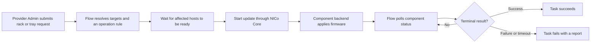

# Rack and Tray Firmware Updates

Firmware updates for racks, compute trays, NVSwitches, and power shelves are
explicit operations. NICo does not start them from the host or DPU drift
detectors described elsewhere in this guide. A Provider Admin submits a REST
request, and NICo Flow creates one or more asynchronous tasks to sequence the
work.

Use this path when an operator needs Flow to update a rack or selected tray.
For desired-state updates on a conventional managed host, use
[Host firmware updates](host-firmware.md) instead.

## How the request runs

The REST response confirms that the task was created; it does not mean that
the firmware update has completed.



Before dispatching a disruptive operation, Flow checks persisted component
readiness. A compute-tray update checks the targeted hosts. An NVSwitch or
power-shelf update checks the hosts in the owning rack, because those devices
can affect every tenant in that rack. Flow waits for up to 30 minutes and
checks every 5 seconds by default.

If readiness information is missing, the current implementation logs a warning
and allows the operation to proceed. Do not treat the readiness check as a
substitute for confirming the maintenance scope and tenant impact.

## Choose the endpoint

All endpoints require the Provider Admin role. `siteId` is required in every
request body and must identify a site owned by the provider organization.

| Scope | Endpoint | Selection |
|---|---|---|
| One rack | [`PATCH /v2/org/{org}/nico/rack/{rack-id}/firmware`](api:PATCH/v2/org/{org}/nico/rack/{id}/firmware) | The rack in the URL. |
| Several or all racks | [`PATCH /v2/org/{org}/nico/rack/firmware`](api:PATCH/v2/org/{org}/nico/rack/firmware) | Optional `filter.names`. No filter means every rack in the site. |
| One tray | [`PATCH /v2/org/{org}/nico/tray/{tray-id}/firmware`](api:PATCH/v2/org/{org}/nico/tray/{id}/firmware) | The tray in the URL. |
| Several or all trays | [`PATCH /v2/org/{org}/nico/tray/firmware`](api:PATCH/v2/org/{org}/nico/tray/firmware) | Optional `filter`. No filter means all compute, NVSwitch, and power-shelf trays in every site rack. |

The batch tray filter supports:

| Filter | Meaning |
|---|---|
| `rackId` or `rackName` | Select trays in one rack. These fields are mutually exclusive. |
| `type` | Select exactly `Compute`, `NVSwitch`, or `PowerShelf`. |
| `componentIds` | Select component IDs of the specified `type`; `type` is required. |
| `ids` | Select tray UUIDs. |
| `slotId` | Select a rack slot; requires `rackId` or `rackName`. |

Rack selection cannot be combined with `ids` or `componentIds`. Prefer a
single-rack or single-tray request for the first update of a new firmware
bundle. An unfiltered batch request can affect the entire site.

## Describe the update

The request has four controls in addition to `siteId`:

| Field | Purpose |
|---|---|
| `version` | Target passed to the component backend. For current rack-scale RMS paths, this is a complete SOT firmware-object JSON document serialized as a string. Legacy backends can accept a plain version string. |
| `targets` | Optional component subset for tray requests. When present, `version` must also be present. Rack handlers do not forward this field, so do not send it with a rack request. |
| `ruleId` | Pins the task to a custom Flow operation rule. When omitted, Flow resolves a rule and falls back to its built-in firmware rule. |
| `overrideReadinessCheck` | Bypasses Flow's readiness gate and tells Core to bypass its state controller where supported. Use only during supervised maintenance after tenant impact has been accepted. |

Although the API permits `version` to be omitted when `targets` is empty, that
is not portable across component backends. Rack-scale RMS updates require SOT
JSON. Supply an explicit version unless the selected backend and operation rule
are known to resolve one.

### SOT firmware-object JSON

RMS firmware is described by a source-of-truth (SOT) firmware object: a JSON
document containing the bundle identity and the artifacts RMS must apply. The
document comes from the platform's firmware release process; it is not the
same as the host firmware catalog described in
[Configure firmware versions](configuration.md).

The REST `version` field is a string, so the complete JSON document must be
serialized into that string. Build the request body with a JSON tool instead
of escaping the document by hand:

```sh
SOT_JSON=$(jq -c . compute-firmware-object.json)

jq -n \
  --arg siteId "$SITE_ID" \
  --arg version "$SOT_JSON" \
  '{siteId: $siteId, version: $version, targets: ["bmc", "bios"]}'
```

For a rack request that needs a different value for each component type,
`version` can contain a layered JSON document with `compute`, `nvswitch`, and
`powershelf` keys. Flow extracts the relevant value before calling each
component manager. For example, this builds a layered value from two complete
SOT documents:

```sh
COMPUTE_SOT=$(jq -c . compute-firmware-object.json)
SWITCH_SOT=$(jq -c . switch-firmware-object.json)

LAYERED_VERSION=$(jq -cn \
  --argjson compute "$COMPUTE_SOT" \
  --argjson nvswitch "$SWITCH_SOT" \
  '{compute: $compute, nvswitch: $nvswitch}')
```

If a layered document omits a component-type key, Flow passes an empty target
to that component manager. Use an operation rule that excludes the component
instead of relying on an empty value to skip it.

The REST surface does not accept an RMS artifact access token. Core sends
`NOAUTH` when no token is available, so artifacts referenced by these requests
must be reachable without a separate token.

## Submit an update

This request updates only the BMC and BIOS targets on one compute tray:

```json
{
  "siteId": "2b88bb63-9a21-4bad-b113-68a54aa6e3dd",
  "version": "<complete SOT firmware-object JSON serialized as a string>",
  "targets": ["bmc", "bios"]
}
```

The response contains the task IDs to monitor:

```json
{
  "taskIds": ["c5e00a88-9b42-4e2b-a237-63e787f698ef"]
}
```

To update all racks named `A01` and `A02`, submit a batch rack request:

```json
{
  "siteId": "2b88bb63-9a21-4bad-b113-68a54aa6e3dd",
  "filter": {
    "names": ["A01", "A02"]
  },
  "version": "<complete or layered firmware target serialized as a string>"
}
```

## Default sequencing

When no site-specific rule or `ruleId` applies, Flow uses this built-in rule:

| Stage | Component type | Status polling | Attempts |
|---|---|---|---|
| 1 | Compute | Every 2 minutes, for up to 45 minutes | 2 |
| 2 | NVSwitch | Every 2 minutes, for up to 45 minutes | 2 |

The stages run in order. A failed or timed-out stage fails the task. A stage
that has no matching components is reported as skipped.

The built-in rule deliberately excludes power shelves and does not perform an
AC power cycle after flashing. Use an approved custom operation rule for power
shelves. If firmware activation requires a power cycle, submit the appropriate
power-recycle task separately or include it in a custom rule. Refer to the
Flow [Operation Rules Guide](../../../rest-api/flow/docs/operation-rules-guide.md).

## Component behavior

### Compute trays

Supported `targets` are:

`bmc`, `bios`, `cec`, `nic`, `cpld_mb`, `cpld_pdb`, `hgx_bmc`,
`combined_bmc_uefi`, `gpu`, and `cx7`.

Omitting `targets` asks Core to update all components represented by the
selected firmware bundle. It does not include DPU reprovisioning.

`dpu` is a special, explicit-only compute target. NICo first submits any
compute-tray update, then reprovisions the DPU on each selected host serially.
The request's `version` is ignored for the DPU branch; its target comes from
site configuration. Use `targets: ["dpu"]` for a DPU-only request. Refer to
[Assigned hosts and operator requests](dpu-firmware.md#assigned-hosts-and-operator-requests)
before using this path.

Core routes conventional standalone machines through the managed-host firmware
workflow and rack-scale compute trays through the configured rack state
controller or component backend. Consequently, a single REST shape can start
different internal workflows depending on the hardware model.

### NVSwitches

Supported `targets` are `bmc`, `cpld`, `bios`, and `nvos`. Omitting `targets`
passes an empty component list to Core, which means all supported switch
components for the selected backend.

When `version` is omitted, Flow first compares the switches' inventory with
Core's desired switch versions and skips the call if every switch is already
current. If an update is needed, the backend must still be able to resolve an
empty target. Supply a target explicitly for predictable behavior.

### Power shelves

Supported `targets` are `pmc` and `psu`. If `targets` is omitted, the current
Flow component manager updates only `pmc`.

Power shelves are not present in the built-in firmware rule, so a power-shelf
tray request needs an operation rule that contains a `PowerShelf` firmware
step. Core's power-shelf state-controller path is not implemented; updates are
currently dispatched through the configured direct backend.

## Monitor and cancel tasks

Use [Retrieve a Task](api:GET/v2/org/{org}/nico/task/{id})
to read each returned task ID until it reaches `Succeeded`, `Failed`, or
`Terminated`:

```http
GET /v2/org/{org}/nico/task/{task-id}?siteId={site-id}
```

The task report records each rule stage and component step as `pending`,
`running`, `completed`, `failed`, or `skipped`. On failure, inspect both the
top-level `message` and the report's stage or step `error`.

You can also
[list tasks for a rack](api:GET/v2/org/{org}/nico/rack/{id}/task)
or [list tasks for a tray](api:GET/v2/org/{org}/nico/tray/{id}/task).

The `activeOnly=true` query parameter restricts the result to non-terminal
tasks, and the `includeReport=true` query parameter includes the stage and
step report.

```http
GET /v2/org/{org}/nico/rack/{rack-id}/task?siteId={site-id}&activeOnly=true&includeReport=true
GET /v2/org/{org}/nico/tray/{tray-id}/task?siteId={site-id}&activeOnly=true&includeReport=true
```

[Cancel a Task](api:POST/v2/org/{org}/nico/task/{id}/cancel)
is best effort. It terminates a pending, running, or waiting task, but it cannot
undo firmware work already accepted by a hardware backend. Completed and
failed tasks cannot be cancelled.

```text
POST /v2/org/{org}/nico/task/{task-id}/cancel

{"siteId":"<site-id>"}
```

After cancellation or failure, inspect component status before retrying. Do not
assume that every component remained on its previous version.

## Inspect Core component status

The `component-manager` commands call NICo Core directly. Use them to inspect
the backend's view of a running REST task or for platform-specific recovery.
They do not create a Flow task or apply its operation rule.

```sh
nico-admin-cli component-manager get-firmware-update-status rack \
  --rack-id <rack-id>

nico-admin-cli component-manager get-firmware-update-status compute-tray \
  --machine-id <machine-id>

nico-admin-cli component-manager get-firmware-update-status switch \
  --switch-id <switch-id>

nico-admin-cli component-manager get-firmware-update-status power-shelf \
  --power-shelf-id <power-shelf-id>

nico-admin-cli component-manager get-firmware-versions switch \
  --switch-id <switch-id>
```

Core also exposes direct update commands. Prefer the REST workflow for normal
rack operations because it provides readiness checks, ordering, task reports,
and cancellation. Direct commands require the operator to provide those
safeguards.

For RMS-backed compute trays or switches, pass a SOT file rather than embedding
it on the command line:

```sh
nico-admin-cli component-manager update-firmware compute-tray \
  --machine-id <machine-id> \
  --sot-json-file ./compute-firmware-object.json

nico-admin-cli component-manager update-firmware switch \
  --switch-id <switch-id> \
  --sot-json-file ./switch-firmware-object.json \
  --component bmc,cpld,bios,nvos

nico-admin-cli component-manager update-firmware power-shelf \
  --power-shelf-id <power-shelf-id> \
  --target-version <target-version> \
  --component pmc,psu
```

Run `nico-admin-cli component-manager update-firmware --help` for the complete
command options. Refer to the
[rack state machine](../../architecture/state_machines/rackstatemachine.md) for
lower-level execution details.

## Troubleshooting

| Symptom | Check |
|---|---|
| No work starts after the REST response | Read the returned task. It may be waiting at the readiness gate or for an earlier rule stage. |
| Task fails after about 30 minutes | Inspect the error for component IDs blocked by the readiness gate. Confirm tenant state and the persisted component operation status. |
| Stage times out | Check Core and backend status. The built-in firmware rule polls for 45 minutes per attempt; a backend job can still be running when Flow times out. |
| Rack-scale update rejects `version` | Confirm that `version` contains a valid SOT JSON object, serialized as a string, and that referenced artifacts are reachable without a REST-supplied access token. |
| Power-shelf request succeeds without updating a shelf | Confirm that the resolved operation rule contains a `PowerShelf` step. The built-in rule excludes power shelves. |
| Firmware was flashed but is not active | Determine whether the platform requires an AC cycle. The built-in firmware rule does not include one. |
| Retry begins from an uncertain state | Inspect per-component status and inventory first. A Flow task failure or cancellation does not roll hardware back. |

Set `overrideReadinessCheck: true` only after diagnosing a readiness block and
confirming that the affected hardware is in a supervised maintenance window.
The override bypasses a tenant-safety guard and may also send the update
directly to the component backend instead of through Core's state controller.
