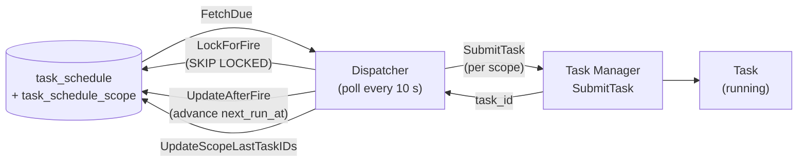
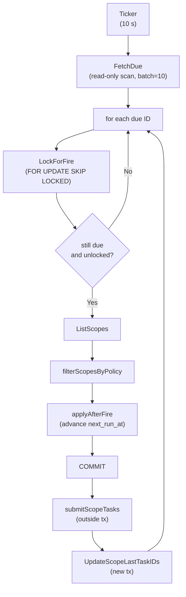

# User-Defined Task Schedules

User-defined task schedules let operators automate recurring or one-shot
operations (power control, firmware upgrade, bring-up, ingest) against a
persistent set of rack targets, without requiring an external scheduler.

---

## Table of Contents

- [Concepts](#concepts)
- [Schedule Types](#schedule-types)
- [Overlap Policy](#overlap-policy)
- [Scope and Component Filters](#scope-and-component-filters)
- [API Reference](#api-reference)
- [Dispatcher Internals](#dispatcher-internals)
- [Conflict Checks](#conflict-checks)
- [Database Schema](#database-schema)

---

## Concepts

A **task schedule** is a persistent record that says:

> "Run *operation X* against *these racks* every *N hours* (or at *this cron
> expression*, or at *this exact time*)."

It is composed of two kinds of rows in the database:

| Table | Purpose |
|---|---|
| `task_schedule` | The scheduling envelope: when to fire, what operation, overlap policy, enabled state. |
| `task_schedule_scope` | One row per targeted rack. Carries an optional component filter and tracks the last task submitted for that rack. |

The **Dispatcher** is a background goroutine that polls `task_schedule` every
10 seconds, locks due rows with `SELECT … FOR UPDATE SKIP LOCKED`, and calls
`taskManager.SubmitTask` once per scope row per firing.



---

## Schedule Types

The `spec_type` field selects the scheduling mechanism. The `spec` field
carries a type-specific string.

| `spec_type` | `spec` format | Example | `timezone` used? |
|---|---|---|---|
| `interval` | Go duration string | `"24h"`, `"30m"` | No |
| `cron` | 5-field cron expression (minute hour dom month dow) | `"0 2 * * 1"` (Mon 02:00) | Yes |
| `one-time` | RFC 3339 timestamp | `"2026-06-01T04:00:00Z"` | No |

### Interval

`next_run_at` is set to `now + duration` when the schedule is created or
resumed. After each firing it advances by the same duration.

### Cron

`next_run_at` is computed by evaluating the cron expression in the schedule's
IANA timezone (default `"UTC"`). The timezone only affects cron: interval and
one-time specs are always absolute.

```text
# Examples
"0 2 * * *"    — every day at 02:00 in the schedule's timezone
"0 */6 * * *"  — every 6 hours
"30 8 * * 1-5" — Mon–Fri at 08:30
```

#### Timezone format

The `timezone` field must be a valid **IANA Time Zone Database** name.
Abbreviations such as `PT`, `PST`, `PDT`, or `EST` are **not** accepted.

| Valid | Invalid |
|---|---|
| `"UTC"` | `"UTC+8"` |
| `"America/Los_Angeles"` | `"PT"`, `"PST"`, `"PDT"` |
| `"America/New_York"` | `"EST"`, `"EDT"`, `"ET"` |
| `"Europe/London"` | `"GMT+1"` |
| `"Asia/Tokyo"` | `"JST"` |

The full list of valid names is the IANA Time Zone Database, commonly
distributed as the `tzdata` package on Linux systems (e.g.
`/usr/share/zoneinfo/`). Use `"UTC"` when no local timezone adjustment is
needed.

### One-Time

Fires exactly once at the specified UTC timestamp. After firing, `enabled` is
set to `false` and `next_run_at` is cleared. A consumed one-time schedule
cannot be re-armed (create a new one instead).

---

## Overlap Policy

Controls what happens when a schedule fires while the previous task for the
same scope is still active (waiting, pending, or running).

| Policy | Behaviour |
|---|---|
| `skip` (default) | The scope is silently skipped for this firing cycle. The schedule still advances `next_run_at`. |
| `queue` | The new task is submitted unconditionally. The task manager queues it behind the active task per its own conflict rules. |

The overlap check is per-scope: a schedule with five rack targets can fire on
four racks while skipping the one whose previous task is still running.

The policy is **not** consulted for manual triggers (`TriggerTaskSchedule`):
all scopes are submitted unconditionally.

---

## Scope and Component Filters

A schedule's scope is the set of racks it targets. Each scope entry
(`task_schedule_scope` row) targets one rack, with an optional
`component_filter` that restricts which components in that rack are included.

### Component filter variants

| Filter | Meaning |
|---|---|
| `null` (absent) | All components in the rack |
| `{"kind":"types","types":["COMPUTE","NVSWITCH"]}` | Only components of the listed types |
| `{"kind":"components","components":["<uuid>","<uuid>"]}` | Specific components by UUID |

### Scope management RPCs

Three RPCs manage scope after a schedule is created:

| RPC | Behaviour |
|---|---|
| `AddTaskScheduleScope` | Additive: merges incoming racks into the existing scope. A rack not yet in scope is added as-is. A rack already present has its component filter merged with the incoming filter (see merge rules below). Existing racks are never removed. |
| `UpdateTaskScheduleScope` | Reconciling: replaces the scope to match a desired `target_spec` exactly. Racks not in the desired spec are removed; racks in the desired spec but not in the current scope are added; racks in both have their filter replaced if changed. |
| `RemoveTaskScheduleScope` | Removes a single scope entry by its `scope_id`. In-flight tasks are not cancelled. |
| `ListTaskScheduleScopes` | Returns all scope entries for a schedule. |

#### Filter merge rules (AddTaskScheduleScope only)

When the incoming rack already has a scope entry, the existing and incoming
`component_filter` values are merged according to these rules:

| Existing filter | Incoming filter | Result |
|---|---|---|
| `null` (all components) | anything | `null` — existing filter already covers everything; incoming is ignored |
| anything | `null` (all components) | `null` — widens to all components |
| `{"kind":"types", ...}` | `{"kind":"types", ...}` | `{"kind":"types", ...}` — union of both type lists |
| `{"kind":"components", ...}` | `{"kind":"components", ...}` | `{"kind":"components", ...}` — union of both UUID lists |
| `{"kind":"types", ...}` | `{"kind":"components", ...}` | **Error** — cannot merge filters of different kinds |
| `{"kind":"components", ...}` | `{"kind":"types", ...}` | **Error** — cannot merge filters of different kinds |

If a merge error occurs for any rack, the entire `AddTaskScheduleScope`
request fails and no changes are persisted. To change the kind of filter on
an existing scope entry, use `UpdateTaskScheduleScope` (which replaces rather
than merges) or remove the scope entry first.

For component-level targets (specific component UUIDs), the server resolves
which rack each component belongs to and groups them into per-rack scope
entries automatically.

---

## API Reference

All RPCs live in the `Flow` gRPC service.

### Schedule lifecycle

```proto
CreateTaskSchedule(CreateTaskScheduleRequest) → TaskSchedule
GetTaskSchedule(GetTaskScheduleRequest)       → TaskSchedule
ListTaskSchedules(ListTaskSchedulesRequest)   → ListTaskSchedulesResponse
UpdateTaskSchedule(UpdateTaskScheduleRequest) → TaskSchedule
PauseTaskSchedule(PauseTaskScheduleRequest)   → TaskSchedule
ResumeTaskSchedule(ResumeTaskScheduleRequest) → TaskSchedule
DeleteTaskSchedule(DeleteTaskScheduleRequest) → Empty
TriggerTaskSchedule(TriggerTaskScheduleRequest) → SubmitTaskResponse
```

### Scope management

```proto
AddTaskScheduleScope(AddTaskScheduleScopeRequest)       → AddTaskScheduleScopeResponse
RemoveTaskScheduleScope(RemoveTaskScheduleScopeRequest) → Empty
UpdateTaskScheduleScope(UpdateTaskScheduleScopeRequest) → UpdateTaskScheduleScopeResponse
ListTaskScheduleScopes(ListTaskScheduleScopesRequest)   → ListTaskScheduleScopesResponse
```

### Advisory

```proto
CheckScheduleConflicts(CheckScheduleConflictsRequest) → CheckScheduleConflictsResponse
```

---

### CreateTaskSchedule

Creates a schedule and its initial scope in a single transaction.

**Required fields:**

| Field | Notes |
|---|---|
| `schedule.name` | Must be unique across all schedules. |
| `schedule.spec.type` | `INTERVAL`, `CRON`, or `ONE_TIME`. |
| `schedule.spec.spec` | Duration string, cron expression, or RFC 3339 timestamp. |
| `operation` (oneof) | One of `power_on`, `power_off`, `power_reset`, `bring_up`, `upgrade_firmware`, `ingest`. The `target_spec` embedded in the operation message defines the initial scope. |

**Optional fields:**

| Field | Default | Notes |
|---|---|---|
| `schedule.spec.timezone` | `"UTC"` | IANA timezone name (e.g. `"America/Los_Angeles"`), only used for cron specs. Abbreviations like `"PT"` or `"EST"` are not valid. |
| `schedule.overlap_policy` | `skip` | `SKIP` or `QUEUE`. |

The initial scope is derived from the operation's `target_spec`. Use the scope
management RPCs to modify it after creation.

---

### UpdateTaskSchedule

Updates the scheduling config of an existing schedule. `update_mask` is
required and controls which fields are written.

| Mask path | Effect |
|---|---|
| `"schedule.name"` | Replaces the display name. |
| `"schedule.overlap_policy"` | Replaces the overlap behaviour. |
| `"schedule.spec"` | Replaces the full spec block (type + spec string). `next_run_at` is recomputed. |
| `"schedule.spec.timezone"` | Replaces the timezone only. The spec type and string are unchanged. |

The operation itself (what the schedule runs) and scope (which racks it targets)
cannot be changed via `UpdateTaskSchedule`. To change the operation, delete the
schedule and create a new one. To change the scope, use the scope management
RPCs.

---

### PauseTaskSchedule / ResumeTaskSchedule

**Pause** sets `enabled = false`. The schedule will not fire until resumed.
Calling pause on an already-paused schedule is a no-op. Pausing a one-time
schedule that has already fired returns an error (nothing to pause).

**Resume** sets `enabled = true`. For interval and cron schedules `next_run_at`
is recomputed from the current time so the schedule does not fire immediately
if `next_run_at` is still in the past from before the pause. For a one-time
schedule that was paused before firing, `next_run_at` is left unchanged.
Resuming a one-time schedule that has already fired (no `next_run_at`) returns
an error.

---

### TriggerTaskSchedule

Fires the schedule immediately, regardless of `next_run_at` or `enabled` state.
All scopes are submitted unconditionally (the overlap policy is ignored).
After firing:

- `last_run_at` is set on the schedule.
- For interval/cron schedules, `next_run_at` advances normally.
- For one-time schedules, `enabled` is set to `false` and `next_run_at` is
  cleared (consumed).

Returns an error if called on a one-time schedule that has already fired.

---

### DeleteTaskSchedule

Hard-deletes the schedule and all its scope entries (via `ON DELETE CASCADE`).
In-flight tasks are **not** cancelled.

---

### ListTaskSchedules

Returns schedules ordered by `created_at` ascending.

| Filter | Effect |
|---|---|
| `rack_id` | Return only schedules with a scope entry on this rack. |
| `enabled_only` | Exclude paused schedules. |
| `pagination` | `offset` / `limit` for paging. Omit to return all. |

The response includes `total`: the count before pagination is applied.

---

## Dispatcher Internals

The `Dispatcher` runs as a background goroutine started by the service at boot.
It is safe to run in multi-instance deployments because individual schedule
rows are locked with `SELECT … FOR UPDATE SKIP LOCKED` before firing.

### Poll cycle



### Three-phase fire

Each schedule firing is split into three phases to avoid nesting transactions
(the task manager opens its own transaction when submitting a task):

1. **Locking phase (transaction):** Lock the row, fetch scopes, run the overlap check,
   advance `next_run_at` (so the row is no longer "due"), commit.
2. **Submission phase (outside transaction):** Call `SubmitTask` once per eligible scope.
3. **Writeback phase (new transaction):** Write back `last_task_id` on each scope row.

If Phase 2 fails for a scope, the scope is logged and skipped — other scopes
still fire. Phase 1 committing before Phase 2 means `next_run_at` has already
advanced; the schedule will not fire again for that same tick even if all
submissions fail.

### Advancing next_run_at

| `spec_type` | When all scopes are skipped (overlap) | After a normal firing |
|---|---|---|
| `one-time` | `next_run_at = NULL`, `enabled = false` (consumed — window passed, nothing to retry) | `next_run_at = NULL`, `enabled = false` |
| `interval` | `next_run_at += duration` | `next_run_at += duration` |
| `cron` | `next_run_at = next cron time` | `next_run_at = next cron time` |

### Operation template

The `operation_template` JSONB column stores the operation type, code, and
parameters needed to reconstruct an `operation.Request` at fire time. The
target is **not** stored in the template — it is resolved from the scope rows
at fire time. This means changing the scope (via scope management RPCs) takes
effect on the very next firing without modifying the operation template.

```json
{
  "type": "power_control",
  "code": "restart",
  "information": { "operation": 5, "forced": false }
}
```

---

## Conflict Checks

`CheckScheduleConflicts` is an advisory RPC that checks whether a proposed
scheduled operation would overlap with any existing enabled schedule on the
same racks. It returns the conflicting schedules (if any) but does **not**
block creation.

**The check is coarse by design.** It compares only the operation type and
code; it does not intersect component-type filters or explicit component UUID
lists. Two schedules that target entirely disjoint component sets on the same
rack will still be reported as conflicting. Treat a non-empty response as a
signal for human review, not a guarantee that tasks will collide at runtime.
Execution-time conflict detection (the task manager's conflict rules) remains
the authoritative backstop.

---

## Database Schema

```sql
CREATE TABLE task_schedule (
    id                  UUID PRIMARY KEY DEFAULT gen_random_uuid(),
    name                VARCHAR(255) NOT NULL UNIQUE,
    spec_type           VARCHAR(16) NOT NULL,   -- 'interval' | 'cron' | 'one-time'
    spec                TEXT NOT NULL,          -- duration string, cron expression, or RFC3339 timestamp
    timezone            VARCHAR(64) NOT NULL DEFAULT 'UTC',
    operation_template  JSONB NOT NULL,         -- serialized operation type + parameters (no target)
    overlap_policy      VARCHAR(16) NOT NULL DEFAULT 'skip',
    enabled             BOOLEAN NOT NULL DEFAULT TRUE,
    next_run_at         TIMESTAMPTZ,
    last_run_at         TIMESTAMPTZ,
    created_at          TIMESTAMPTZ NOT NULL DEFAULT current_timestamp,
    updated_at          TIMESTAMPTZ NOT NULL DEFAULT current_timestamp
);

-- Partial index used by the dispatcher's FetchDue query.
CREATE INDEX idx_task_schedule_next_run ON task_schedule (next_run_at)
    WHERE enabled = TRUE AND next_run_at IS NOT NULL;

CREATE TABLE task_schedule_scope (
    id               UUID PRIMARY KEY DEFAULT gen_random_uuid(),
    schedule_id      UUID NOT NULL REFERENCES task_schedule(id) ON DELETE CASCADE,
    rack_id          UUID NOT NULL REFERENCES rack(id) ON DELETE CASCADE,
    component_filter JSONB,          -- NULL = all components in rack
    last_task_id     UUID REFERENCES task(id) ON DELETE SET NULL,
    created_at       TIMESTAMPTZ NOT NULL DEFAULT current_timestamp,
    UNIQUE (schedule_id, rack_id)
);

CREATE INDEX idx_task_schedule_scope_rack ON task_schedule_scope (rack_id);
```

### Key columns

| Column | Notes |
|---|---|
| `task_schedule.name` | Unique across all schedules. Human-readable identifier. |
| `task_schedule.next_run_at` | `NULL` for disabled one-time schedules that have fired. The partial index makes the dispatcher's poll query efficient. |
| `task_schedule.enabled` | `false` = paused (will not fire). Set by `PauseTaskSchedule` or automatically after a one-time schedule fires. |
| `task_schedule_scope.component_filter` | `NULL` means all components. See [Component filter variants](#component-filter-variants). |
| `task_schedule_scope.last_task_id` | The task submitted for this rack on the most recent firing. Used by the overlap check for the `skip` policy. `NULL` until the first firing. |
| `task_schedule_scope.schedule_id` FK | `ON DELETE CASCADE` — scopes are removed automatically when the schedule is deleted. |
